# AI Development Expert Course Dictionary

## Table of Contents
* [Activation Function](#activation-function)
* [Adam Optimizer](#adam-optimizer)
* [AI Agent](#ai-agent)
* [Alternative Hypothesis (H1)](#alternative-hypothesis-h1)
* [Anchor Box](#anchor-box)
* [Anomaly Detection](#anomaly-detection)
* [Apriori Algorithm](#apriori-algorithm)
* [Artificial Intelligence (AI)](#artificial-intelligence-ai)
* [Attention Mechanism](#attention-mechanism)
* [Augmentation (Data)](#augmentation-data)
* [Auto Encoder](#auto-encoder)
* [Average Pooling](#average-pooling)
* [Average Precision (AP)](#average-precision-ap)
* [Batch (Training)](#batch-training)
* [Bayes' Theorem](#bayes-theorem)
* [B-Frame (Bi-directional Frame)](#b-frame-bi-directional-frame)
* [Back Propagation](#back-propagation)
* [Batch Normalization](#batch-normalization)
* [Bias (Neural Network)](#bias-neural-network)
* [Binomial Distribution](#binomial-distribution)
* [Bit Rate](#bit-rate)
* [Bounding Box](#bounding-box)
* [Centroid](#centroid)
* [Chain of Thought (CoT)](#chain-of-thought-cot)
* [Classification](#classification)
* [CNN (Convolutional Neural Network)](#cnn-convolutional-neural-network)
* [Command Line Interface (CLI)](#command-line-interface-cli)
* [Confidence (Association Rules)](#confidence-association-rules)
* [Confidence Score](#confidence-score)
* [Confusion Matrix](#confusion-matrix)
* [Context Window](#context-window)
* [Convolution](#convolution)
* [Correlation](#correlation)
* [Cosine Similarity](#cosine-similarity)
* [Covariance Matrix](#covariance-matrix)
* [Cross Entropy](#cross-entropy)
* [Cumulative Distribution Function (CDF)](#cumulative-distribution-function-cdf)
* [Curse of Dimensionality](#curse-of-dimensionality)
* [Darknet](#darknet)
* [Data Imbalance](#data-imbalance)
* [Dataset](#dataset)
* [DCT (Discrete Cosine Transform)](#dct-discrete-cosine-transform)
* [Decimation (Image)](#decimation-image)
* [Deep Learning (DL)](#deep-learning-dl)
* [Determinant](#determinant)
* [Dropout](#dropout)
* [Early Stopping](#early-stopping)
* [Edge Detection](#edge-detection)
* [EfficientNet](#efficientnet)
* [Eigenvalue & Eigenvector](#eigenvalue--eigenvector)
* [ELBO (Evidence Lower Bound)](#elbo-evidence-lower-bound)
* [Embedding](#embedding)
* [Entropy](#entropy)
* [Epoch](#epoch)
* [Euclidean Distance](#euclidean-distance)
* [F1-Score](#f1-score)
* [Feature](#feature)
* [Feature Extraction](#feature-extraction)
* [Feature Map](#feature-map)
* [Few Shot Prompting](#few-shot-prompting)
* [FFMPEG](#ffmpeg)
* [Fine-Tuning](#fine-tuning)
* [Flatten](#flatten)
* [Forward Propagation](#forward-propagation)
* [Fourier Transform (FFT)](#fourier-transform-fft)
* [Fully Convolutional Network (FCN)](#fully-convolutional-network-fcn)
* [Fully Connected Layer (MLP)](#fully-connected-layer-mlp)
* [Gaussian Distribution](#gaussian-distribution)
* [Gaussian Mixture Model (GMM)](#gaussian-mixture-model-gmm)
* [Generative Modeling](#generative-modeling)
* [GIL (Global Interpreter Lock)](#gil-global-interpreter-lock)
* [Git / GitHub](#git--github)
* [Global Average Pooling (GAP)](#global-average-pooling-gap)
* [Google Colab](#google-colab)
* [GoogLeNet / Inception](#googlenet--inception)
* [Gradient Descent](#gradient-descent)
* [Ground Truth](#ground-truth)
* [Group of Pictures (GOP)](#group-of-pictures-gop)
* [Histogram](#histogram)
* [Hough Transform](#hough-transform)
* [Huffman Coding](#huffman-coding)
* [Hyperparameter](#hyperparameter)
* [Hyperspectral Image](#hyperspectral-image)
* [I-Frame](#i-frame)
* [Image Processing](#image-processing)
* [Inner Product (Dot Product)](#inner-product-dot-product)
* [Instance Segmentation](#instance-segmentation)
* [Interquartile Range (IQR)](#interquartile-range-iqr)
* [Interpolation](#interpolation)
* [IoU (Intersection over Union)](#iou-intersection-over-union)
* [JPEG Compression](#jpeg-compression)
* [Kaggle](#kaggle)
* [Keras](#keras)
* [Kernel (Filter)](#kernel-filter)
* [Keypoint (Pose Estimation)](#keypoint-pose-estimation)
* [K-Fold Cross Validation](#k-fold-cross-validation)
* [K-Means Clustering](#k-means-clustering)
* [K-Nearest Neighbors (KNN)](#k-nearest-neighbors-knn)
* [KL Divergence](#kl-divergence)
* [Large Language Model (LLM)](#large-language-model-llm)
* [Latent Space](#latent-space)
* [Leaky ReLU](#leaky-relu)
* [Learning Rate](#learning-rate)
* [Lift (Association Rules)](#lift-association-rules)
* [Likelihood Function (MLE)](#likelihood-function-mle)
* [Linear Discriminant Analysis (LDA)](#linear-discriminant-analysis-lda)
* [Linear Programming](#linear-programming)
* [Linear Regression](#linear-regression)
* [Local Minimum](#local-minimum)
* [Logistic Regression](#logistic-regression)
* [Logit](#logit)
* [Loss Function](#loss-function)
* [LSTM (Long Short-Term Memory)](#lstm-long-short-term-memory)
* [Machine Learning (ML)](#machine-learning-ml)
* [Macro Block](#macro-block)
* [Manhattan Distance](#manhattan-distance)
* [Matrix](#matrix)
* [Max Pooling](#max-pooling)
* [Mean Square Error (MSE)](#mean-square-error-mse)
* [Median](#median)
* [MediaPipe](#mediapipe)
* [Min-Max Normalization](#min-max-normalization)
* [MNIST Dataset](#mnist-dataset)
* [MobileNet](#mobilenet)
* [Model Context Protocol (MCP)](#model-context-protocol-mcp)
* [Motion Vector](#motion-vector)
* [Multi-Processing](#multi-processing)
* [Multi-Threading](#multi-threading)
* [Naive Bayes Classifier](#naive-bayes-classifier)
* [Non-Max Suppression](#non-max-suppression)
* [Norm (Vector)](#norm-vector)
* [Normalization](#normalization)
* [NotebookLM](#notebooklm)
* [Null Hypothesis (H0)](#null-hypothesis-h0)
* [NumPy](#numpy)
* [Object Detection](#object-detection)
* [One-Hot Encoding](#one-hot-encoding)
* [OpenCV](#opencv)
* [Orthogonal Vectors](#orthogonal-vectors)
* [Outlier](#outlier)
* [Overfitting](#overfitting)
* [P-Frame (Predictive Frame)](#p-frame-predictive-frame)
* [Padding](#padding)
* [Perceptron](#perceptron)
* [PMF (Probability Mass Function)](#pmf-probability-mass-function)
* [Poisson Distribution](#poisson-distribution)
* [PRD (Product Requirements Document)](#prd-product-requirements-document)
* [Precision](#precision)
* [Principal Component Analysis (PCA)](#principal-component-analysis-pca)
* [Probability](#probability)
* [Probability Density Function (PDF)](#probability-density-function-pdf)
* [Prompt Engineering](#prompt-engineering)
* [P-value](#p-value)
* [PyTorch](#pytorch)
* [Quantiles](#quantiles)
* [ReAct (Reasoning + Acting)](#react-reasoning--acting)
* [Recall](#recall)
* [Receptive Field](#receptive-field)
* [Regression](#regression)
* [Regularization](#regularization)
* [Reinforcement Learning (RL)](#reinforcement-learning-rl)
* [ReLU (Rectified Linear Unit)](#relu-rectified-linear-unit)
* [Residuals](#residuals)
* [ResNet (Residual Network)](#resnet-residual-network)
* [Retrieval-Augmented Generation (RAG)](#retrieval-augmented-generation-rag)
* [RNN (Recurrent Neural Network)](#rnn-recurrent-neural-network)
* [Rotation Matrix](#rotation-matrix)
* [R-Squared (R²)](#r-squared-r)
* [Sample (Data Point)](#sample-data-point)
* [Scalar](#scalar)
* [Scikit-learn](#scikit-learn)
* [Semantic Segmentation](#semantic-segmentation)
* [Siamese Network](#siamese-network)
* [Sigmoid Function](#sigmoid-function)
* [Skip Connections](#skip-connections)
* [Softmax](#softmax)
* [Spatial Frequency](#spatial-frequency)
* [Standard Deviation (STD)](#standard-deviation-std)
* [Stride](#stride)
* [Supervised Learning](#supervised-learning)
* [Support (Association Rules)](#support-association-rules)
* [Support Vector Machine (SVM)](#support-vector-machine-svm)
* [T-Test](#t-test)
* [t-SNE (t-Distributed Stochastic Neighbor Embedding)](#t-sne-t-distributed-stochastic-neighbor-embedding)
* [Tensor](#tensor)
* [Token](#token)
* [Training / Validation / Test Split](#training--validation--test-split)
* [Transformer](#transformer)
* [Transfer Learning](#transfer-learning)
* [Transposed Convolution](#transposed-convolution)
* [Tree of Thoughts (ToT)](#tree-of-thoughts-tot)
* [TSSCI (Skeletal Motion Image)](#tssci-skeletal-motion-image)
* [Underfitting](#underfitting)
* [U-NET](#u-net)
* [Unsupervised Learning](#unsupervised-learning)
* [Up-sampling](#up-sampling)
* [VAE (Variational Auto Encoder)](#vae-variational-auto-encoder)
* [Variance](#variance)
* [Vector](#vector)
* [Vector Database (Vector DB)](#vector-database-vector-db)
* [VGGNet](#vggnet)
* [Virtual Environment](#virtual-environment)
* [WSL (Windows Subsystem for Linux)](#wsl-windows-subsystem-for-linux)
* [Xavier / He Initialization](#xavier--he-initialization)
* [XOR Problem](#xor-problem)
* [YOLO (You Only Look Once)](#yolo-you-only-look-once)
* [YUV (Color Space)](#yuv-color-space)
* [Z-Score Normalization](#z-score-normalization)
* [Zero-Shot Prompting](#zero-shot-prompting)
* [Z-Test](#z-test)

---

## Activation Function
**[Category: Deep Learning]** | **[Hebrew: פונקציית הפעלה]**
* A mathematical equation attached to each artificial neuron in a neural network that determines whether the neuron should be "activated" or fired. It introduces crucial non-linear properties to the network, allowing it to learn highly complex patterns instead of just simple straight lines. Without activation functions, even a 100-layer network would reduce to a single linear equation. Common types include ReLU (most popular for hidden layers), Sigmoid (binary output), and Softmax (multi-class probability output).
* **Synonyms:** Transfer Function, Non-linear Filter
* **Lessons Discussed In:** Lesson 27, Lesson 28, Lesson 36, Lesson 37, Lesson 38, Lesson 40
* **Prerequisites:** Perceptron
* **Related Items:** Perceptron, Sigmoid Function, Softmax, ReLU (Rectified Linear Unit), Leaky ReLU
* **Application in Industry:** Used heavily in image recognition models to convert continuous numbers into fixed threshold probabilities. ReLU is preferred in hidden layers for speed; Softmax is used at the output for multi-class classification; Sigmoid for binary classification.
* **Example Diagram:**
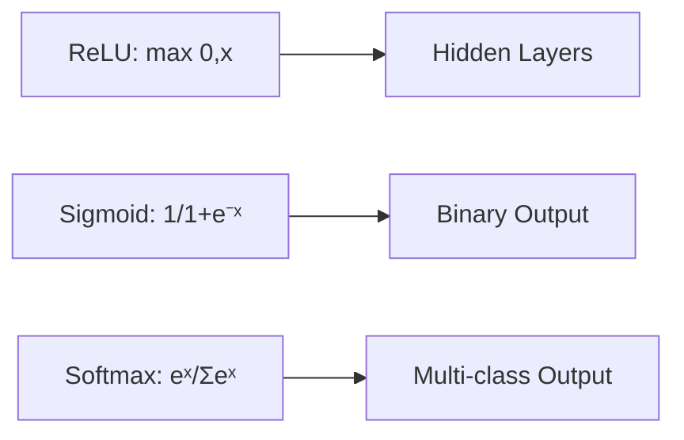
* **Example Snippet:**
```python
# A simple ReLU Activation Function
def relu(x):
    return max(0, x)
```
* **External Resources:** [Machine Learning Mastery - Activation Functions](https://machinelearningmastery.com/a-gentle-introduction-to-rectified-linear-unit-relu/)

## Adam Optimizer
**[Category: Deep Learning]** | **[Hebrew: אופטימייזר Adam / אדם]**
* An adaptive learning rate optimization algorithm that combines the benefits of two earlier methods: AdaGrad (adapts learning rate per parameter) and RMSProp (uses moving averages). Adam starts with larger steps for rapid initial progress and automatically reduces step size as it approaches the optimal solution, making it the most popular optimizer in modern deep learning.
* **Synonyms:** Adaptive Moment Estimation
* **Lessons Discussed In:** Lesson 28, Lesson 36, Lesson 37, Lesson 40
* **Prerequisites:** Gradient Descent, Learning Rate
* **Related Items:** Gradient Descent, Learning Rate, Back Propagation, Loss Function
* **Application in Industry:** The default optimizer in virtually all modern deep learning frameworks. Used in training GPT models, image classifiers, and recommendation systems because it requires minimal hyperparameter tuning compared to vanilla gradient descent. In the course, Dr. Segal describes Adam as reducing step size over time to avoid overshooting the optimal point.
* **Example Snippet:**
```python
from keras.optimizers import Adam
model.compile(optimizer=Adam(learning_rate=0.001),
              loss='categorical_crossentropy', metrics=['accuracy'])
```
* **External Resources:** [Machine Learning Mastery - Adam Optimizer](https://machinelearningmastery.com/adam-optimization-algorithm-for-deep-learning/)

## AI Agent
**[Category: AI Agents & Architecture]** | **[Hebrew: סוכן AI / סוכן חכם]**
* An autonomous software system that combines three core components: an LLM (brain), Memory (context retention), and Tools (external capabilities). AI Agents receive structured JSON inputs, process them using their LLM, and produce JSON outputs, enabling them to perform complex multi-step tasks like code generation, data analysis, and workflow automation.
* **Synonyms:** Intelligent Agent, Autonomous Agent
* **Lessons Discussed In:** Lesson 4, Lesson 12, Lesson 13, Lesson 14, Lesson 19, Lesson 25, Lesson 30
* **Prerequisites:** Large Language Model (LLM), Command Line Interface (CLI)
* **Related Items:** Model Context Protocol (MCP), Large Language Model (LLM), Prompt Engineering, Context Window
* **Application in Industry:** Powers virtual software engineers (OpenAI Codex), automated customer support systems, and enterprise workflow automation. Claude Code and Gemini CLI are examples of AI agents that can read files, write code, and execute commands. In the course, agents are described as receiving JSON input and producing JSON output, and can be "internal" (sharing an LLM) or "external" (having their own dedicated LLM).
* **Example Diagram:**
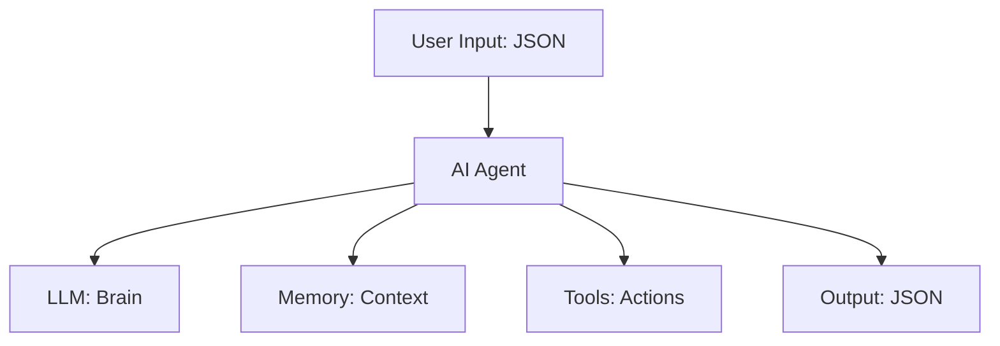
* **External Resources:** [Anthropic - Building AI Agents](https://www.anthropic.com/)

## Alternative Hypothesis (H1)
**[Category: Statistics]** | **[Hebrew: השערה חלופית / H1]**
* The hypothesis that contradicts the Null Hypothesis (H0), proposing that there IS a statistically significant effect or difference between the groups being compared. If the P-value is below 0.05, the null hypothesis is rejected in favor of the alternative hypothesis.
* **Synonyms:** H1, Research Hypothesis
* **Lessons Discussed In:** Lesson 6
* **Prerequisites:** Null Hypothesis (H0), P-value
* **Related Items:** Null Hypothesis (H0), P-value, T-Test, Z-Test
* **Application in Industry:** In clinical drug trials: H0 says "Drug has no effect," H1 says "Drug has an effect." With three drugs, multiple alternative hypotheses exist (A differs from B, B differs from C, etc.), each requiring separate statistical testing.
* **Example Snippet:**
```text
H0: Drug A = Drug B (no difference)
H1: Drug A ≠ Drug B (there IS a difference)
If P-value = 0.02 < 0.05 → Reject H0, Accept H1
```
* **External Resources:** [Khan Academy - Hypothesis Testing](https://www.khanacademy.org/math/statistics-probability/significance-tests-one-sample)

## Anomaly Detection
**[Category: Machine Learning Fundamentals]** | **[Hebrew: זיהוי חריגות / Anomaly Detection]**
* An unsupervised machine learning technique that identifies data points, patterns, or observations that deviate significantly from the expected normal behavior. Unlike classification (which needs labeled examples of each class), anomaly detection learns what "normal" looks like and flags anything that doesn't fit.
* **Synonyms:** Outlier Detection, Novelty Detection
* **Lessons Discussed In:** Lesson 16
* **Prerequisites:** Unsupervised Learning, Variance
* **Related Items:** Outlier, K-Means Clustering, Unsupervised Learning, Interquartile Range (IQR)
* **Application in Industry:** Used in cybersecurity to detect network intrusions, in banking to flag fraudulent transactions, in manufacturing to identify defective products on assembly lines, and in IT infrastructure to predict server failures before they occur.
* **Example Diagram:**
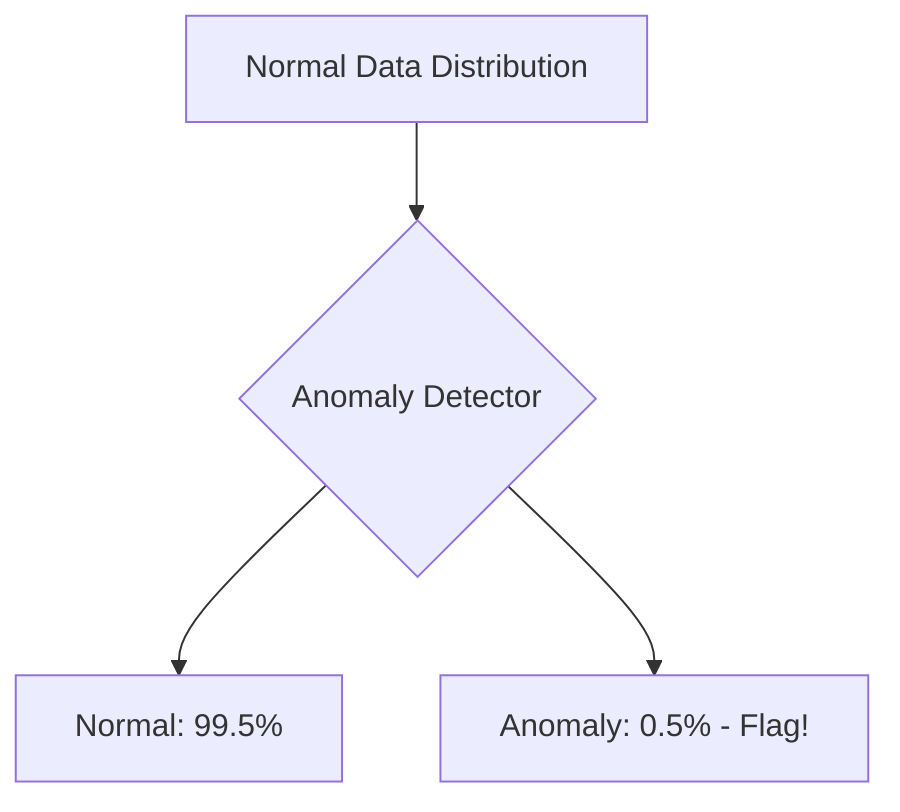
* **External Resources:** [Scikit-learn - Anomaly Detection](https://scikit-learn.org/stable/modules/outlier_detection.html)

## Anchor Box
**[Category: Computer Vision]** | **[Hebrew: תיבת עוגן / Anchor Box]**
* A set of predefined bounding box templates with specific aspect ratios and scales, placed at each position on the feature map grid during object detection. The model predicts adjustments (offsets) to these anchor boxes rather than predicting box coordinates from scratch, making detection faster and more accurate.
* **Synonyms:** Prior Box, Default Box
* **Lessons Discussed In:** Lesson 46
* **Prerequisites:** CNN (Convolutional Neural Network), Bounding Box
* **Related Items:** YOLO (You Only Look Once), IoU (Intersection over Union), Non-Max Suppression
* **Application in Industry:** Used in autonomous driving to detect objects of wildly different shapes (tall pedestrians vs. wide trucks) simultaneously, as each anchor box template is tuned to a specific aspect ratio.
* **Example Diagram:**
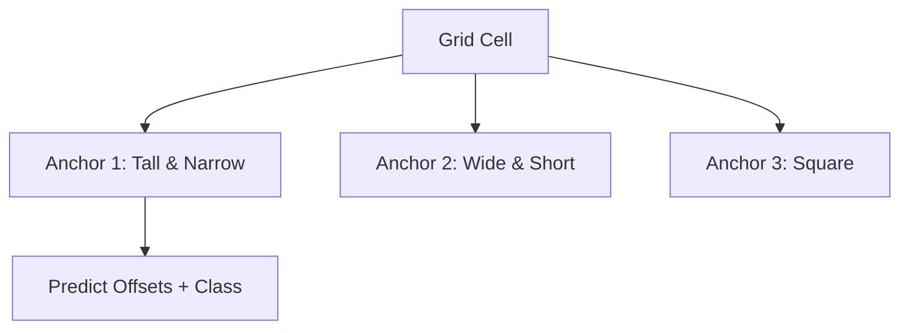
* **External Resources:** [Towards Data Science - Anchor Boxes](https://towardsdatascience.com/anchor-boxes-the-key-to-quality-object-detection-ddf9d612d4f9)

## Apriori Algorithm
**[Category: Machine Learning Algorithms]** | **[Hebrew: אלגוריתם Apriori / חוקי אסוציאציה]**
* An unsupervised machine learning algorithm used to find frequent itemsets and discover association rules in a dataset. It is highly efficient because it prunes uninteresting combinations early on, based on the principle that if an itemset is infrequent, all its supersets must also be infrequent.
* **Synonyms:** Market Basket Analysis, Association Rule Learning
* **Lessons Discussed In:** Lesson 10, Lesson 11
* **Prerequisites:** Dataset
* **Related Items:** Confidence (Association Rules), Support (Association Rules), Lift (Association Rules)
* **Application in Industry:** Used by retail stores and e-commerce (like Amazon) to recommend products: "Customers who bought a camera also bought an SD card."
* **Example Diagram:**
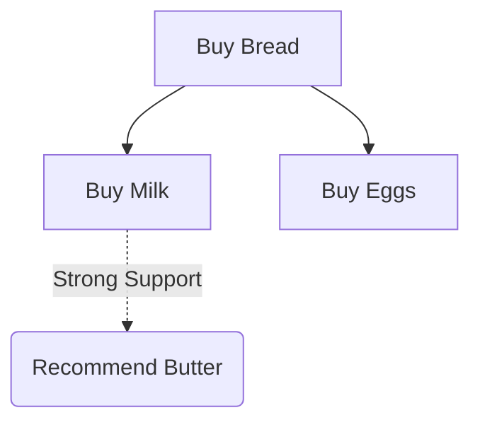
* **External Resources:** [GeeksforGeeks - Apriori Algorithm](https://www.geeksforgeeks.org/apriori-algorithm/)

## Artificial Intelligence (AI)
**[Category: General Concepts]** | **[Hebrew: בינה מלאכותית (AI)]**
* A field of computer science dedicated to creating systems capable of performing tasks that typically require human intelligence, such as visual perception, speech recognition, and decision-making. AI concepts form the foundation for building advanced software models and agents.
* **Synonyms:** Machine Intelligence
* **Lessons Discussed In:** Lesson 1
* **Prerequisites:** None
* **Related Items:** Machine Learning (ML), Large Language Model (LLM)
* **Application in Industry:** Used in autonomous driving (Tesla), natural language translations (Google Translate), and fraud detection in banking.
* **Example Diagram:**
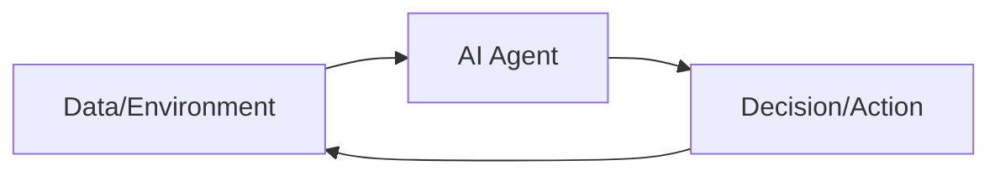
* **External Resources:** [HubSpot - What is AI?](https://www.hubspot.com/artificial-intelligence)

## Attention Mechanism
**[Category: Deep Learning]** | **[Hebrew: מנגנון קשב / Attention]**
* A neural network component that allows the model to dynamically focus on the most relevant parts of the input data when producing an output, rather than treating all input elements equally. It computes relevance scores between a query and a set of key-value pairs, enabling the network to weigh important information more heavily.
* **Synonyms:** Self-Attention, Scaled Dot-Product Attention
* **Lessons Discussed In:** Lesson 22, Lesson 27
* **Prerequisites:** Deep Learning (DL), Vector
* **Related Items:** Transformer, Context Window, Embedding
* **Application in Industry:** The core innovation behind ChatGPT and all modern LLMs. Attention allows a language model to understand that in "The cat sat on the mat because it was tired," the word "it" refers to "cat" by assigning a high attention score between them.
* **Example Diagram:**
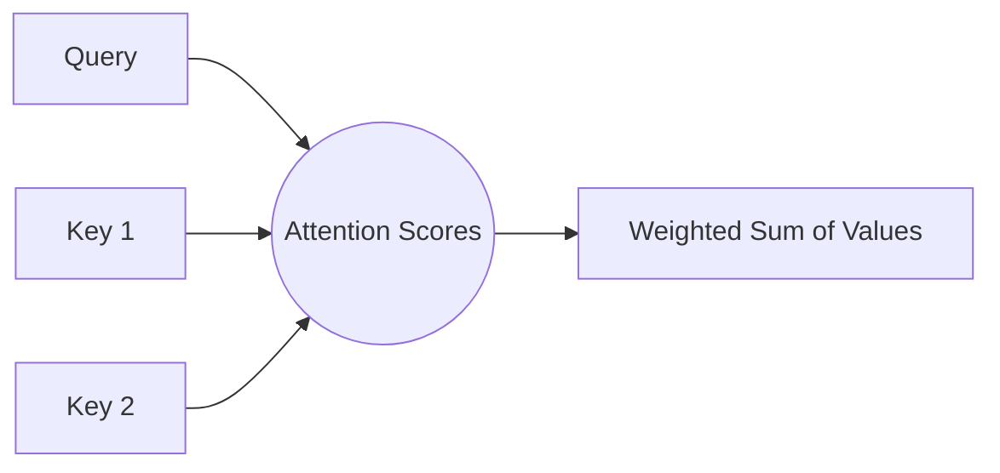
* **External Resources:** [Jay Alammar - The Illustrated Transformer](https://jalammar.github.io/illustrated-transformer/)

## Augmentation (Data)
**[Category: Data Preprocessing]** | **[Hebrew: אוגמנטציה / הרחבת נתונים]**
* A data preprocessing technique that artificially expands a training dataset by creating modified copies of existing data points. For images, this includes random rotations, flips, crops, color shifts, and noise injection. It prevents overfitting by exposing the model to more diverse variations without collecting new data.
* **Synonyms:** Data Augmentation, Data Expansion
* **Lessons Discussed In:** Lesson 7, Lesson 24, Lesson 36
* **Prerequisites:** Dataset, Overfitting
* **Related Items:** Overfitting, Regularization, Training Data
* **Application in Industry:** Medical imaging AI massively benefits from augmentation because obtaining new labeled X-rays is expensive. By flipping, rotating, and slightly distorting existing scans, the training dataset can grow 10x without a single new patient scan.
* **Example Snippet:**
```python
# Keras ImageDataGenerator for augmentation
from keras.preprocessing.image import ImageDataGenerator
datagen = ImageDataGenerator(rotation_range=20, horizontal_flip=True,
                             zoom_range=0.2, brightness_range=[0.8, 1.2])
```
* **External Resources:** [Keras - Image Data Augmentation](https://keras.io/api/data_loading/image/)

## Auto Encoder
**[Category: Deep Learning]** | **[Hebrew: מקודד אוטומטי / Auto Encoder]**
* An unsupervised neural network architecture designed exactly to compress data and then perfectly reconstruct it. It consists of two halves: an "Encoder" that aggressively shrinks the image down to its core features (Latent Space), and a "Decoder" that learns how to blindly re-expand those core features back into the original image.
* **Synonyms:** Data Compressor Network
* **Lessons Discussed In:** Lesson 42, Lesson 43, Lesson 44, Lesson 45
* **Prerequisites:** Unsupervised Learning, CNN
* **Related Items:** Generative Modeling, Principal Component Analysis (PCA)
* **Application in Industry:** Heavily used for "Denoising." An Auto Encoder can be trained by feeding it noisy, grainy photos and forcing the Decoder to output a crisp, clean version. It naturally learns to "drop" the static noise during the compression phase.
* **Example Diagram:**
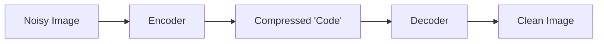
* **External Resources:** [IBM - Autoencoders](https://www.ibm.com/topics/autoencoder)

## Average Pooling
**[Category: Deep Learning]** | **[Hebrew: סינון ממוצע / Average Pooling]**
* A downsampling operation applied after a Convolutional layer that reduces spatial dimensions by computing the average of all values within the pooling window, rather than taking only the maximum. It preserves more background context information than Max Pooling, making it useful for noisy images.
* **Synonyms:** Mean Pooling
* **Lessons Discussed In:** Lesson 39, Lesson 40
* **Prerequisites:** CNN (Convolutional Neural Network), Max Pooling
* **Related Items:** Max Pooling, Global Average Pooling, CNN (Convolutional Neural Network)
* **Application in Industry:** Used in medical imaging where background tissue patterns carry diagnostic value. Unlike Max Pooling which aggressively discards information, Average Pooling smoothly summarizes all pixel data in the region.
* **Example Diagram:**
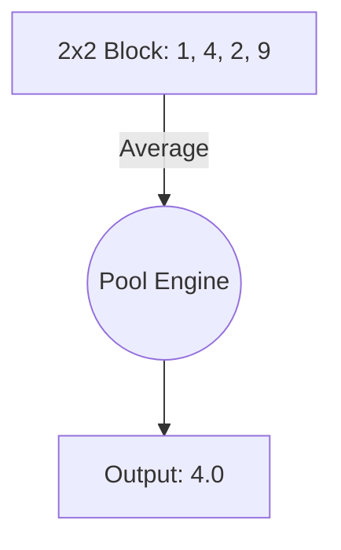
* **External Resources:** [Machine Learning Mastery - Pooling Layers](https://machinelearningmastery.com/pooling-layers-for-convolutional-neural-networks/)

## Average Precision (AP)
**[Category: Model Evaluation]** | **[Hebrew: דיוק ממוצע / Average Precision]**
* A single-number summary metric for object detection models that calculates the area under the Precision-Recall curve. It measures how well the detector performs across all confidence thresholds, combining both precision (accuracy of detections) and recall (completeness of detections) into one score.
* **Synonyms:** AP, mAP (mean Average Precision)
* **Lessons Discussed In:** Lesson 46
* **Prerequisites:** Precision, Recall, IoU (Intersection over Union)
* **Related Items:** Precision, Recall, F1-Score, YOLO (You Only Look Once), Confidence Score
* **Application in Industry:** The standard evaluation metric for object detection competitions (COCO, Pascal VOC). When comparing YOLO versions, researchers report mAP@0.5 (AP at 50% IoU threshold) and mAP@0.5:0.95 (averaged across multiple IoU thresholds).
* **Example Snippet:**
```text
mAP@0.5 = Average Precision at IoU threshold of 50%
YOLOv8: mAP@0.5 = 53.9%
Higher mAP = Better detector across all confidence levels
```
* **External Resources:** [Papers With Code - Object Detection Metrics](https://paperswithcode.com/task/object-detection)

## Bayes' Theorem
**[Category: Statistics]** | **[Hebrew: משפט בייס / הסתברות מותנית]**
* A fundamental probability theorem that calculates the probability of a hypothesis given observed evidence, by combining prior knowledge with new data. The formula P(H|E) = P(E|H) × P(H) / P(E) allows updating beliefs as new evidence arrives, forming the mathematical backbone of the Naive Bayes Classifier.
* **Synonyms:** Bayesian Inference, Posterior Probability
* **Lessons Discussed In:** Lesson 21
* **Prerequisites:** Probability, Naive Bayes Classifier
* **Related Items:** Naive Bayes Classifier, Probability, Likelihood Function (MLE), Classification
* **Application in Industry:** Powers medical diagnostic systems that update disease probability as each new test result arrives, spam filters that learn from user feedback, and recommendation engines that refine predictions based on user behavior.
* **Example Snippet:**
```text
P(Disease | Positive Test) = P(Positive | Disease) × P(Disease) / P(Positive)
Prior: P(Disease) = 0.01 (1% base rate)
Likelihood: P(Positive | Disease) = 0.95
Evidence: P(Positive) = 0.05
Posterior: P(Disease | Positive) = 0.95 × 0.01 / 0.05 = 0.19 (19%)
```
* **External Resources:** [3Blue1Brown - Bayes Theorem](https://www.3blue1brown.com/lessons/bayes-theorem)

## Batch (Training)
**[Category: Deep Learning]** | **[Hebrew: אצווה / Batch]**
* A subset of the training dataset that is fed through the neural network in a single forward/backward pass before the model's weights are updated. Instead of processing the entire dataset at once (too large for GPU memory) or one sample at a time (too noisy), batches provide a balanced middle ground for stable, efficient training.
* **Synonyms:** Mini-Batch, Training Batch
* **Lessons Discussed In:** Lesson 28, Lesson 36, Lesson 37
* **Prerequisites:** Dataset, Epoch
* **Related Items:** Epoch, Gradient Descent, GPU
* **Application in Industry:** A typical batch size of 32 or 64 is used in image classification. Larger batches require more GPU memory but provide smoother gradient estimates, while smaller batches introduce beneficial noise that can help escape local minima.
* **Example Snippet:**
```python
# Keras training with batch size
model.fit(x_train, y_train, epochs=100, batch_size=32)
# Total samples: 10,000 → 10,000/32 = 312 batches per epoch
```
* **External Resources:** [Machine Learning Mastery - Batch vs Epoch](https://machinelearningmastery.com/difference-between-a-batch-and-an-epoch/)

## Bounding Box
**[Category: Computer Vision]** | **[Hebrew: תיבת תוחמת / Bounding Box]**
* A rectangular frame drawn around a detected object in an image, defined by its center coordinates (X, Y), width, and height. It is the primary output format of object detection algorithms like YOLO, representing where an object is located within the image.
* **Synonyms:** Detection Box, BBox
* **Lessons Discussed In:** Lesson 42, Lesson 45, Lesson 46
* **Prerequisites:** CNN (Convolutional Neural Network)
* **Related Items:** YOLO (You Only Look Once), IoU (Intersection over Union), Non-Max Suppression, Anchor Box
* **Application in Industry:** Self-driving cars use bounding boxes to localize pedestrians, vehicles, and traffic signs in real-time camera feeds. Each box comes with a confidence score indicating how certain the model is about the detection.
* **Example Snippet:**
```text
Output = [X_center, Y_center, Width, Height, Confidence, Class]
Example: [320, 240, 80, 120, 0.95, "Person"]
```
* **External Resources:** [PyImageSearch - Object Detection](https://pyimagesearch.com/category/object-detection/)

## B-Frame (Bi-directional Frame)
**[Category: Video Compression]** | **[Hebrew: פריים פנימי (B-Frame)]**
* A highly compressed video frame that saves data by referencing visual information from both previous and future frames. It calculates and stores only the differences between the frames rather than the complete image, which reduces the bitrate significantly.
* **Synonyms:** Bi-directional Predictive Picture
* **Lessons Discussed In:** Lesson 35
* **Prerequisites:** I-Frame
* **Related Items:** Group of Pictures (GOP)
* **Application in Industry:** Essential for internet streaming, saving massive bandwidth. However, because it requires calculating future frames, it introduces latency, making it unsuitable for real-time video games passing inputs.
* **Example Diagram:**
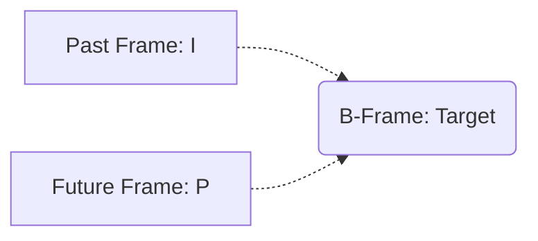
* **External Resources:** [Wikipedia - Video Frames](https://en.wikipedia.org/wiki/Video_compression_picture_types)

## Back Propagation
**[Category: Deep Learning]** | **[Hebrew: התפשטות לאחור / Back Propagation]**
* The core mathematical mechanism used to train neural networks. It calculates the error (loss) at the output layer and propagates it backward through the network's layers to update the weights of each neuron using Gradient Descent, gradually minimizing future errors.
* **Synonyms:** Backward Pass
* **Lessons Discussed In:** Lesson 27, Lesson 28, Lesson 37, Lesson 41
* **Prerequisites:** Deep Learning (DL), Gradient Descent
* **Related Items:** Gradient Descent, Perceptron
* **Application in Industry:** Enables the massive training loops behind GPT models, dictating how their billions of internal weights adjust effectively after making a mistake.
* **Example Diagram:**
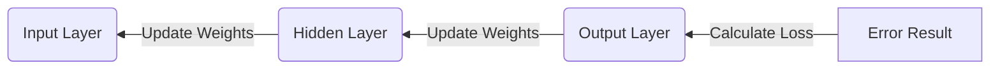
* **External Resources:** [3Blue1Brown - Backpropagation](https://www.3blue1brown.com/lessons/backpropagation)

## Batch Normalization
**[Category: Deep Learning]** | **[Hebrew: נרמול אצווה / Batch Normalization]**
* A technique used to make deep neural networks train faster and more stably by normalizing the inputs of each layer across the current "batch" of data. It mathematically centers the data to a mean of zero and standard deviation of one, reducing "internal covariate shift" and acting as a mild regularization to fight overfitting.
* **Synonyms:** BN
* **Lessons Discussed In:** Lesson 40, Lesson 41
* **Prerequisites:** Neural Networks, Z-Score Normalization
* **Related Items:** Regularization, Epoch
* **Application in Industry:** Standard practice in almost all modern CNN architectures like ResNet. It allows AI engineers to increase the learning rate for much faster training on massive cloud GPU clusters without the network destabilizing.
* **Example Snippet:**
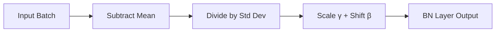
* **External Resources:** [Towards Data Science - Batch Normalization](https://towardsdatascience.com/batch-normalization-in-3-levels-of-understanding-14c2da90a338)

## Bias (Neural Network)
**[Category: Deep Learning]** | **[Hebrew: הטיה / קבוע b]**
* A constant value added to the weighted sum of inputs in each neuron before the activation function is applied. The bias allows the model to shift the activation function left or right, enabling it to fit data that doesn't pass through the origin. Together with weights, biases are the learnable parameters optimized during training.
* **Synonyms:** Offset, Intercept, b-term
* **Lessons Discussed In:** Lesson 27, Lesson 28
* **Prerequisites:** Perceptron, Activation Function
* **Related Items:** Perceptron, Activation Function, Back Propagation, Gradient Descent
* **Application in Industry:** Without bias terms, a neuron could only model functions passing through zero. The bias gives the model the flexibility needed to accurately fit real-world data where the decision boundary is not centered at the origin.
* **Example Snippet:**
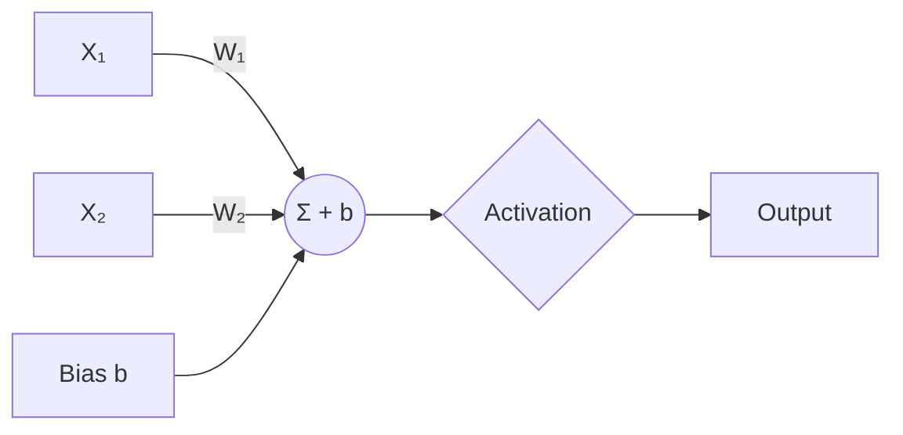
* **External Resources:** [Machine Learning Mastery - Role of Bias](https://machinelearningmastery.com/role-of-bias-in-neural-networks/)

## Binomial Distribution
**[Category: Statistics]** | **[Hebrew: התפלגות בינומית]**
* A probability distribution that summarizes the likelihood that a value will take one of two independent values under a given set of parameters. It treats events as discrete.
* **Synonyms:** Bernoulli trials
* **Lessons Discussed In:** Lesson 5
* **Prerequisites:** Probability, Histogram
* **Related Items:** Histogram, Normal Distribution, Poisson Distribution
* **Application in Industry:** A/B Testing in e-commerce to compare user conversion rates, or quality control in manufacturing (Pass/Fail testing).
* **Example Diagram:**
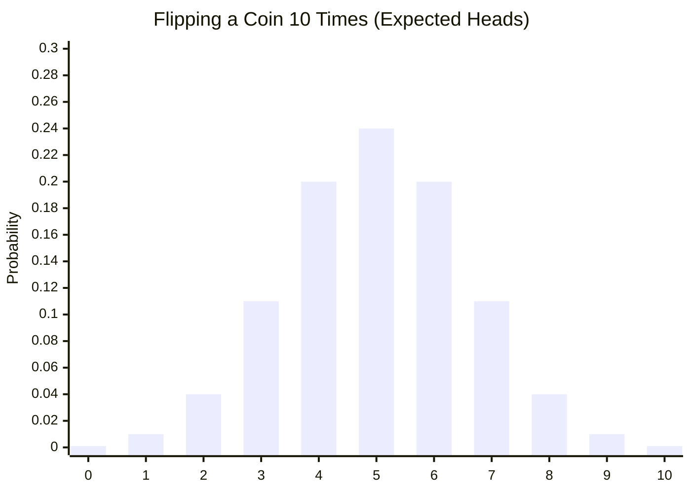
* **External Resources:** [Math Is Fun - Binomial Distribution](https://www.mathsisfun.com/data/binomial-distribution.html)

## Bit Rate
**[Category: Signal Processing]** | **[Hebrew: קצב העברת נתונים / Bit Rate]**
* The number of bits that are conveyed or processed per unit of time in a digital multimedia stream. It defines the "bandwidth pipeline" needed to smoothly transmit a video or audio file.
* **Synonyms:** Data Rate
* **Lessons Discussed In:** Lesson 35
* **Prerequisites:** None
* **Related Items:** JPEG Compression
* **Application in Industry:** Zoom meetings dynamically adjust their Bit Rate down when a user's WiFi drops, automatically lowering the video quality to prevent the call from completely disconnecting.
* **Example Snippet:**
```text
Bit Rate = 10KB (per frame) X 30 Frames X 8 bits = 2.4 Mbps
```
* **External Resources:** [Cloudflare - What is Bitrate?](https://www.cloudflare.com/learning/video/what-is-bitrate/)

## Convolution
**[Category: Image Processing]** | **[Hebrew: קונבולוציה / כפיפה]**
* A fundamental mathematical operation where a small filter (kernel) is systematically slid across an input signal or image, computing a scalar product at each position. In image processing, convolution detects specific patterns like edges, corners, or textures by measuring how well the kernel pattern matches the local region of the image.
* **Synonyms:** Filtering, Kernel Operation
* **Lessons Discussed In:** Lesson 9, Lesson 27, Lesson 38, Lesson 39, Lesson 40, Lesson 44
* **Prerequisites:** Inner Product (Dot Product), Matrix
* **Related Items:** Kernel (Filter), CNN (Convolutional Neural Network), Padding, Stride, Edge Detection
* **Application in Industry:** Every smartphone camera uses convolution for real-time image sharpening and blur effects. In CNNs, stacked convolution layers progressively detect increasingly complex features — from simple edges to complete objects.
* **Example Snippet:**
```python
import numpy as np
from scipy.signal import convolve2d
kernel = np.array([[-1, 0, 1], [-2, 0, 2], [-1, 0, 1]])  # Sobel edge detector
edges = convolve2d(image, kernel, mode='same')
```
* **Example Diagram:**
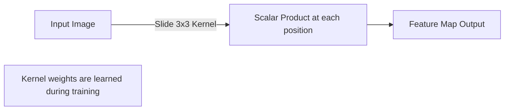
* **External Resources:** [3Blue1Brown - Convolutions](https://www.3blue1brown.com/lessons/convolutions)

## Correlation
**[Category: Statistics]** | **[Hebrew: מתאם / קורלציה]**
* A normalized statistical measure quantifying the strength and direction of the linear relationship between two variables. Its value ranges from -1 (perfect negative correlation) through 0 (no correlation) to +1 (perfect positive correlation). It is calculated by dividing the covariance by the product of both standard deviations.
* **Synonyms:** Pearson Correlation Coefficient, Linear Correlation
* **Lessons Discussed In:** Lesson 5, Lesson 9, Lesson 38
* **Prerequisites:** Variance, Standard Deviation (STD)
* **Related Items:** Covariance Matrix, Inner Product (Dot Product), Orthogonal Vectors
* **Application in Industry:** Used in financial portfolio analysis to identify stocks that move together (high positive correlation) or inversely (negative correlation), helping investors diversify their risk.
* **Example Snippet:**
```text
Correlation(A, B) = Covariance(A, B) / (STD(A) * STD(B))
Result: +1 = identical movement, 0 = no relation, -1 = opposite movement
```
* **External Resources:** [Khan Academy - Correlation Coefficient](https://www.khanacademy.org/math/statistics-probability/describing-relationships-quantitative-data/scatterplots-and-correlation/v/correlation-coefficient-intuition-examples)

## Cosine Similarity
**[Category: Linear Algebra]** | **[Hebrew: דמיון קוסינוס / Cosine Similarity]**
* A similarity metric that measures the cosine of the angle between two vectors, producing a value between -1 (opposite) and +1 (identical direction). Unlike Euclidean distance which measures magnitude, cosine similarity measures orientation, making it ideal for comparing documents or embeddings regardless of their length.
* **Synonyms:** Cosine Distance, Angular Similarity
* **Lessons Discussed In:** Lesson 17
* **Prerequisites:** Vector, Inner Product (Dot Product), Norm (Vector)
* **Related Items:** Inner Product (Dot Product), Euclidean Distance, Embedding, Vector Database (Vector DB)
* **Application in Industry:** Powers semantic search in vector databases — when searching for "affordable flights," cosine similarity finds documents about "cheap airfare" because their embedding vectors point in similar directions, even though they share no common words.
* **Example Diagram:**
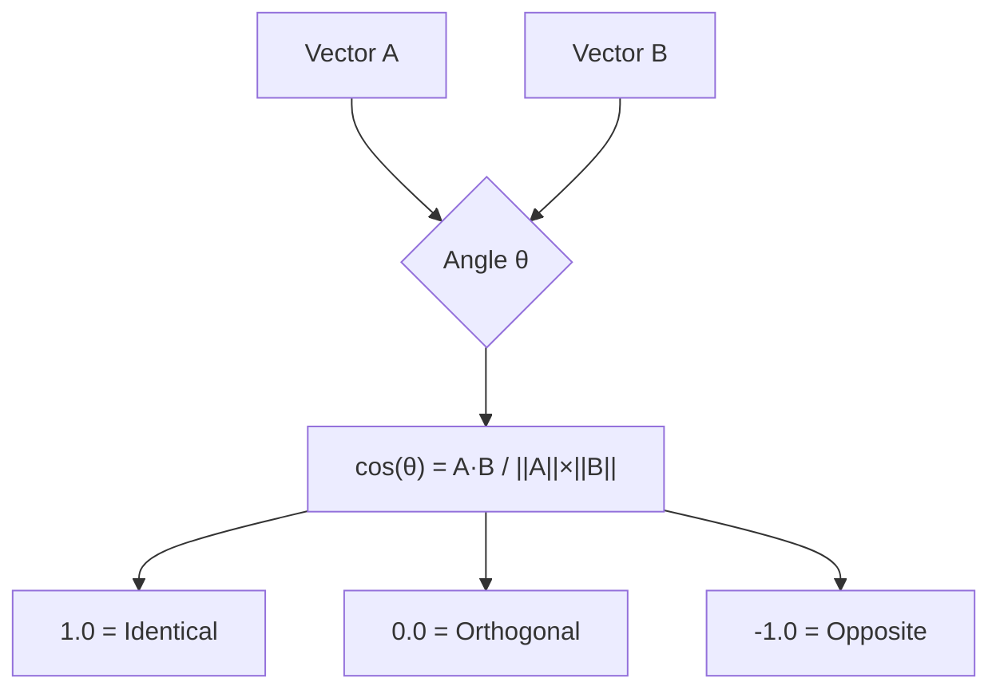
* **Example Snippet:**
```python
import numpy as np
a = np.array([1, 2, 3])
b = np.array([2, 4, 6])
cosine_sim = np.dot(a, b) / (np.linalg.norm(a) * np.linalg.norm(b))
# Returns 1.0 — identical direction (b = 2*a)
```
* **External Resources:** [Machine Learning Mastery - Cosine Similarity](https://machinelearningmastery.com/what-is-cosine-similarity/)

## Covariance Matrix
**[Category: Statistics]** | **[Hebrew: מטריצת שונות-משותפת / Covariance Matrix]**
* A square matrix that captures the variance of each feature along the diagonal and the covariance (joint variability) between every pair of features in the off-diagonal elements. It is the foundational input for PCA and LDA, revealing which features move together and which are independent.
* **Synonyms:** Variance-Covariance Matrix
* **Lessons Discussed In:** Lesson 17, Lesson 20
* **Prerequisites:** Variance, Matrix
* **Related Items:** Principal Component Analysis (PCA), Linear Discriminant Analysis (LDA), Eigenvalue & Eigenvector, Correlation
* **Application in Industry:** Used in financial risk analysis (Modern Portfolio Theory) to model how different asset returns co-move, enabling optimal portfolio construction that minimizes total risk.
* **Example Snippet:**
```python
import numpy as np
data = np.array([[1, 2], [3, 4], [5, 6]])
cov_matrix = np.cov(data.T)  # Returns 2x2 covariance matrix
```
* **External Resources:** [StatQuest - Covariance Matrix](https://statquest.org/)

## Cross Entropy
**[Category: Deep Learning]** | **[Hebrew: אנטרופיה צולבת / Cross Entropy]**
* A loss function used extensively in classification tasks that measures the difference between the predicted probability distribution and the actual ground truth distribution. In the course, it is described as converting categorical classification into a distance-based metric, where the distance between predicted and true distributions is minimized during training. It heavily penalizes confident wrong predictions, making it far more effective than MSE for classification problems.
* **Synonyms:** Log Loss, Categorical Cross Entropy
* **Lessons Discussed In:** Lesson 37
* **Prerequisites:** Softmax, Entropy
* **Related Items:** Loss Function, Softmax, Entropy, Gradient Descent
* **Application in Industry:** The standard loss function for virtually all modern image classification and NLP models. When a model predicts "Cat: 99%" but the image is actually a dog, Cross Entropy assigns an extremely high penalty, forcing rapid correction.
* **Example Snippet:**
```python
# Keras model compilation with cross entropy
model.compile(optimizer='adam',
              loss='sparse_categorical_crossentropy',
              metrics=['accuracy'])
```
* **External Resources:** [Machine Learning Mastery - Cross Entropy](https://machinelearningmastery.com/cross-entropy-for-machine-learning/)

## Centroid
**[Category: Machine Learning Algorithms]** | **[Hebrew: מרכז קבוצה / צנטרואיד]**
* The geometric center point of a cluster, calculated as the mean of all data points assigned to that cluster. In K-Means clustering, centroids are iteratively repositioned: data points are assigned to their nearest centroid, then each centroid is recalculated as the mean of its assigned points, until convergence.
* **Synonyms:** Cluster Center, Mean Point
* **Lessons Discussed In:** Lesson 11, Lesson 15
* **Prerequisites:** K-Means Clustering, Euclidean Distance
* **Related Items:** K-Means Clustering, Euclidean Distance, Vector
* **Application in Industry:** In customer segmentation, each centroid represents the "average customer" of a market segment. Marketing teams use centroid profiles to design targeted campaigns for each segment.
* **Example Snippet:**
```python
from sklearn.cluster import KMeans
kmeans = KMeans(n_clusters=3)
kmeans.fit(data)
centroids = kmeans.cluster_centers_  # 3 centroid positions
```
* **External Resources:** [Scikit-learn - K-Means](https://scikit-learn.org/stable/modules/clustering.html#k-means)

## Chain of Thought (CoT)
**[Category: Prompt Engineering]** | **[Hebrew: שרשרת מחשבה / CoT]**
* A highly effective prompt engineering technique that instructs an AI to "think step-by-step" before providing its final answer. This forces the LLM to break down complex logical or mathematical problems into intermediate cognitive chunks, massively reducing mistakes.
* **Synonyms:** Step-by-Step Prompting
* **Lessons Discussed In:** Lesson 24
* **Prerequisites:** Prompt Engineering
* **Related Items:** Prompt Engineering, Zero Shot, Few Shot Prompting
* **Application in Industry:** Crucial for building AI agents that solve coding challenges or mathematical algorithms where intermediate steps dictate the success of the outcome.
* **Example Snippet:**
```text
User: How many apples are left if John buys 10, gives half to Jane, and eats 1?
Prompt Optimization: "Let's work through this step by step."
LLM: 
1. John buys 10.
2. Half of 10 is 5. John gives 5 away, leaving 5.
3. John eats 1, leaving 4.
Answer: 4.
```
* **External Resources:** [PromptingGuide - CoT](https://www.promptingguide.ai/techniques/cot)

## Classification
**[Category: Machine Learning Fundamentals]** | **[Hebrew: סיווג / קלסיפיקציה]**
* A supervised machine learning task where the model assigns input data to one of several predefined discrete categories (classes). Unlike regression (which predicts continuous numbers), classification outputs a class label — such as "cat" vs "dog," "spam" vs "not spam," or one of 10 digit classes (0-9).
* **Synonyms:** Categorization, Labeling
* **Lessons Discussed In:** Lesson 16, Lesson 36, Lesson 37
* **Prerequisites:** Supervised Learning, Ground Truth
* **Related Items:** Regression, Confusion Matrix, Softmax, Cross Entropy, Precision, Recall
* **Application in Industry:** Email spam filtering, medical diagnosis (benign vs malignant), sentiment analysis (positive/negative reviews), image recognition (identifying objects), and credit card fraud detection. Binary classification uses Sigmoid at the output; multi-class classification uses Softmax.
* **Example Diagram:**
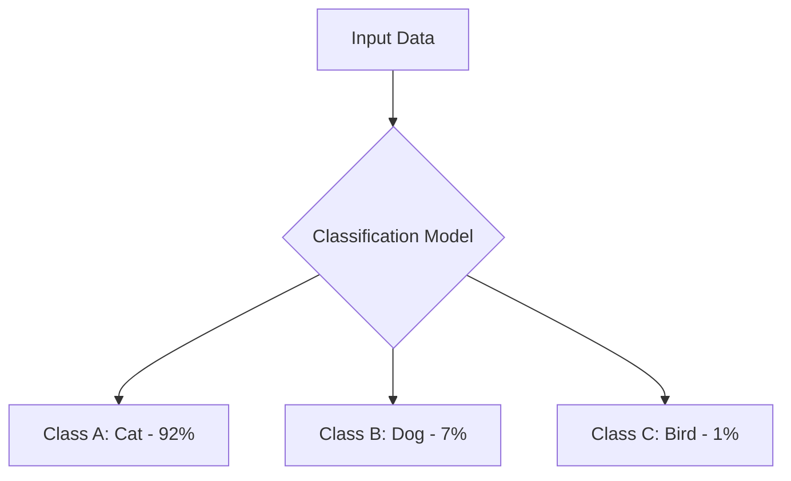
* **External Resources:** [Google ML Glossary - Classification](https://developers.google.com/machine-learning/glossary#classification)

## CNN (Convolutional Neural Network)
**[Category: Deep Learning]** | **[Hebrew: רשת נוירונים קונבולוציונית]**
* A highly specialized Deep Learning architecture uniquely designed for analyzing pixel data by preserving spatial relationships. It relies heavily on spatial filters (kernels) interacting with neighboring pixels in a grid to recognize edges, shapes, and complex objects. CNNs extract features hierarchically — early layers detect simple edges, middle layers detect textures and patterns, and deep layers detect complete objects. CNNs are highly suitable for GPU parallel processing.
* **Synonyms:** ConvNet
* **Lessons Discussed In:** Lesson 27, Lesson 38, Lesson 39, Lesson 40, Lesson 41, Lesson 44, Lesson 45
* **Prerequisites:** Deep Learning (DL)
* **Related Items:** Fully Connected Layer (MLP)
* **Application in Industry:** Used heavily in medical MRI automated diagnostics, facial recognition systems, and self-driving car camera analysis.
* **Example Diagram:**
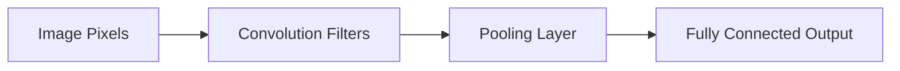
* **External Resources:** [IBM - What are CNNs?](https://www.ibm.com/topics/convolutional-neural-networks)

## Command Line Interface (CLI)
**[Category: Tools & Environments]** | **[Hebrew: ממשק שורת פקודה (CLI)]**
* A text-based interface used to interact with a computer's operating system or software by typing specific text commands instead of using graphical windows and buttons. It provides developers with powerful, direct, and automatable control over their working code environment.
* **Synonyms:** Terminal, Console, Shell
* **Lessons Discussed In:** Lesson 4
* **Prerequisites:** None
* **Related Items:** WSL, Git / GitHub
* **Application in Industry:** DevOps engineers use it for deploying cloud infrastructure (AWS/Azure CLI) and AI developers use it (e.g., Gemini/Claude CLI) to interact directly with LLMs securely and quickly.
* **Example Snippet:**
```bash
# Example CLI commands for Gemini
$ gemini
[Agent] > Create a python calculator
```
* **External Resources:** [Codecademy - Command Line Basics](https://www.codecademy.com/learn/learn-the-command-line)

## Confidence (Association Rules)
**[Category: Machine Learning Algorithms]** | **[Hebrew: מהימנות - Confidence]**
* A crucial metric in Association Rule learning that measures the likelihood or probability that a consequent item (Y) is purchased when an antecedent item (X) is already purchased. It is calculated as the Support of (X and Y) divided by the Support of (X).
* **Synonyms:** Conditional Probability, Rule Accuracy
* **Lessons Discussed In:** Lesson 10
* **Prerequisites:** Apriori Algorithm, Support (Association Rules)
* **Related Items:** Lift (Association Rules), Apriori Algorithm
* **Application in Industry:** Used in marketing to determine cross-selling campaigns (e.g. if 80% of customers buying a car also buy insurance, campaigns will immediately offer insurance post-sale).
* **Example Diagram:**
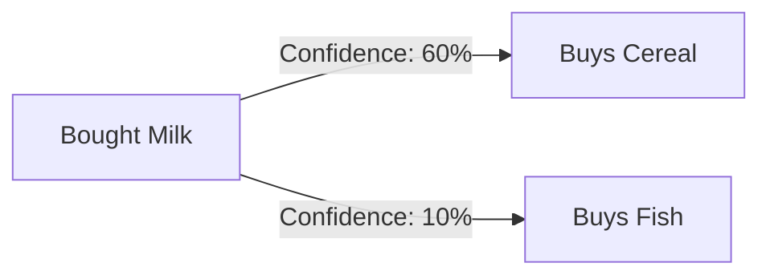
* **External Resources:** [Wikipedia - Association Rule Learning](https://en.wikipedia.org/wiki/Association_rule_learning)

## Confidence Score
**[Category: Computer Vision]** | **[Hebrew: ציון ביטחון / Confidence Score]**
* A probability value (0 to 1) output by an object detection model indicating how confident it is that a detected bounding box contains a valid object of the predicted class. Detections with confidence scores below a set threshold are discarded, and Non-Max Suppression uses these scores to select the best box among overlapping detections.
* **Synonyms:** Detection Confidence, Objectness Score, Pc
* **Lessons Discussed In:** Lesson 45, Lesson 46
* **Prerequisites:** YOLO (You Only Look Once), Bounding Box
* **Related Items:** YOLO (You Only Look Once), Non-Max Suppression, Bounding Box, Precision
* **Application in Industry:** Self-driving cars set high confidence thresholds (e.g., 0.8) for pedestrian detection to minimize false positives, while security cameras might use lower thresholds (0.5) to avoid missing intruders, accepting more false alarms.
* **Example Snippet:**
```text
YOLO Output per grid cell:
[X, Y, W, H, Confidence=0.92, Class="Person"]
If threshold = 0.80 → Keep detection (0.92 > 0.80)
If threshold = 0.95 → Discard detection (0.92 < 0.95)
```
* **External Resources:** [Ultralytics - YOLO Confidence](https://docs.ultralytics.com/)

## Confusion Matrix
**[Category: Model Evaluation]** | **[Hebrew: מטריצת בלבול]**
* A critical performance measurement tool for machine learning classification problems, represented as a table layout. It cleanly visualizes exactly where the AI algorithm is getting "confused" by specifically plotting the True Positives, True Negatives, False Positives, and False Negatives.
* **Synonyms:** Error Matrix
* **Lessons Discussed In:** Lesson 6, Lesson 36, Lesson 37
* **Prerequisites:** Supervised Learning
* **Related Items:** Ground Truth
* **Application in Industry:** Used heavily in medical AI diagnostics to understand if the model is producing too many "False Positives" (scaring healthy patients) or "False Negatives" (missing sick patients).
* **Example Snippet:**
```text
            Predicted: Dog  |  Predicted: Cat
Actual: Dog       50 (TP)          5 (FN)
Actual: Cat       2 (FP)           40 (TN)
```
* **External Resources:** [Machine Learning Mastery - Confusion Matrix](https://machinelearningmastery.com/confusion-matrix-machine-learning/)

## Context Window
**[Category: Large Language Models (LLM)]** | **[Hebrew: חלון הקשר (CW)]**
* The maximum amount of text (measured in tokens) an AI model can process and "remember" at any one time during a conversation. When a session exceeds this memory limit, the model starts forgetting the earliest parts of the conversation.
* **Synonyms:** Token Limit, Memory Context
* **Lessons Discussed In:** Lesson 14, Lesson 22
* **Prerequisites:** Large Language Model (LLM), Token
* **Related Items:** Vector DB, RAG (Retrieval-Augmented Generation)
* **Application in Industry:** Used to determine how large a prompt can be fed into an LLM. For instance, Gemini 1.5 has a 2-million token context window, allowing entire books to be analyzed in a single prompt.
* **Example Diagram:**
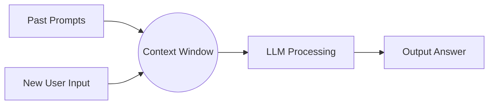
* **External Resources:** [Anthropic - Context Windows](https://www.anthropic.com/)

## Cumulative Distribution Function (CDF)
**[Category: Statistics]** | **[Hebrew: פונקציית התפלגות מצטברת / CDF]**
* A mathematical function used in statistics that describes the probability that a continuous variable will take a value less than or equal to a specific boundary number. It essentially calculates the total accumulated probability up to a given point on a mathematical curve.
* **Synonyms:** Cumulative distribution curve
* **Lessons Discussed In:** Lesson 5
* **Prerequisites:** Histogram, Probability Density Function (PDF)
* **Related Items:** Probability Density Function (PDF), Normal Distribution
* **Application in Industry:** Financial risk management to calculate the probability that losses will not exceed a certain amount (Value at Risk).
* **Example Diagram:**
```mermaid
graph LR
    A(Probability < x) --> B((CDF))
    B --> C{Result between 0 and 1}
```
* **External Resources:** [Wikipedia - CDF](https://en.wikipedia.org/wiki/Cumulative_distribution_function)

## Curse of Dimensionality
**[Category: Machine Learning Mathematics]** | **[Hebrew: קללת המימדים]**
* A phenomenon where adding more features (dimensions) to a dataset exponentially increases the volume of the data space, making the available data points increasingly sparse. As dimensions grow, distance metrics become less meaningful, algorithms need exponentially more training samples, and models become prone to overfitting.
* **Synonyms:** Dimensionality Problem, High-Dimensional Sparsity
* **Lessons Discussed In:** Lesson 17
* **Prerequisites:** Feature, Dataset, Euclidean Distance
* **Related Items:** Principal Component Analysis (PCA), t-SNE, Feature Extraction
* **Application in Industry:** A rule of thumb: you need at least 30 samples per feature dimension. With 100 features, you need 3,000+ samples. PCA and feature selection are used to reduce dimensions before training, combating this curse.
* **Example Snippet:**
```text
1D: 10 samples covers the space well
2D: Need 10² = 100 samples for same coverage
10D: Need 10¹⁰ = 10 billion samples!
Solution: Reduce dimensions with PCA before training
```
* **External Resources:** [Towards Data Science - Curse of Dimensionality](https://towardsdatascience.com/the-curse-of-dimensionality-50dc6e49aa1e)

## Darknet
**[Category: Tools & Environments]** | **[Hebrew: מסגרת Darknet ל-YOLO]**
* An open-source neural network framework written in C and CUDA, originally designed as the backbone for training and running YOLO object detection models. It is lightweight, fast, and optimized for GPU processing, making it ideal for real-time computer vision applications.
* **Synonyms:** Darknet Framework
* **Lessons Discussed In:** Lesson 42
* **Prerequisites:** CNN (Convolutional Neural Network), YOLO (You Only Look Once)
* **Related Items:** YOLO (You Only Look Once), Object Detection, PyTorch
* **Application in Industry:** Used in edge computing deployments where YOLO models need to run on embedded devices with limited resources. Modern YOLO versions (v5+) have migrated to PyTorch, but Darknet remains relevant for legacy deployments.
* **External Resources:** [Darknet - YOLO](https://pjreddie.com/darknet/yolo/)

## Data Imbalance
**[Category: Data Preprocessing]** | **[Hebrew: חוסר איזון בנתונים / Data Imbalance]**
* A common dataset problem where one class has significantly more samples than another (e.g., 95% healthy vs. 5% sick patients). This causes models to be biased toward predicting the majority class, achieving high accuracy while completely failing to detect the minority class that is often the most important.
* **Synonyms:** Class Imbalance, Imbalanced Dataset
* **Lessons Discussed In:** Lesson 18, Lesson 37
* **Prerequisites:** Dataset, Classification
* **Related Items:** Augmentation (Data), Recall, Precision, F1-Score
* **Application in Industry:** Critical in fraud detection (99.9% legitimate vs. 0.1% fraud) and medical diagnosis. Solutions include oversampling the minority class (SMOTE), undersampling the majority, adjusting class weights, or using evaluation metrics (F1, Recall) instead of accuracy.
* **Example Snippet:**
```python
# Handling imbalance with class weights in Keras
model.fit(x_train, y_train,
          class_weight={0: 1.0, 1: 10.0})  # 10x weight for minority class
```
* **External Resources:** [Machine Learning Mastery - Imbalanced Classification](https://machinelearningmastery.com/what-is-imbalanced-classification/)

## DCT (Discrete Cosine Transform)
**[Category: Signal Processing]** | **[Hebrew: התמרת קוסינוס בדידה / DCT]**
* A mathematical transformation that converts spatial image data into frequency components using cosine functions. It is the core mathematical operation in JPEG compression — decomposing each 8×8 pixel block into a sum of cosine waves at different frequencies, allowing high-frequency (imperceptible) components to be discarded for compression.
* **Synonyms:** Discrete Cosine Transform
* **Lessons Discussed In:** Lesson 33
* **Prerequisites:** Fourier Transform (FFT), Spatial Frequency
* **Related Items:** JPEG Compression, Fourier Transform (FFT), Macro Block, Huffman Coding
* **Application in Industry:** The mathematical engine behind JPEG, MPEG video, and MP3 audio compression. Every digital photo, streaming video, and music file on the internet relies on DCT for data reduction.
* **Example Snippet:**
```python
import cv2, numpy as np
# Apply DCT to an 8x8 block (core of JPEG)
block = image[0:8, 0:8].astype(np.float32)
dct_block = cv2.dct(block)
# High-frequency components (bottom-right) can be zeroed for compression
```
* **External Resources:** [Wikipedia - Discrete Cosine Transform](https://en.wikipedia.org/wiki/Discrete_cosine_transform)

## Dataset
**[Category: Machine Learning Fundamentals]** | **[Hebrew: מערך נתונים / דאטה-סט]**
* A structured collection of data, often organized in a table format, where rows represent individual sample records and columns represent categorical or numerical features. It serves as the core foundational information used to train, test, and evaluate machine learning models.
* **Synonyms:** Data Frame, Corpus
* **Lessons Discussed In:** Lesson 3
* **Prerequisites:** None
* **Related Items:** Feature, Ground Truth, Machine Learning (ML)
* **Application in Industry:** Used extensively by Data Scientists in Pandas (Python) to train machine learning models and discover business insights from consumer behavior history.
* **Example:**
| ID | Age | Weight | [Target] Disease |
|---|---|---|---|
| 1 | 25 | 70kg | No |
| 2 | 45 | 90kg | Yes |
* **External Resources:** [Kaggle Datasets](https://www.kaggle.com/datasets)

## Decimation (Image)
**[Category: Image Processing]** | **[Hebrew: דסימציה / דילול פיקסלים]**
* An image processing technique that drastically reduces image resolution by combining groups of neighboring pixels into single representative pixels (Downsampling). This mathematically shrinks the image to save compute power during analysis.
* **Synonyms:** Downsampling, Subsampling
* **Lessons Discussed In:** Lesson 33
* **Prerequisites:** None
* **Related Items:** CNN (Convolutional Neural Network)
* **Application in Industry:** Used strategically in automated security cameras to recognize movement faster. Lowering the resolution means fewer pixels to calculate, increasing the system's processing speed without missing large moving objects.
* **Example Diagram:**
```mermaid
graph TD
    A[16x16 Raw Image Frame] --> B{Decimation Engine}
    B --> C[4x4 Downsampled Frame]
```
* **External Resources:** [MathWorks - Decimation](https://www.mathworks.com/help/signal/ref/decimate.html)

## Deep Learning (DL)
**[Category: Artificial Intelligence Domains]** | **[Hebrew: למידה עמוקה / DL]**
* An advanced subset of Machine Learning that essentially uses massive, multi-layered Artificial Neural Networks to independently extract abstract features from vast quantities of unlabeled data. It scales incredibly well with data compared to traditional Machine Learning.
* **Synonyms:** Neural Learning, Multi-Layer Perceptron Networks
* **Lessons Discussed In:** Lesson 27, Lesson 28, Lesson 29, Lesson 36, Lesson 37, Lesson 38
* **Prerequisites:** Machine Learning (ML), Dataset
* **Related Items:** Perceptron, CNN (Convolutional Neural Network)
* **Application in Industry:** It powers the entirety of modern visual recognition, ChatGPT, audio transcriptions, and complex multi-modal AI systems due to its ability to scale infinitely with GPU compute.
* **Example Diagram:**
```mermaid
graph LR
    A[Inputs] --> B(Hidden Layer 1)
    B --> C(Hidden Layer 2)
    C --> D(Hidden Layer 3)
    D --> E[Outputs]
```
* **External Resources:** [IBM - Deep Learning](https://www.ibm.com/topics/deep-learning)

## Determinant
**[Category: Linear Algebra]** | **[Hebrew: דטרמיננטה]**
* A scalar value computed from a square matrix that encodes important geometric and algebraic properties. A determinant of zero means the matrix is singular (non-invertible) and the data is linearly dependent. In PCA, determinants are used to solve the characteristic equation for finding eigenvalues and eigenvectors.
* **Synonyms:** det(A), Matrix Determinant
* **Lessons Discussed In:** Lesson 17
* **Prerequisites:** Matrix, Eigenvalue & Eigenvector
* **Related Items:** Matrix, Eigenvalue & Eigenvector, Principal Component Analysis (PCA)
* **Application in Industry:** Used in PCA computations to find the principal components of high-dimensional data. The characteristic equation det(A - λI) = 0 is solved to find eigenvalues, which determine the importance of each principal component.
* **Example Snippet:**
```python
import numpy as np
A = np.array([[4, 2], [1, 3]])
det = np.linalg.det(A)  # Returns 10.0
# det ≠ 0 → matrix is invertible, data is independent
```
* **External Resources:** [Khan Academy - Determinant](https://www.khanacademy.org/math/linear-algebra/matrix-transformations/inverse-of-matrices/v/linear-algebra-deriving-a-method-for-determining-inverses)

## Dropout
**[Category: Deep Learning]** | **[Hebrew: השמטה אקראית / Dropout]**
* A powerful regularization technique used specifically to prevent Neural Networks from memorizing datasets (Overfitting). During the training phase, it randomly "turns off" or ignores a set percentage of neurons in a layer, forcing the remaining active neurons to work harder and learn independent features. The dropped neurons change randomly each batch, making the network more resilient and dynamic. In the course, Dr. Segal describes dropout as making the network more robust by preventing any single neuron from becoming overly specialized.
* **Synonyms:** Node Deactivation
* **Lessons Discussed In:** Lesson 36, Lesson 40
* **Prerequisites:** Deep Learning (DL)
* **Related Items:** Overfitting, Early Stopping
* **Application in Industry:** A standard default setting in practically all Deep Learning vision and language models (like PyTorch / Keras) ensuring models are resilient and generalize well to completely new data.
* **Example Diagram:**
```mermaid
graph TD
    A[Input Features] --> B[Neuron: Active]
    A --> C[Neuron: Dropped Out]
    A --> D[Neuron: Active]
    B --> E[Output]
    D --> E
```
* **External Resources:** [Keras - Dropout Layer](https://keras.io/api/layers/regularization_layers/dropout/)

## Edge Detection
**[Category: Image Processing]** | **[Hebrew: זיהוי קצוות / Edge Detection]**
* An image processing technique that identifies boundaries and sharp transitions in pixel intensity within an image. It uses directional kernels (such as Sobel or Canny filters) to highlight where rapid changes occur, revealing the structural outlines of objects.
* **Synonyms:** Boundary Detection, Contour Detection
* **Lessons Discussed In:** Lesson 32, Lesson 38
* **Prerequisites:** Convolution, Kernel (Filter)
* **Related Items:** Convolution, Kernel (Filter), Spatial Frequency, CNN (Convolutional Neural Network)
* **Application in Industry:** Used as the first processing step in autonomous vehicle vision systems to detect lane markings, road boundaries, and obstacle outlines from raw camera feeds.
* **Example Snippet:**
```python
import cv2
edges = cv2.Canny(image, threshold1=100, threshold2=200)
```
* **External Resources:** [OpenCV - Canny Edge Detection](https://docs.opencv.org/4.x/da/d22/tutorial_py_canny.html)

## Eigenvalue & Eigenvector
**[Category: Linear Algebra]** | **[Hebrew: ערך עצמי ווקטור עצמי]**
* An eigenvector of a matrix is a special non-zero vector that, when the matrix transformation is applied to it, only changes in scale (stretched or shrunk) but not in direction. The eigenvalue is the scalar factor by which the eigenvector is scaled. Together, they reveal the principal axes of variance in a dataset.
* **Synonyms:** Characteristic Vector, Characteristic Value
* **Lessons Discussed In:** Lesson 17, Lesson 20
* **Prerequisites:** Matrix, Vector
* **Related Items:** Principal Component Analysis (PCA), Covariance Matrix, Linear Discriminant Analysis (LDA)
* **Application in Industry:** PCA uses eigenvectors of the covariance matrix to find the directions of maximum variance in data, and eigenvalues indicate how much variance each direction captures — enabling dimensionality reduction from thousands of features to just a handful.
* **Example Snippet:**
```python
import numpy as np
cov_matrix = np.cov(data.T)
eigenvalues, eigenvectors = np.linalg.eig(cov_matrix)
```
* **External Resources:** [3Blue1Brown - Eigenvectors and Eigenvalues](https://www.3blue1brown.com/lessons/eigenvalues)

## EfficientNet
**[Category: Deep Learning]** | **[Hebrew: רשת EfficientNet יעילה]**
* A family of CNN architectures that systematically scales network width, depth, and input resolution simultaneously using a compound scaling method. EfficientNet achieves state-of-the-art accuracy with far fewer parameters than competing architectures, making it highly efficient for both training and inference.
* **Synonyms:** EfficientNet-B0 through B7
* **Lessons Discussed In:** Lesson 44
* **Prerequisites:** CNN (Convolutional Neural Network), Transfer Learning
* **Related Items:** ResNet (Residual Network), MobileNet, VGGNet, Transfer Learning
* **Application in Industry:** Deployed in mobile and edge AI applications where computational budget is limited but high accuracy is required. EfficientNet-B7 achieves ImageNet accuracy comparable to much larger models at a fraction of the computational cost.
* **External Resources:** [Papers With Code - EfficientNet](https://paperswithcode.com/method/efficientnet)

## ELBO (Evidence Lower Bound)
**[Category: Deep Learning]** | **[Hebrew: חסם תחתון לראיה / ELBO]**
* The objective function optimized during training of Variational Auto Encoders (VAE). ELBO combines two terms: a reconstruction loss (how well the decoder recreates the input) and a KL divergence penalty (how closely the latent distribution matches a target Gaussian). Maximizing ELBO simultaneously improves reconstruction quality and regularizes the latent space.
* **Synonyms:** Variational Lower Bound
* **Lessons Discussed In:** Lesson 44
* **Prerequisites:** VAE (Variational Auto Encoder), KL Divergence
* **Related Items:** VAE (Variational Auto Encoder), KL Divergence, Loss Function, Auto Encoder
* **Application in Industry:** Critical for training generative models that produce realistic synthetic data. In drug discovery, VAEs optimized with ELBO generate novel molecular structures that are chemically valid and potentially therapeutic.
* **Example Snippet:**
```text
ELBO = Reconstruction Loss + KL Divergence
     = E[log P(x|z)] - KL(Q(z|x) || P(z))
Maximize ELBO → Better reconstruction + Regularized latent space
```
* **External Resources:** [Towards Data Science - Understanding VAE ELBO](https://towardsdatascience.com/understanding-variational-autoencoders-vaes-f70510919f73)

## Embedding
**[Category: Large Language Models (LLM)]** | **[Hebrew: שיכון / Embedding]**
* The process of converting discrete data (like words, sentences, or images) into dense, continuous numerical vectors in a high-dimensional space. Semantically similar items are mapped to nearby points in this vector space, enabling mathematical operations on meaning.
* **Synonyms:** Vector Embedding, Dense Representation
* **Lessons Discussed In:** Lesson 14, Lesson 17
* **Prerequisites:** Vector, Token
* **Related Items:** Vector Database (Vector DB), Retrieval-Augmented Generation (RAG), Token
* **Application in Industry:** Powers semantic search engines: when a user searches "cheap flights to Paris," the embedding maps it near "affordable airfare to France" even though the words are completely different, because their meaning vectors are close.
* **Example Diagram:**
```mermaid
graph LR
    A["King"] --> B[0.2, 0.8, -0.1, ...]
    C["Queen"] --> D[0.2, 0.7, -0.1, ...]
    E["Car"] --> F[-0.5, 0.1, 0.9, ...]
```
* **External Resources:** [Google - Word Embeddings](https://developers.google.com/machine-learning/crash-course/embeddings/video-lecture)

## Entropy
**[Category: Statistics]** | **[Hebrew: אנטרופיה / מידת אי-ודאות]**
* A mathematical measure of uncertainty or randomness in a probability distribution. When entropy is 0, there is complete certainty (probability of 1 for one outcome). When entropy is maximal (1 for binary), the distribution is perfectly uniform — maximum uncertainty. It quantifies how many bits are needed to encode the information.
* **Synonyms:** Information Entropy, Shannon Entropy
* **Lessons Discussed In:** Lesson 5, Lesson 36
* **Prerequisites:** Probability, Histogram
* **Related Items:** Cross Entropy, KL Divergence, Loss Function
* **Application in Industry:** Decision tree algorithms (like Random Forest) use entropy to determine which feature provides the most "information gain" at each split, choosing the feature that most effectively reduces uncertainty about the target class.
* **Example Snippet:**
```text
H(X) = -Σ P(x) * log₂(P(x))
Fair coin: H = -[0.5*log₂(0.5) + 0.5*log₂(0.5)] = 1 bit (max uncertainty)
Loaded coin (always heads): H = -[1*log₂(1)] = 0 bits (no uncertainty)
```
* **External Resources:** [Khan Academy - Information Entropy](https://www.khanacademy.org/computing/computer-science/informationtheory/moderninfotheory/v/information-entropy)

## Euclidean Distance
**[Category: Linear Algebra]** | **[Hebrew: מרחק אוקלידי]**
* The straight-line distance between two points in multi-dimensional space, calculated using the Pythagorean theorem generalized to N dimensions. It is the most commonly used distance metric in machine learning for measuring similarity between data points.
* **Synonyms:** L2 Distance, Straight-Line Distance
* **Lessons Discussed In:** Lesson 11, Lesson 16
* **Prerequisites:** Vector, Scalar
* **Related Items:** K-Nearest Neighbors (KNN), K-Means Clustering, Norm (Vector)
* **Application in Industry:** Used by KNN classifiers and K-Means clustering to determine which data points are "closest" to each other. In recommendation systems, items with small Euclidean distances in embedding space are considered similar.
* **Example Snippet:**
```python
import numpy as np
point_a = np.array([1, 2, 3])
point_b = np.array([4, 5, 6])
distance = np.linalg.norm(point_a - point_b)  # Returns 5.196
```
* **External Resources:** [Math Is Fun - Pythagorean Theorem in N Dimensions](https://www.mathsisfun.com/algebra/distance-2-points.html)

## Early Stopping
**[Category: Deep Learning]** | **[Hebrew: עצירה מוקדמת]**
* A critical regularization technique that automatically halts a neural network's training phase the exact moment it detects that the model's performance on the validation dataset has stopped improving, preventing it from spiraling into Overfitting.
* **Synonyms:** Training Cutoff
* **Lessons Discussed In:** Lesson 29, Lesson 37, Lesson 40
* **Prerequisites:** Deep Learning (DL), Overfitting
* **Related Items:** Gradient Descent
* **Application in Industry:** Saves enterprise data scientists tens of thousands of dollars in wasted cloud GPU hours by terminating model training automatically when the algorithm reaches its peak effectiveness.
* **Example Diagram:**
```mermaid
graph TD
    A[Monitor Validation Loss] --> B{Did Error Increase?}
    B -->|Yes for N Epochs| C[Stop Training!]
    B -->|No| D[Continue Training]
```
* **External Resources:** [Machine Learning Mastery - Early Stopping](https://machinelearningmastery.com/early-stopping-to-avoid-overtraining-neural-network-models/)

## Epoch
**[Category: Machine Learning Fundamentals]** | **[Hebrew: תקופת אימון מלאה / Epoch]**
* One complete pass of the Model training algorithm directly over the entire chosen training dataset. Deep learning networks are generally trained through hundreds or thousands of epochs so the internal weight parameters can gradually settle into minimum loss states.
* **Synonyms:** Training Iteration, Cycle
* **Lessons Discussed In:** Lesson 36, Lesson 37, Lesson 40
* **Prerequisites:** Dataset
* **Related Items:** Early Stopping, Gradient Descent
* **Application in Industry:** AI researchers monitor the Epoch vs. Validation Loss graph actively. When a massive 175-billion parameter model is training, knowing exactly how many Epochs it takes to "converge" equals millions of dollars in compute savings.
* **Example Snippet:**
```python
# Keras configuration
model.fit(x_train, y_train, epochs=300, batch_size=32)
```
* **External Resources:** [Machine Learning Mastery - Epoch vs Batch](https://machinelearningmastery.com/difference-between-a-batch-and-an-epoch/)

## F1-Score
**[Category: Model Evaluation]** | **[Hebrew: מדד הרמוני / F1-Score]**
* A consolidated performance metric combining 'Precision' and 'Recall' into a single, balanced harmonic mean. It is especially vital when evaluating datasets with highly imbalanced class distributions, providing a far more realistic evaluation than simple Accuracy.
* **Synonyms:** Harmonic Mean of Precision and Recall
* **Lessons Discussed In:** Lesson 36, Lesson 37, Lesson 46
* **Prerequisites:** Precision, Recall
* **Related Items:** Precision, Recall, Confusion Matrix
* **Application in Industry:** Used exclusively when scoring "Spam Filters." You want to catch spam (Recall), but you absolutely don't want to throw away real emails (Precision). F1-Score perfectly balances this dangerous trade-off.
* **Example Snippet:**
```text
F1 = 2 * (Precision * Recall) / (Precision + Recall)
```
* **External Resources:** [Scikit-Learn - F1 Score](https://scikit-learn.org/stable/modules/generated/sklearn.metrics.f1_score.html)

## Feature
**[Category: Machine Learning Fundamentals]** | **[Hebrew: עמודה / פיצ'ר / תכונה]**
* An individual, measurable property or attribute of the phenomenon being observed. In the course, features are described as the columns in a dataset table. The number of features determines the dimensionality of the problem and the number of input neurons in a neural network. CNNs progressively extract features from simple (edges) to complex (complete objects) through their layered architecture. In machine learning datasets, features act as the specific variables (e.g., a patient's height or weight) that the model analyzes to make future predictions.
* **Synonyms:** Attribute, Input Variable, Predictor, Dimension
* **Lessons Discussed In:** Lesson 3
* **Prerequisites:** Dataset
* **Related Items:** Dataset, Principal Component Analysis (PCA), Feature Extraction
* **Application in Industry:** Used in real-estate pricing algorithms, where "number of bedrooms" and "square footage" act as the exact features predicting the house price.
* **Example Diagram:**
```mermaid
pie title Importance of Features in Predicting House Prices
    "Square Footage" : 60
    "Location" : 30
    "Num Bedrooms" : 10
```
* **External Resources:** [Machine Learning Mastery - Feature Selection](https://machinelearningmastery.com/an-introduction-to-feature-selection/)

## Feature Extraction
**[Category: Machine Learning Fundamentals]** | **[Hebrew: חילוץ תכונות / Feature Extraction]**
* The process of transforming raw data into a reduced set of meaningful numerical features that can be effectively used by machine learning models. In deep learning, convolutional layers automatically extract hierarchical features — from simple edges in early layers to complex shapes and objects in deeper layers.
* **Synonyms:** Feature Engineering, Representation Learning
* **Lessons Discussed In:** Lesson 32, Lesson 40, Lesson 41
* **Prerequisites:** Feature, CNN (Convolutional Neural Network)
* **Related Items:** Feature Map, Transfer Learning, Principal Component Analysis (PCA)
* **Application in Industry:** In Transfer Learning, pre-trained models like ResNet are used as automatic feature extractors — their convolutional layers have already learned to detect universal visual features (edges, textures, shapes), saving months of training time.
* **Example Diagram:**
```mermaid
graph LR
    A[Raw Image] --> B[Layer 1: Edges]
    B --> C[Layer 2: Textures]
    C --> D[Layer 3: Parts]
    D --> E[Layer 4: Objects]
```
* **External Resources:** [Machine Learning Mastery - Feature Extraction](https://machinelearningmastery.com/deep-learning-for-feature-extraction/)

## Feature Map
**[Category: Deep Learning]** | **[Hebrew: מפת תכונות / Feature Map]**
* The output produced by applying a single convolutional kernel to an input image or to the output of a previous layer. Each feature map highlights where a specific pattern (edge, corner, texture) was detected in the input. A convolutional layer with 32 kernels produces 32 separate feature maps, collectively called "channels."
* **Synonyms:** Activation Map, Channel Output
* **Lessons Discussed In:** Lesson 38, Lesson 41
* **Prerequisites:** Convolution, Kernel (Filter)
* **Related Items:** Convolution, CNN (Convolutional Neural Network), Kernel (Filter), Max Pooling
* **Application in Industry:** Visualizing feature maps in medical AI reveals exactly which regions of an X-ray the model is focusing on, providing interpretability and trust for radiologists reviewing AI-assisted diagnoses.
* **Example Diagram:**
```mermaid
graph LR
    A[Input Image] -->|Kernel 1| B[Feature Map 1: Horizontal Edges]
    A -->|Kernel 2| C[Feature Map 2: Vertical Edges]
    A -->|Kernel 3| D[Feature Map 3: Diagonal Edges]
```
* **External Resources:** [Machine Learning Mastery - Feature Maps](https://machinelearningmastery.com/how-to-visualize-filters-and-feature-maps-in-convolutional-neural-networks/)

## Few Shot Prompting
**[Category: Prompt Engineering]** | **[Hebrew: פרומפטינג עם מספר דוגמאות / Few Shot]**
* A prompt engineering strategy where an LLM is given 2 to 5 concrete examples (demonstrations) of the desired task directly within the prompt itself. This massively helps the model map out the strict structural formatting expected for its response.
* **Synonyms:** In-Context Learning (ICL)
* **Lessons Discussed In:** Lesson 24
* **Prerequisites:** Prompt Engineering
* **Related Items:** Prompt Engineering, Chain of Thought (CoT)
* **Application in Industry:** Used intensely by AI developer agents that need LLMs to return custom JSON payloads in a very exact object structure without hallucinating new dictionary keys.
* **Example Snippet:**
```text
Prompt: 
Translate English to French.
Boy => Garçon
Cat => Chat
Sun => 
```
* **External Resources:** [PromptingGuide - Few-Shot](https://www.promptingguide.ai/techniques/fewshot)

## FFMPEG
**[Category: Tools & Environments]** | **[Hebrew: כלי FFMPEG לעיבוד וידאו]**
* A powerful open-source command-line tool for recording, converting, streaming, and processing audio and video files. It supports virtually every codec and container format, making it the industry-standard Swiss Army knife for multimedia manipulation, from format conversion to video compression analysis.
* **Synonyms:** Fast Forward MPEG
* **Lessons Discussed In:** Lesson 35
* **Prerequisites:** Bit Rate, JPEG Compression
* **Related Items:** Group of Pictures (GOP), I-Frame, B-Frame (Bi-directional Frame), Motion Vector
* **Application in Industry:** Used by YouTube, Netflix, and Twitch for server-side video transcoding. AI researchers use it to extract frames from video datasets, adjust compression parameters, and prepare training data for video analysis models.
* **Example Snippet:**
```bash
# Extract frames from video as JPEG images
ffmpeg -i video.mp4 -r 30 frames/frame_%04d.jpg
# Convert video codec
ffmpeg -i input.avi -c:v h264 -crf 23 output.mp4
```
* **External Resources:** [FFMPEG Documentation](https://ffmpeg.org/documentation.html)

## Fine-Tuning
**[Category: Deep Learning]** | **[Hebrew: כוונון עדין / Fine-Tuning]**
* The process of taking a pre-trained neural network model and continuing its training on a new, smaller, domain-specific dataset. Typically, the early convolutional layers are 'frozen' (their weights are locked) while only the later classification layers are retrained, adapting the model to a specialized task with minimal data.
* **Synonyms:** Model Adaptation, Domain Adaptation
* **Lessons Discussed In:** Lesson 41
* **Prerequisites:** Transfer Learning, CNN (Convolutional Neural Network)
* **Related Items:** Transfer Learning, ResNet, VGGNet, Epoch
* **Application in Industry:** A hospital takes a ResNet model pre-trained on millions of general images, freezes its feature-extraction layers, and fine-tunes only the final layers on 500 labeled tumor scans — achieving expert-level accuracy in days instead of months.
* **Example Snippet:**
```python
# Freeze all layers except the last 5
for layer in base_model.layers[:-5]:
    layer.trainable = False
# Retrain on new domain data
model.fit(medical_images, labels, epochs=20)
```
* **External Resources:** [Keras - Transfer Learning & Fine-Tuning](https://keras.io/guides/transfer_learning/)

## Flatten
**[Category: Deep Learning]** | **[Hebrew: השטחה / Flatten]**
* A vital structural data manipulation step used right before feeding multi-dimensional data (like 2D images or 3D tensors) into a standard 1D Artificial Neural Network. It unrolls the grid of pixels into a single, long sequence of numbers (a vector).
* **Synonyms:** Unrolling, 1D Reshape
* **Lessons Discussed In:** Lesson 36, Lesson 40, Lesson 41
* **Prerequisites:** Tensor, Vector
* **Related Items:** CNN (Convolutional Neural Network), Fully Connected Layer (MLP)
* **Application in Industry:** Acts as the required "bridge" connecting the outputs of a structural CNN visual search into the flat Dense logical classification layers that decide "Is this a dog?"
* **Example Diagram:**
```mermaid
graph LR
    A[2x2 Image Grid] --> B((Flatten Engine))
    B --> C[1x4 Vector Array]
```
* **External Resources:** [Keras - Flatten Layer](https://keras.io/api/layers/reshaping_layers/flatten/)

## Forward Propagation
**[Category: Deep Learning]** | **[Hebrew: התפשטות קדימה / Forward Pass]**
* The process of passing input data sequentially through all layers of a neural network — from the input layer through hidden layers to the output layer — to produce a prediction. Each layer applies its weights, biases, and activation functions to transform the data. Forward propagation generates the prediction; Back Propagation then calculates the error gradient for weight updates.
* **Synonyms:** Forward Pass, Inference Pass
* **Lessons Discussed In:** Lesson 36, Lesson 41
* **Prerequisites:** Perceptron, Activation Function
* **Related Items:** Back Propagation, Loss Function, Activation Function, Bias (Neural Network)
* **Application in Industry:** During training, forward propagation is followed by back propagation in each iteration. During deployment (inference), only forward propagation runs — making inference much faster than training.
* **Example Diagram:**
```mermaid
graph LR
    A[Input X] -->|Forward| B[Hidden Layer 1]
    B -->|Forward| C[Hidden Layer 2]
    C -->|Forward| D[Output ŷ]
    D -->|Compare with Y| E[Loss]
    E -->|Backward| C
```
* **External Resources:** [3Blue1Brown - Neural Networks](https://www.3blue1brown.com/topics/neural-networks)

## Fourier Transform (FFT)
**[Category: Image Processing]** | **[Hebrew: התמרת פורייה]**
* A transformative mathematical formula that breaks apart a complex signal, like an image, from its spatial domain (pixels) into its frequency domain (sine waves). It allows machines to view and edit images based on their underlying repeating structural frequencies rather than color dots.
* **Synonyms:** Fast Fourier Transform
* **Lessons Discussed In:** Lesson 32, Lesson 33, Lesson 44
* **Prerequisites:** Spatial Frequency
* **Related Items:** JPEG Compression
* **Application in Industry:** Enables medical scanners to remove repetitive background noise/interference from X-ray scans. It is also the absolute bedrock mathematics enabling JPEG image compression.
* **Example Snippet:**
```python
import cv2, numpy as np
f_transform = np.fft.fft2(image)
f_shift = np.fft.fftshift(f_transform)
```
* **External Resources:** [3Blue1Brown - Fourier Transform](https://www.3blue1brown.com/lessons/fourier-transforms)

## Fully Convolutional Network (FCN)
**[Category: Deep Learning]** | **[Hebrew: רשת קונבולוציונית מלאה / FCN]**
* A neural network architecture composed entirely of convolutional layers without any fully connected (dense) layers. By replacing dense layers with convolutional ones, the network can accept inputs of any size and produce spatially structured outputs, making it ideal for pixel-level tasks like semantic segmentation.
* **Synonyms:** FCN, All-Convolutional Network
* **Lessons Discussed In:** Lesson 42
* **Prerequisites:** CNN (Convolutional Neural Network), Convolution
* **Related Items:** Semantic Segmentation, U-NET, Up-sampling, Transposed Convolution
* **Application in Industry:** Used in autonomous driving for road surface segmentation, where every pixel in the camera feed must be classified as "road," "sidewalk," "vehicle," or "pedestrian" — a task requiring spatially precise, full-resolution output.
* **Example Diagram:**
```mermaid
graph LR
    A[Input Image] --> B[Conv Layers: Downsample]
    B --> C[Conv Layers: Upsample]
    C --> D[Pixel-Level Classification Map]
```
* **External Resources:** [Papers With Code - FCN](https://paperswithcode.com/method/fcn)

## Fully Connected Layer (MLP)
**[Category: Deep Learning]** | **[Hebrew: שכבה מלאה / Multi-Layer Perceptron]**
* A fundamental architectural layer in Deep Learning where every single artificial neuron is strictly connected to every single neuron in the preceding layer and following layer. It is highly expressive but extremely computationally expensive.
* **Synonyms:** Dense Layer, MLP
* **Lessons Discussed In:** Lesson 27, Lesson 36, Lesson 37, Lesson 40, Lesson 41
* **Prerequisites:** Perceptron, Deep Learning (DL)
* **Related Items:** Perceptron, Back Propagation
* **Application in Industry:** Acts as the final "classification" layer acting upon the feature maps created by Convolutional Neural Networks (CNN) to correctly guess if an image is a "cat" or a "dog".
* **Example Diagram:**
```mermaid
graph TD
    A1((In1)) --> B1((Mid1)); A1 --> B2((Mid2)); A1 --> B3((Mid3))
    A2((In2)) --> B1; A2 --> B2; A2 --> B3
```
* **External Resources:** [Keras - Dense Layer Docs](https://keras.io/api/layers/core_layers/dense/)

## GIL (Global Interpreter Lock)
**[Category: Tools & Environments]** | **[Hebrew: נעילת מפרש גלובלית / GIL]**
* A mutex (lock) in CPython that allows only one thread to execute Python bytecode at a time, even on multi-core processors. This means Python's Multi-Threading cannot achieve true parallel CPU computation. To bypass the GIL, developers must use Multi-Processing (separate processes with separate memory) instead.
* **Synonyms:** CPython GIL, Global Lock
* **Lessons Discussed In:** Lesson 19
* **Prerequisites:** Multi-Threading, Multi-Processing
* **Related Items:** Multi-Threading, Multi-Processing
* **Application in Industry:** The reason PyTorch and TensorFlow DataLoaders use multi-processing (not threading) for CPU-heavy data preprocessing. For I/O-bound tasks (network requests, file reading), threading still works fine despite the GIL.
* **Example Snippet:**
```text
Multi-Threading in Python: Good for I/O tasks (waiting for API responses)
Multi-Processing in Python: Required for CPU tasks (data preprocessing)
Reason: GIL blocks parallel CPU execution in threads
```
* **External Resources:** [Real Python - Python GIL](https://realpython.com/python-gil/)

## Global Average Pooling (GAP)
**[Category: Deep Learning]** | **[Hebrew: סינון ממוצע גלובלי / GAP]**
* An advanced pooling operation that computes the average of all values across each entire feature map channel, collapsing the spatial dimensions (height × width) into a single number per channel. It replaces the traditional Flatten + Dense approach, drastically reducing the total number of parameters and overfitting risk.
* **Synonyms:** GAP, Channel-wise Average
* **Lessons Discussed In:** Lesson 39
* **Prerequisites:** CNN (Convolutional Neural Network), Average Pooling
* **Related Items:** Average Pooling, Max Pooling, Flatten, Feature Map
* **Application in Industry:** Used in modern architectures like GoogLeNet and MobileNet to create the final feature vector before classification, enabling much lighter models suitable for mobile devices and edge computing.
* **Example Snippet:**
```python
# Keras Global Average Pooling
from keras.layers import GlobalAveragePooling2D
# Input: (batch, 7, 7, 512) → Output: (batch, 512)
model.add(GlobalAveragePooling2D())
```
* **External Resources:** [Papers With Code - Global Average Pooling](https://paperswithcode.com/method/global-average-pooling)

## Google Colab
**[Category: Tools & Environments]** | **[Hebrew: סביבת עבודה בענן / Google Colab]**
* A free, cloud-based Jupyter notebook environment provided by Google that offers access to GPUs and TPUs for running Python code. It requires no local installation, stores notebooks in Google Drive, and is widely used for machine learning experimentation and education.
* **Synonyms:** Colaboratory, Colab
* **Lessons Discussed In:** Lesson 5, Lesson 27, Lesson 36, Lesson 41
* **Prerequisites:** None
* **Related Items:** Keras, PyTorch, NumPy
* **Application in Industry:** Enables students and researchers without expensive GPU hardware to train deep learning models for free. Entire university courses in AI are built on Google Colab notebooks, democratizing access to GPU-accelerated computing.
* **Example Snippet:**
```python
# Mount Google Drive in Colab
from google.colab import drive
drive.mount('/content/drive')
# Check GPU availability
import tensorflow as tf
print(tf.config.list_physical_devices('GPU'))
```
* **External Resources:** [Google Colab](https://colab.research.google.com/)

## Gaussian Distribution
**[Category: Statistics]** | **[Hebrew: התפלגות גאוסיאנית / התפלגות נורמלית]**
* A continuous probability distribution that forms a symmetrical, bell-shaped curve around its mean. In this distribution, most of the observations cluster around the central peak, and the probabilities for values further away taper off equally in both directions.
* **Synonyms:** Normal Distribution, Bell Curve
* **Lessons Discussed In:** Lesson 5, Lesson 6, Lesson 11, Lesson 15
* **Prerequisites:** Histogram
* **Related Items:** Standard Deviation (STD), Median, Z-Score
* **Application in Industry:** Human heights, standardized test scores, and hardware manufacturing tolerances are all modeled using Gaussian distributions to detect anomalies.
* **Example Diagram:**
```mermaid
graph TD
    A[Mean] --> B(Highest Probability)
    C[Standard Deviation] -.-> |Controls Width| B
```
* **External Resources:** [StatQuest - Normal Distribution](https://statquest.org/)

## Gaussian Mixture Model (GMM)
**[Category: Machine Learning Algorithms]** | **[Hebrew: מודל תערובת גאוסיאנית / GMM]**
* A probabilistic clustering model that represents data as a mixture of multiple Gaussian (normal) distributions, each with its own mean and variance. Unlike K-Means (which assigns hard cluster boundaries), GMM assigns soft probabilities — each data point has a percentage chance of belonging to each cluster, handling overlapping groups naturally.
* **Synonyms:** GMM, Mixture of Gaussians
* **Lessons Discussed In:** Lesson 11
* **Prerequisites:** Gaussian Distribution, K-Means Clustering
* **Related Items:** K-Means Clustering, Gaussian Distribution, Unsupervised Learning, Maximum Likelihood Estimation
* **Application in Industry:** Used in speaker recognition systems to model each person's voice as a unique mixture of Gaussians, enabling voice-based authentication. Also used in anomaly detection where normal behavior is modeled as a GMM.
* **Example Snippet:**
```python
from sklearn.mixture import GaussianMixture
gmm = GaussianMixture(n_components=3)
gmm.fit(data)
probabilities = gmm.predict_proba(new_data)  # Soft cluster assignments
```
* **External Resources:** [Scikit-learn - Gaussian Mixture](https://scikit-learn.org/stable/modules/mixture.html)

## Generative Modeling
**[Category: Deep Learning]** | **[Hebrew: מודל ג'נרטיבי]**
* A branch of AI focused completely on creating entirely new, unseen data that mimics the original training dataset. Instead of classifying if an image is a cat or a dog (Discriminative), generative models study the deep mathematical "distribution" of cat photos to artificially draw a fake cat from scratch.
* **Synonyms:** Synthetic Data Generation
* **Lessons Discussed In:** Lesson 44
* **Prerequisites:** Auto Encoder
* **Related Items:** Prompt Engineering, Retrieval-Augmented Generation (RAG)
* **Application in Industry:** The foundation of all modern AI art tools like Midjourney or ChatGPT. They use generative modeling to output completely original images and paragraphs of text that have never been typed before.
* **Example Snippet:**
```text
Discriminative: "Given this photo, is it a Car?"
Generative: "Based on all cars you've seen, draw a new Car."
```
* **External Resources:** [Google - Generative AI](https://cloud.google.com/use-cases/generative-ai)

## Git / GitHub
**[Category: Tools & Version Control]** | **[Hebrew: ארכיון קוד בענן / ניהול גרסאות (גיט)]**
* Git is a popular local version control system that tracks changes in computer files, while GitHub is a cloud platform for securely hosting and managing those Git repositories. Together, they allow development teams to collaborate efficiently, backup code remotely, and easily maintain a complete history of their project versions.
* **Synonyms:** Source Control, Repo
* **Lessons Discussed In:** Lesson 2
* **Prerequisites:** Command Line Interface (CLI)
* **Related Items:** Command Line Interface (CLI), Local Repository, Cloud Repository
* **Application in Industry:** It is the industry standard for software development. Google, Microsoft, and open-source foundations use it daily to manage code collaboration among thousands of developers.
* **Example Snippet:**
```bash
git init
git add main.py
git commit -m "Initial commit"
git push -u origin main
```
* **External Resources:** [GitHub Guides](https://guides.github.com/)

## GoogLeNet / Inception
**[Category: Deep Learning]** | **[Hebrew: רשת GoogLeNet / Inception]**
* A deep CNN architecture developed by Google that introduced the "Inception module" — parallel convolutional paths with different kernel sizes (1×1, 3×3, 5×5) that process the same input simultaneously and concatenate their outputs. This allows the network to capture features at multiple scales in a single layer, achieving high accuracy with fewer parameters than VGGNet.
* **Synonyms:** Inception Network, InceptionV3
* **Lessons Discussed In:** Lesson 41
* **Prerequisites:** CNN (Convolutional Neural Network), Kernel (Filter)
* **Related Items:** ResNet (Residual Network), VGGNet, MobileNet, Transfer Learning
* **Application in Industry:** Used in Google's image search and photo classification systems. The Inception architecture inspired many subsequent designs and remains a popular choice for Transfer Learning when both accuracy and efficiency matter.
* **Example Snippet:**
```python
from keras.applications import InceptionV3
# Load pre-trained InceptionV3 (23.8M parameters)
model = InceptionV3(weights='imagenet', include_top=False,
                     input_shape=(299, 299, 3))
```
* **External Resources:** [Papers With Code - Inception](https://paperswithcode.com/method/inception-module)

## Gradient Descent
**[Category: Machine Learning Mathematics]** | **[Hebrew: ירידה בגרדיאנט (אופטימיזציה)]**
* The core optimization algorithm used intensely in Machine Learning and Deep Learning to minimize the model's loss function. It mathematically calculates the steepest downward slope of the error curve and takes incremental steps downward towards the absolute minimum error. In the course, Dr. Segal describes it as a 'blind hiker' searching for the lowest point in a valley — the gradient tells which direction is steepest, and the algorithm walks in the opposite direction. When working with vectors, the gradient is computed by taking partial derivatives along each dimension separately.
* **Synonyms:** Steepest Descent Optimization
* **Lessons Discussed In:** Lesson 7, Lesson 8, Lesson 18, Lesson 27, Lesson 28, Lesson 29, Lesson 37
* **Prerequisites:** Supervised Learning
* **Related Items:** Back Propagation, Local Minimum
* **Application in Industry:** Serves as the mathematical engine updating the weights inside every neural network currently operating in the AI industry.
* **Example Diagram:**
```mermaid
graph TD
    A[High Error] -->|Calculate Slope| B((Step Down))
    B --> C((Step Down))
    C --> D[Minimum Error Goal]
```
* **External Resources:** [StatQuest - Gradient Descent](https://statquest.org/)

## Ground Truth
**[Category: Machine Learning Fundamentals]** | **[Hebrew: האמת המוחלטת / תיוג המוצא]**
* The definitive, absolute reality or correct answer that a machine learning model aims to ultimately predict. In the course, Dr. Segal emphasizes: 'There is always a Specialist (Professional) that decides what is the ground truth (האמת המוחלטת).' The machine gives predictions, but only the domain expert knows the truth. It acts as an accurate "answer key," usually defined by human domain experts, enabling the model to learn efficiently and measure its own accuracy during training tests.
* **Synonyms:** Labels, Targets, Y-values
* **Lessons Discussed In:** Lesson 3, Lesson 5, Lesson 7, Lesson 28, Lesson 36
* **Prerequisites:** Dataset
* **Related Items:** Dataset, Mean Square Error (MSE)
* **Application in Industry:** In medical AI imaging, the Ground Truth consists of thousands of X-rays that were manually labeled by expert radiologists as "cancerous" or "benign".
* **Example Diagram:**
```mermaid
graph TD
    A[Image of a Dog] --> B{AI Model}
    B --> C[Prediction: Cat 80%]
    A --> D[Ground Truth: Dog]
    C -.-> |Calculates Error vs| D
```
* **External Resources:** [Google ML Glossary](https://developers.google.com/machine-learning/glossary)

## Group of Pictures (GOP)
**[Category: Video Compression]** | **[Hebrew: קבוצת פריימים / GOP]**
* In digital video compression, a GOP defines a specific clustered sequence of frames starting with a full I-Frame and followed by predictive P and B frames. It acts as an independent chunk of video that can be decoded without needing outside data.
* **Synonyms:** Frame Sequence
* **Lessons Discussed In:** Lesson 35
* **Prerequisites:** I-Frame, B-Frame (Bi-directional Frame)
* **Related Items:** I-Frame, B-Frame (Bi-directional Frame)
* **Application in Industry:** Video streamers like YouTube slice videos strictly along GOP boundaries so that when a viewer skips forward 10 minutes, the video instantly loads exactly at a fresh I-Frame.
* **Example Diagram:**
```mermaid
graph LR
    A[I] --> B(P)
    B --> C(B)
    C --> D(P)
    D -.-> E[New GOP Starts: I]
```
* **External Resources:** [Wikipedia - Group of pictures](https://en.wikipedia.org/wiki/Group_of_pictures)

## Hough Transform
**[Category: Image Processing]** | **[Hebrew: התמרת הוף / Hough Transform]**
* A classical image processing algorithm that detects geometric shapes (primarily straight lines and circles) in images. It transforms edge points from image space into parameter space, where intersecting curves indicate the presence of a geometric shape, making it robust to noise and partial occlusion.
* **Synonyms:** Hough Line Transform, Hough Circle Transform
* **Lessons Discussed In:** Lesson 32
* **Prerequisites:** Edge Detection, Image Processing
* **Related Items:** Edge Detection, OpenCV, Convolution
* **Application in Industry:** Used in autonomous driving for lane detection, in industrial inspection for detecting straight edges on manufactured parts, and in document scanning for detecting page boundaries and text line orientation.
* **Example Snippet:**
```python
import cv2, numpy as np
edges = cv2.Canny(image, 50, 150)
lines = cv2.HoughLinesP(edges, 1, np.pi/180, threshold=100,
                         minLineLength=50, maxLineGap=10)
```
* **External Resources:** [OpenCV - Hough Line Transform](https://docs.opencv.org/4.x/d6/d10/tutorial_py_houghlines.html)

## Huffman Coding
**[Category: Signal Processing]** | **[Hebrew: קידוד הופמן / Huffman Coding]**
* A lossless data compression algorithm that assigns variable-length binary codes to characters based on their frequency of occurrence. Frequently occurring values receive shorter codes, while rare values receive longer codes, minimizing the total number of bits required to represent the data.
* **Synonyms:** Huffman Encoding, Variable-Length Coding
* **Lessons Discussed In:** Lesson 33
* **Prerequisites:** Entropy
* **Related Items:** JPEG Compression, Entropy
* **Application in Industry:** The final stage of JPEG image compression. After the lossy DCT and quantization steps remove imperceptible detail, Huffman Coding losslessly compresses the remaining data into the smallest possible file size.
* **Example Snippet:**
```text
Character frequencies: A=50, B=25, C=15, D=10
Huffman codes:  A=0, B=10, C=110, D=111
Most frequent (A) gets shortest code (1 bit)
```
* **External Resources:** [Computerphile - Huffman Coding](https://www.youtube.com/watch?v=JsTptu56GM8)

## Hyperspectral Image
**[Category: Image Processing]** | **[Hebrew: תמונה היפר-ספקטרלית / רב-שכבתית]**
* A digital image containing many more layers (channels) than standard RGB. While a regular photo has 3 channels (Red, Green, Blue), a hyperspectral image can have dozens or hundreds of channels capturing data across different wavelengths — including infrared, ultraviolet, radar, and thermal bands invisible to the human eye.
* **Synonyms:** Multi-spectral Image, Multi-band Image
* **Lessons Discussed In:** Lesson 33
* **Prerequisites:** Image Processing, Matrix
* **Related Items:** Image Processing, YUV (Color Space), CNN (Convolutional Neural Network)
* **Application in Industry:** Used in satellite remote sensing for crop health monitoring (detecting plant stress invisible to the eye), military surveillance (seeing through camouflage), geological surveys (identifying mineral deposits), and medical imaging (detecting tissue composition).
* **Example Snippet:**
```text
Regular Image: 3 channels (R, G, B)
Hyperspectral:  200+ channels across wavelength spectrum
Each pixel = vector of 200+ intensity values
Applications: Agriculture, Military, Medical, Geology
```
* **External Resources:** [Wikipedia - Hyperspectral Imaging](https://en.wikipedia.org/wiki/Hyperspectral_imaging)

## Hyperparameter
**[Category: Machine Learning Fundamentals]** | **[Hebrew: היפר-פרמטר / פרמטר מוגדר מראש]**
* A configuration variable that is set before the learning process begins and is not learned from the data. Unlike model parameters (weights and biases) that are optimized during training, hyperparameters control the training process itself — such as learning rate, batch size, number of layers, and number of epochs.
* **Synonyms:** Tuning Parameter, Configuration Parameter
* **Lessons Discussed In:** Lesson 8, Lesson 27, Lesson 29
* **Prerequisites:** Machine Learning (ML)
* **Related Items:** Learning Rate, Epoch, Batch (Training), Gradient Descent
* **Application in Industry:** Data scientists use automated hyperparameter tuning tools like Optuna or GridSearch to systematically test thousands of hyperparameter combinations, finding the optimal configuration that maximizes model performance without manual trial and error.
* **Example Snippet:**
```python
# Common hyperparameters in Keras
model.fit(x_train, y_train,
          epochs=100,          # Hyperparameter
          batch_size=32,       # Hyperparameter
          learning_rate=0.001) # Hyperparameter
```
* **External Resources:** [Google ML Glossary - Hyperparameter](https://developers.google.com/machine-learning/glossary#hyperparameter)

## Histogram
**[Category: Statistics]** | **[Hebrew: היסטוגרמה (פיזור נתונים ב-"סלים")]**
* A visual, graphical representation of how numerical data sets are distributed across varying size ranges. It groups continuous data into consecutive, non-overlapping intervals (called "bins") and uses vertical bars to clearly show the frequency of data points falling into each bin.
* **Synonyms:** Frequency Distribution Graph
* **Lessons Discussed In:** Lesson 5, Lesson 20, Lesson 21
* **Prerequisites:** None
* **Related Items:** Binomial Distribution, Normal Distribution, Standard Deviation (STD)
* **Application in Industry:** Used by retail stores to analyze the distribution of customer age brackets (e.g. 18-25, 26-35) to optimize marketing campaigns.
* **Example Diagram:**
```mermaid
xychart-beta
    title "Age Distribution of Course Students"
    x-axis ["20-30", "31-40", "41-50", "51-60", "61+"]
    y-axis "Number of Students" 0 --> 10
    bar [3, 4, 3, 7, 5]
```
* **External Resources:** [Khan Academy - Histograms](https://www.khanacademy.org/math/statistics-probability/displaying-describing-data/quantitative-data-graphs/v/histograms-intro)

## Image Processing
**[Category: Image Processing]** | **[Hebrew: עיבוד תמונה]**
* The broad field of applying mathematical operations to digital images in order to enhance, analyze, compress, or extract information from them. In the course, the fundamental goal is described as extracting objects from flat 2D images. Key concepts include spatial frequency (how rapidly brightness changes across an image), and the distinction between spatial domain (pixel values) and frequency domain (sine wave components). It encompasses operations from simple transformations (rotation, scaling) to complex analyses (frequency decomposition, segmentation) and forms the foundation for computer vision and deep learning on visual data.
* **Synonyms:** Digital Image Processing, Image Analysis
* **Lessons Discussed In:** Lesson 32, Lesson 33
* **Prerequisites:** Matrix, Fourier Transform (FFT)
* **Related Items:** Convolution, Edge Detection, Decimation (Image), JPEG Compression, Semantic Segmentation, YUV (Color Space)
* **Application in Industry:** Used everywhere from smartphone camera apps (filters, HDR, portrait mode) to satellite imagery analysis for agriculture, military intelligence, and climate monitoring.
* **Example Diagram:**
```mermaid
graph LR
    A[Raw Image] --> B[Enhancement]
    A --> C[Compression]
    A --> D[Segmentation]
    A --> E[Feature Extraction]
```
* **External Resources:** [OpenCV - Image Processing Tutorials](https://docs.opencv.org/4.x/d2/d96/tutorial_py_table_of_contents_imgproc.html)

## I-Frame
**[Category: Video Compression]** | **[Hebrew: פריים מפתח / I-Frame]**
* An Intra-coded picture (I-Frame) is a complete, fully independent image within a video stream (essentially a standard compressed JPG). It requires no other frames to be decoded and acts as the foundational anchor resetting the video feed for predictive frames.
* **Synonyms:** Keyframe
* **Lessons Discussed In:** Lesson 35
* **Prerequisites:** None
* **Related Items:** Group of Pictures (GOP), B-Frame (Bi-directional Frame)
* **Application in Industry:** Essential for video editing software timeline scrubbing. If a user seeks a spot in a video file, the software must rapidly jump to the nearest I-Frame to render the picture cleanly.
* **Example Snippet:**
```text
I-Frame = Expensive Memory (Raw Picture)
P-Frame = Medium Memory (Changes Only)
```
* **External Resources:** [Wikipedia - Video Compression Picture Types](https://en.wikipedia.org/wiki/Video_compression_picture_types)

## Inner Product (Dot Product)
**[Category: Linear Algebra]** | **[Hebrew: מכפלה פנימית / מכפלה סקלרית]**
* An algebraic operation that takes two equal-length vectors and returns a single numerical scalar. Geometrically, it reflects the "projection" or similarity in direction between two data points.
* **Synonyms:** Dot Product, Scalar Product
* **Lessons Discussed In:** Lesson 3, Lesson 5, Lesson 9, Lesson 23
* **Prerequisites:** Vector
* **Related Items:** Support Vector Machine (SVM), Vector
* **Application in Industry:** The math foundation behind Support Vector Machines separating classifications. When an inner product hits exactly 0, the AI mathematically knows the data point sits directly on the boundary fence.
* **Example Snippet:**
```python
import numpy as np
vector_a = np.array([1, 2])
vector_b = np.array([3, 4])
dot_product = np.dot(vector_a, vector_b) # Returns 11
```
* **External Resources:** [Math Is Fun - Dot Product](https://www.mathsisfun.com/algebra/vectors-dot-product.html)

## Interquartile Range (IQR)
**[Category: Statistics]** | **[Hebrew: הטווח שבין הרבעונים / IQR]**
* A measure of statistical dispersion that represents the middle 50% of the data. It is calculated by subtracting the first quartile (Q1, 25th percentile) from the third quartile (Q3, 75th percentile). It is exceptionally useful for detecting outliers since it ignores extreme endpoint values.
* **Synonyms:** Midspread, H-spread
* **Lessons Discussed In:** Lesson 16
* **Prerequisites:** Dataset, Median
* **Related Items:** Outliers, Median, Boxplot
* **Application in Industry:** Used heavily in fraud detection to remove extreme, obvious outlier data points before passing the dataset into a strict Machine Learning model.
* **Example Diagram:**
```mermaid
graph LR
    A(Min) --- B[Q1: 25%]
    B --- C((Median))
    C --- D[Q3: 75%]
    D --- E(Max)
    style B fill:#bbf,stroke:#333
    style D fill:#bbf,stroke:#333
    B -.- D
```
* **External Resources:** [StatQuest - Quartiles and Outliers](https://statquest.org)

## Instance Segmentation
**[Category: Computer Vision]** | **[Hebrew: פילוח מופעים / Instance Segmentation]**
* An advanced computer vision task that combines object detection and semantic segmentation. Unlike semantic segmentation which classifies every pixel but cannot distinguish between individual objects of the same class, instance segmentation identifies and separates each individual object instance with its own pixel-precise mask.
* **Synonyms:** Object Instance Segmentation
* **Lessons Discussed In:** Lesson 42
* **Prerequisites:** Semantic Segmentation, Bounding Box
* **Related Items:** Semantic Segmentation, YOLO (You Only Look Once), Bounding Box, U-NET
* **Application in Industry:** Used in robotic warehouse picking systems where the robot must not only identify "boxes" but distinguish between individual overlapping boxes to grasp each one separately.
* **Example Diagram:**
```mermaid
graph TD
    A[Input Image: 3 Dogs] --> B{Instance Segmentation}
    B --> C[Dog 1: Blue Mask]
    B --> D[Dog 2: Green Mask]
    B --> E[Dog 3: Red Mask]
```
* **External Resources:** [Papers With Code - Instance Segmentation](https://paperswithcode.com/task/instance-segmentation)

## Interpolation
**[Category: Image Processing]** | **[Hebrew: אינטרפולציה / ביניים]**
* A mathematical technique used to estimate unknown values between known data points. In image processing, interpolation is used to increase image resolution (up-sampling) by computing new pixel values based on surrounding existing pixels, enabling smooth enlargement without blocky artifacts.
* **Synonyms:** Resampling, Bilinear/Bicubic Interpolation
* **Lessons Discussed In:** Lesson 42
* **Prerequisites:** Matrix, Image Processing
* **Related Items:** Up-sampling, Decimation (Image), Transposed Convolution
* **Application in Industry:** Used in every digital zoom feature on smartphone cameras. When a user zooms into a photo, interpolation generates new pixels to fill the gaps, providing a smoother enlarged image than simply stretching the existing pixels.
* **Example Snippet:**
```python
import cv2
# Resize image from 100x100 to 400x400 using bilinear interpolation
upscaled = cv2.resize(image, (400, 400), interpolation=cv2.INTER_LINEAR)
```
* **External Resources:** [OpenCV - Geometric Transformations](https://docs.opencv.org/4.x/da/d6e/tutorial_py_geometric_transformations.html)

## IoU (Intersection over Union)
**[Category: Computer Vision]** | **[Hebrew: חיתוך חלקי האיחוד / IoU]**
* The standard mathematical metric used to evaluate how accurate an object detection algorithm (like YOLO) is. It calculates the area where the predicted bounding box visually overlaps with the actual Ground Truth bounding box, divided by the total area both boxes cover combined. 
* **Synonyms:** Jaccard Index
* **Lessons Discussed In:** Lesson 45
* **Prerequisites:** YOLO (You Only Look Once), Ground Truth
* **Related Items:** Non-Max Suppression
* **Application in Industry:** Used globally to score self-driving car algorithms. If the AI draws a bounding box over a pedestrian with an IoU of 0.95 (95% overlap with reality), the detection is considered highly successful.
* **Example Snippet:**
```text
IoU = Area of Overlap / Area of Union
Perfect Match: IoU = 1.0
Complete Miss: IoU = 0.0
```
* **External Resources:** [PyImageSearch - IoU](https://pyimagesearch.com/2016/11/07/intersection-over-union-iou-for-object-detection/)

## JPEG Compression
**[Category: Image Processing]** | **[Hebrew: תאימות דחיסת תמונה / דחיסת JPEG]**
* A lossy compression algorithm explicitly designed to drastically reduce the digital footprint of photographic images. It works by converting the image into the frequency domain (via DCT), rounding off high-frequency human-imperceptible data, and packing the remainder.
* **Synonyms:** DCT Compression
* **Lessons Discussed In:** Lesson 33
* **Prerequisites:** Fourier Transform (FFT)
* **Related Items:** Fourier Transform (FFT), YUV (Color Space)
* **Application in Industry:** Used universally as the standard internet image format. Every smartphone camera natively encodes raw optical data down into JPEG instantly to save storage space.
* **Example Diagram:**
```mermaid
graph TD
    A[Raw RGB] --> B(Convert YUV)
    B --> C(Run DCT)
    C --> D(Quantization: Loss of Detail)
    D --> E[Huffman Encoding: JPEG Out]
```
* **External Resources:** [Computerphile - JPEG Compression](https://www.youtube.com/watch?v=Kv1Hiv3ox8I)

## Kaggle
**[Category: Tools & Environments]** | **[Hebrew: קאגל / פלטפורמת תחרויות ML]**
* A popular online platform and community for data science and machine learning competitions, datasets, and collaborative notebooks. It hosts thousands of public datasets and competitions where data scientists compete to build the best predictive models, providing a practical learning environment.
* **Synonyms:** Kaggle.com, ML Competition Platform
* **Lessons Discussed In:** Lesson 10
* **Prerequisites:** None
* **Related Items:** Dataset, Machine Learning (ML), Google Colab
* **Application in Industry:** Companies like Google and Airbnb host prize competitions on Kaggle to crowdsource solutions to their hardest data problems. Winning solutions often reveal novel algorithmic approaches that advance the entire field.
* **External Resources:** [Kaggle](https://www.kaggle.com/)

## Keras
**[Category: Tools & Environments]** | **[Hebrew: ספריית Keras לרשתות נוירונים]**
* A high-level, user-friendly Python deep learning library that provides simple, intuitive APIs for building and training neural networks. It runs on top of TensorFlow and abstracts away the low-level mathematical complexity, allowing developers to define complex architectures in just a few lines of code.
* **Synonyms:** TensorFlow Keras, tf.keras
* **Lessons Discussed In:** Lesson 27, Lesson 36, Lesson 37, Lesson 40
* **Prerequisites:** Deep Learning (DL)
* **Related Items:** PyTorch, CNN (Convolutional Neural Network), Fully Connected Layer (MLP)
* **Application in Industry:** The most commonly used framework for rapid prototyping of deep learning models in industry and academia. Its Sequential and Functional APIs make it trivial to stack layers and experiment with architectures.
* **Example Snippet:**
```python
from keras.models import Sequential
from keras.layers import Dense, Conv2D, Flatten
model = Sequential([
    Conv2D(32, (3,3), activation='relu', input_shape=(28,28,1)),
    Flatten(),
    Dense(10, activation='softmax')
])
```
* **External Resources:** [Keras Documentation](https://keras.io/)

## Kernel (Filter)
**[Category: Deep Learning]** | **[Hebrew: קרנל / מסנן / פילטר]**
* A small matrix of learnable weights (typically 3×3 or 5×5) that slides across an input image during convolution, computing a scalar product at each position to produce a feature map. Each kernel is specialized to detect a specific pattern — horizontal edges, vertical edges, corners, textures — and the CNN learns the optimal kernel values during training.
* **Synonyms:** Filter, Convolution Mask, Weight Matrix
* **Lessons Discussed In:** Lesson 9, Lesson 38, Lesson 39, Lesson 40, Lesson 41
* **Prerequisites:** Convolution, Matrix
* **Related Items:** Convolution, Feature Map, CNN (Convolutional Neural Network), Stride, Padding
* **Application in Industry:** In the first layer of a trained CNN, kernels typically learn to detect simple features like Sobel-like edge detectors. Deeper layers combine these to detect complex structures like eyes, wheels, or text characters.
* **Example Snippet:**
```python
# A 3x3 edge detection kernel
kernel = [[-1, -1, -1],
          [ 0,  0,  0],
          [ 1,  1,  1]]  # Detects horizontal edges
```
* **External Resources:** [Setosa.io - Image Kernels](https://setosa.io/ev/image-kernels/)

## Keypoint (Pose Estimation)
**[Category: Computer Vision]** | **[Hebrew: נקודת מפתח / Keypoint]**
* A specific anatomical landmark on the human body (such as elbow, knee, shoulder) detected and tracked by pose estimation algorithms. Each keypoint is represented as (X, Y, Confidence), where X and Y are pixel coordinates and Confidence indicates detection reliability. MediaPipe tracks 33 body keypoints per frame.
* **Synonyms:** Landmark, Joint Point, Body Point
* **Lessons Discussed In:** Lesson 44
* **Prerequisites:** CNN (Convolutional Neural Network), MediaPipe
* **Related Items:** MediaPipe, TSSCI (Skeletal Motion Image), Object Detection
* **Application in Industry:** Powers fitness apps analyzing exercise form, physical therapy monitoring, sports performance analysis, sign language recognition, and motion capture for film and gaming industries.
* **Example Snippet:**
```python
import mediapipe as mp
pose = mp.solutions.pose.Pose()
results = pose.process(image)
# Access left shoulder keypoint: (x, y, confidence)
left_shoulder = results.pose_landmarks.landmark[11]
```
* **External Resources:** [Google MediaPipe - Pose Landmarks](https://mediapipe.dev/)

## K-Fold Cross Validation
**[Category: Model Evaluation]** | **[Hebrew: אימות צולב K-Fold]**
* A model evaluation technique that divides the entire dataset into K equal-sized subsets (folds). The model is trained K times, each time using a different fold as the test set and the remaining K-1 folds as training data. The final performance metric is the average across all K runs, providing a more reliable estimate than a single train-test split.
* **Synonyms:** Cross Validation, K-Fold CV
* **Lessons Discussed In:** Lesson 37
* **Prerequisites:** Dataset, Supervised Learning
* **Related Items:** Overfitting, Training Data
* **Application in Industry:** Used when datasets are small and a single train-test split would produce unreliable metrics. Medical AI studies with only 200 labeled scans use 5-fold CV to ensure every scan is tested exactly once.
* **Example Diagram:**
```mermaid
graph TD
    A[Full Dataset] --> B[Fold 1: Test | Folds 2-5: Train]
    A --> C[Fold 2: Test | Folds 1,3-5: Train]
    A --> D[Fold 3: Test | Folds 1-2,4-5: Train]
    B --> E[Average All 5 Scores]
    C --> E
    D --> E
```
* **External Resources:** [Scikit-learn - Cross Validation](https://scikit-learn.org/stable/modules/cross_validation.html)

## K-Means Clustering
**[Category: Machine Learning Algorithms]** | **[Hebrew: קיבוץ K-Means]**
* An unsupervised learning algorithm that groups unlabeled data into a specified number (K) of distinct, non-overlapping clusters. The algorithm iterates: (1) assign each point to the nearest centroid, (2) recalculate each centroid as the mean of its assigned points, (3) repeat until convergence. The goal is to minimize within-cluster variance while maximizing between-cluster variance. It works iteratively to assign each data point to the cluster with the nearest mean (centroid).
* **Synonyms:** Centroid-based Clustering
* **Lessons Discussed In:** Lesson 11, Lesson 12, Lesson 15, Lesson 16, Lesson 17
* **Prerequisites:** Dataset, Vector, Unsupervised Learning
* **Related Items:** KNN Classification, Euclidean Distance
* **Application in Industry:** Used in customer segmentation, organizing people into targeted marketing groups based on purchasing behaviors and demographic data without any pre-defined labels.
* **Example Diagram:**
```mermaid
graph TD
    A[Unlabeled Data] --> B{K-Means Algorithm}
    B --> C[Cluster A: High Spenders]
    B --> D[Cluster B: Bargain Hunters]
    B --> E[Cluster C: Window Shoppers]
```
* **External Resources:** [Scikit-learn - K-Means](https://scikit-learn.org/stable/modules/clustering.html#k-means)

## K-Nearest Neighbors (KNN)
**[Category: Machine Learning Algorithms]** | **[Hebrew: אלגוריתם KNN / שכן קרוב]**
* A simple, supervised machine learning algorithm used for classification and regression tasks. It predicts the category of a new data point by finding the 'K' closest data points (neighbors) in the training set and using a majority vote to assign the label.
* **Synonyms:** Instance-based Learning, Lazy Learning
* **Lessons Discussed In:** Lesson 6, Lesson 16
* **Prerequisites:** Supervised Learning, Euclidean Distance
* **Related Items:** K-Means Clustering, Normalization
* **Application in Industry:** Used in image classification, handwriting recognition, and basic recommendation systems based on similar user preferences.
* **Example Diagram:**
```mermaid
graph LR
    A[Unknown Point] --> |Measure Distance| B(Find K Closest Neighbors)
    B --> C{Majority Vote}
    C --> |3 Dogs vs 1 Cat| D[Prediction: Dog]
```
* **External Resources:** [IBM - What is KNN?](https://www.ibm.com/topics/knn)

## KL Divergence
**[Category: Deep Learning]** | **[Hebrew: מדד קולבק-לייבלר / KL Divergence]**
* A statistical measure that calculates how much one probability distribution differs from a second, reference probability distribution. In AI, it is heavily used as a Loss Function within Generative Models (like Variational Autoencoders) to force the AI's generated data to mathematically match the distribution of the required training data.
* **Synonyms:** Relative Entropy
* **Lessons Discussed In:** Lesson 44
* **Prerequisites:** Gaussian Distribution, Auto Encoder
* **Related Items:** Generative Modeling, Loss Function
* **Application in Industry:** Essential for AI systems generating deep fakes or synthetic human voices. KL Divergence ensures the "random noise" the AI starts with aligns perfectly with the expected bell curve of real human facial features.
* **Example Snippet:**
```text
If Distribution P mathematically perfectly matches Q:
KL(P || Q) = 0
```
* **External Resources:** [Count Bayesie - KL Divergence](https://www.countbayesie.com/blog/2017/5/9/kullback-leibler-divergence-explained)

## Latent Space
**[Category: Deep Learning]** | **[Hebrew: מרחב סמוי / Latent Space]**
* The compressed, low-dimensional representation of data learned by the encoder half of an Auto Encoder or VAE. It captures the essential features and structure of the input data in a compact form. In VAEs, the latent space is structured as a Gaussian distribution, enabling smooth interpolation and generation of new data by sampling from it.
* **Synonyms:** Latent Representation, Code Space, Bottleneck
* **Lessons Discussed In:** Lesson 44
* **Prerequisites:** Auto Encoder, VAE (Variational Auto Encoder)
* **Related Items:** Auto Encoder, VAE (Variational Auto Encoder), Embedding, Generative Modeling
* **Application in Industry:** In generative AI art tools, the latent space represents all possible images as points. Moving smoothly between two points in latent space creates a smooth visual transition between two images — enabling style transfer, face morphing, and creative interpolation.
* **Example Diagram:**
```mermaid
graph LR
    A[High-Dim Input: 784 pixels] --> B[Encoder]
    B --> C[Latent Space: 2-32 dimensions]
    C --> D[Decoder]
    D --> E[Reconstructed Output: 784 pixels]
```
* **External Resources:** [Towards Data Science - Latent Space](https://towardsdatascience.com/understanding-latent-space-in-machine-learning-de5a7c687d8d)

## Large Language Model (LLM)
**[Category: Artificial Intelligence Domains]** | **[Hebrew: מודל שפה גדול / LLM]**
* A massive deep learning model trained on enormous text corpora that can understand, generate, and reason about natural language. LLMs like GPT, Claude, and Gemini contain billions of parameters and use Transformer architectures with attention mechanisms to process sequential text data.
* **Synonyms:** Foundation Model, Language Model
* **Lessons Discussed In:** Lesson 1, Lesson 12, Lesson 14, Lesson 22, Lesson 24
* **Prerequisites:** Deep Learning (DL), Transformer
* **Related Items:** Context Window, Token, Prompt Engineering, Retrieval-Augmented Generation (RAG), Attention Mechanism
* **Application in Industry:** Powers conversational AI (ChatGPT, Claude), code generation (GitHub Copilot), document summarization, and enterprise knowledge management systems across virtually every industry.
* **Example Diagram:**
```mermaid
graph LR
    A[User Prompt] --> B[Tokenizer]
    B --> C[LLM: Billions of Parameters]
    C --> D[Generated Response]
```
* **External Resources:** [Anthropic - What are LLMs?](https://www.anthropic.com/)

## Learning Rate
**[Category: Deep Learning]** | **[Hebrew: קצב למידה / Learning Rate]**
* A critical hyperparameter that controls the size of the step taken during each iteration of Gradient Descent when updating the model's weights. In the course (Lesson 29), the learning rate is described as the 'step size' — if too large, the loss graph becomes noisy and rocky; if too small, convergence takes excessively long. A learning rate too large causes the model to overshoot the minimum and diverge; too small causes extremely slow convergence and potential trapping in local minima.
* **Synonyms:** Step Size, Alpha (α)
* **Lessons Discussed In:** Lesson 18, Lesson 27, Lesson 29, Lesson 36
* **Prerequisites:** Gradient Descent, Hyperparameter
* **Related Items:** Gradient Descent, Back Propagation, Local Minimum, Adam Optimizer
* **Application in Industry:** Modern optimizers like Adam dynamically reduce the learning rate during training — starting with large steps for rapid initial progress and gradually shrinking steps for precise fine-tuning near the optimal solution.
* **Example Snippet:**
```python
# Setting learning rate in Keras
from keras.optimizers import Adam
model.compile(optimizer=Adam(learning_rate=0.001), loss='mse')
```
* **External Resources:** [Machine Learning Mastery - Learning Rate](https://machinelearningmastery.com/learning-rate-for-deep-learning-neural-networks/)

## Leaky ReLU
**[Category: Deep Learning]** | **[Hebrew: ReLU דולף / Leaky ReLU]**
* A variant of the ReLU activation function that allows a small, non-zero gradient for negative input values instead of outputting strict zero. The formula is f(x) = x if x > 0, else αx (where α is a small constant like 0.01). This prevents the "dying ReLU" problem where neurons permanently output zero and stop learning.
* **Synonyms:** Leaky Rectifier, Parametric ReLU (PReLU)
* **Lessons Discussed In:** Lesson 40
* **Prerequisites:** ReLU (Rectified Linear Unit), Activation Function
* **Related Items:** ReLU (Rectified Linear Unit), Activation Function, Gradient Descent
* **Application in Industry:** Preferred in GANs (Generative Adversarial Networks) and deep architectures where the dying ReLU problem is common. The Swish activation (x × sigmoid(x)) is another alternative that provides smooth gradients throughout.
* **Example Snippet:**
```python
from keras.layers import LeakyReLU
model.add(Dense(128))
model.add(LeakyReLU(alpha=0.01))
# Positive: f(x) = x, Negative: f(x) = 0.01*x (not zero!)
```
* **External Resources:** [Machine Learning Mastery - Leaky ReLU](https://machinelearningmastery.com/rectified-linear-activation-function-for-deep-learning-neural-networks/)

## Likelihood Function (MLE)
**[Category: Statistics]** | **[Hebrew: פונקציית נראות / שיטת הנראות המרבית]**
* A function that measures the probability of observing the actual collected data given specific model parameter values. Maximum Likelihood Estimation (MLE) finds the parameter values (θ) that maximize this function — i.e., the parameters that make the observed data most probable. It is the mathematical foundation for fitting probability distributions to data.
* **Synonyms:** Maximum Likelihood Estimation, MLE
* **Lessons Discussed In:** Lesson 11, Lesson 18
* **Prerequisites:** Probability, Gaussian Distribution
* **Related Items:** Gaussian Distribution, Logistic Regression, Bayes' Theorem
* **Application in Industry:** Used to estimate the mean and variance of Gaussian distributions from sample data, to fit logistic regression models for classification, and to train Hidden Markov Models for speech recognition.
* **Example Snippet:**
```text
Given data: [2.1, 2.5, 1.8, 2.3]
MLE finds: μ = 2.175, σ = 0.26
These parameters maximize P(data | μ, σ)
meaning this Gaussian best explains the observed data
```
* **External Resources:** [StatQuest - Maximum Likelihood](https://statquest.org/maximum-likelihood-clearly-explained/)

## Lift (Association Rules)
**[Category: Machine Learning Algorithms]** | **[Hebrew: עניין / Lift]**
* A metric used in Association Rule learning to determine the strength of an association over what would be expected by random chance. A Lift greater than 1 means the two items appear together more often than expected, indicating a useful rule. A Lift below 1 indicates a negative correlation.
* **Synonyms:** Association Interest
* **Lessons Discussed In:** Lesson 10
* **Prerequisites:** Apriori Algorithm, Confidence, Support
* **Related Items:** Confidence (Association Rules), Support (Association Rules), Apriori Algorithm
* **Application in Industry:** Used by data analysts to filter out "obvious" purchasing trends (like Milk & Bread) and uncover hidden gem insights (like Beer & Diapers).
* **Example Snippet:**
```python
# A lift > 1.2 is considered very interesting!
lift = support(X_AND_Y) / (support(X) * support(Y))
```
* **External Resources:** [Towards Data Science - Apriori Metrics](https://towardsdatascience.com)

## Linear Discriminant Analysis (LDA)
**[Category: Machine Learning Algorithms]** | **[Hebrew: ניתוח סיווג לינארי / LDA]**
* A dimensionality reduction technique used mainly in supervised machine learning. Its goal is to project a dataset onto a lower-dimensional space while maximizing the separability between known categories, minimizing the overlap between them.
* **Synonyms:** Discriminant Function Analysis
* **Lessons Discussed In:** Lesson 20, Lesson 21
* **Prerequisites:** Principal Component Analysis (PCA), Variance
* **Related Items:** Principal Component Analysis (PCA), Feature Extraction
* **Application in Industry:** Used heavily in facial recognition and medical diagnosis classification to differentiate heavily between disease states by maximizing the separation between "Sick" and "Healthy" data points.
* **Example Diagram:**
```mermaid
graph TD
    A[Raw Data] --> B{LDA Projection}
    B --> C[Maximize Distance Between Groups]
    B --> D[Minimize Scatter Within Groups]
```
* **External Resources:** [Analytics Vidhya - LDA](https://www.analyticsvidhya.com/blog/2021/08/a-brief-introduction-to-linear-discriminant-analysis/)

## Linear Programming
**[Category: Machine Learning Mathematics]** | **[Hebrew: תכנון לינארי / אופטימיזציה]**
* A mathematical modeling technique where an algorithm seeks the absolute optimally maximum or minimum outcome (like minimum cost, or maximum profit) within a rigid, defined set of strict linear constraints (budgets, hours allowed, material limits).
* **Synonyms:** Linear Optimization
* **Lessons Discussed In:** Lesson 23
* **Prerequisites:** Linear Algebra
* **Related Items:** Support Vector Machine (SVM)
* **Application in Industry:** Essential in supply chain routing systems and factory productions to calculate the exact optimal quantity of physical goods to manufacture for maximum profit without running short on materials.
* **Example Snippet:**
```python
from scipy.optimize import linprog
# linprog seeks the minimum. Use negative impacts to find a max profit.
result = linprog(c=[-1, -2], A_ub=[[1, 1]], b_ub=[10])
```
* **External Resources:** [Scipy - LinProg Docs](https://docs.scipy.org/doc/scipy/reference/generated/scipy.optimize.linprog.html)

## Linear Regression
**[Category: Machine Learning Algorithms]** | **[Hebrew: רגרסיה ליניארית]**
* A supervised machine learning algorithm that models the relationship between a dependent variable (Y) and one or more independent variables (X) by fitting a straight line (Y = aX + b) that minimizes the sum of squared errors (SSE) between predicted and actual values. The core of ML: 'I know X and Y (the data). The ML needs to learn the optimal a and b.' The Ordinary Least Squares (OLS) method finds optimal parameters via calculus derivatives rather than trial-and-error. It is the foundational algorithm for understanding all regression-based machine learning.
* **Synonyms:** OLS (Ordinary Least Squares), Least Squares Regression
* **Lessons Discussed In:** Lesson 7, Lesson 8
* **Prerequisites:** Mean Square Error (MSE), Gradient Descent
* **Related Items:** R-Squared (R²), Gradient Descent, Mean Square Error (MSE), Logistic Regression
* **Application in Industry:** Used in real estate valuation to predict house prices based on features like square footage, number of rooms, and location. Also used in sales forecasting and trend analysis across every business domain.
* **Example Snippet:**
```python
from sklearn.linear_model import LinearRegression
model = LinearRegression()
model.fit(X_train, y_train)
print(f"Slope (a): {model.coef_}, Intercept (b): {model.intercept_}")
```
* **External Resources:** [StatQuest - Linear Regression](https://statquest.org/linear-regression-clearly-explained/)

## Logistic Regression
**[Category: Machine Learning Algorithms]** | **[Hebrew: רגרסיה לוגיסטית]**
* A supervised machine learning algorithm for binary classification that uses the Sigmoid function to map a linear combination of input features to a probability value between 0 and 1. Despite its name containing 'regression,' it is fundamentally a classification algorithm that predicts the probability of belonging to a specific class.
* **Synonyms:** Logit Regression, Binary Classifier
* **Lessons Discussed In:** Lesson 18
* **Prerequisites:** Linear Regression, Sigmoid Function
* **Related Items:** Sigmoid Function, Softmax, Gradient Descent, Confusion Matrix
* **Application in Industry:** Used extensively in banking for credit scoring — predicting the probability that a loan applicant will default based on income, credit history, and employment status.
* **Example Snippet:**
```python
from sklearn.linear_model import LogisticRegression
model = LogisticRegression()
model.fit(X_train, y_train)
probabilities = model.predict_proba(X_test)  # Returns [P(0), P(1)]
```
* **External Resources:** [StatQuest - Logistic Regression](https://statquest.org/logistic-regression-clearly-explained/)

## Logit
**[Category: Machine Learning Mathematics]** | **[Hebrew: לוגיט / פונקציית יחס הסיכויים]**
* The logarithm of the odds ratio, transforming a probability value (0 to 1) into an unbounded real number (-∞ to +∞). The logit function is the mathematical inverse of the sigmoid function. In logistic regression, the logit creates a linear relationship between input features and the log-odds of the outcome, making the problem solvable with linear methods.
* **Synonyms:** Log-Odds, Logit Function
* **Lessons Discussed In:** Lesson 18
* **Prerequisites:** Sigmoid Function, Probability
* **Related Items:** Sigmoid Function, Logistic Regression, Probability
* **Application in Industry:** Powers logistic regression models used in credit scoring, medical risk assessment, and marketing response prediction. The logit transformation is why logistic regression is called "logistic" — it models the log-odds as a linear function of features.
* **Example Snippet:**
```text
Probability P = 0.8
Odds = P / (1-P) = 0.8 / 0.2 = 4.0
Logit = log(Odds) = log(4.0) = 1.386
Logit maps [0,1] probability → [-∞, +∞] for linear modeling
```
* **External Resources:** [StatQuest - Logistic Regression](https://statquest.org/logistic-regression-clearly-explained/)

## Loss Function
**[Category: Deep Learning]** | **[Hebrew: פונקציית הפסד / פונקציית שגיאה]**
* A mathematical function that quantifies how far the model's predictions are from the actual ground truth values. The entire goal of training a neural network is to minimize this function. Different tasks require different loss functions: MSE for regression, Cross Entropy for classification.
* **Synonyms:** Cost Function, Error Function, Objective Function
* **Lessons Discussed In:** Lesson 7, Lesson 8, Lesson 27, Lesson 28, Lesson 36, Lesson 37, Lesson 47
* **Prerequisites:** Ground Truth, Gradient Descent
* **Related Items:** Mean Square Error (MSE), Cross Entropy, Gradient Descent, Back Propagation
* **Application in Industry:** Choosing the correct loss function is critical. A self-driving car uses focal loss (a variant of cross entropy) that emphasizes rare but dangerous scenarios (pedestrians at night) over common easy scenarios (empty highway).
* **Example Snippet:**
```text
Regression:      Loss = MSE = (1/n) * Σ(Actual - Predicted)²
Classification:  Loss = CrossEntropy = -Σ y*log(ŷ)
```
* **External Resources:** [Machine Learning Mastery - Loss Functions](https://machinelearningmastery.com/loss-and-loss-functions-for-training-deep-learning-neural-networks/)

## LSTM (Long Short-Term Memory)
**[Category: Deep Learning]** | **[Hebrew: זיכרון ארוך-קצר טווח / LSTM]**
* An advanced variant of Recurrent Neural Networks (RNN) specifically designed to learn long-term dependencies in sequential data. It solves the "vanishing gradient" problem of standard RNNs by introducing a gating mechanism (forget gate, input gate, output gate) that selectively remembers or forgets information over extended time sequences.
* **Synonyms:** Long Short-Term Memory Network
* **Lessons Discussed In:** Lesson 27
* **Prerequisites:** RNN (Recurrent Neural Network), Back Propagation
* **Related Items:** RNN (Recurrent Neural Network), Transformer, Attention Mechanism
* **Application in Industry:** Widely used for stock price prediction, speech recognition, and machine translation before being largely superseded by Transformers. Still preferred for time-series sensor data analysis in IoT and industrial applications.
* **Example Diagram:**
```mermaid
graph LR
    A[Input t=1] --> B((LSTM Cell))
    B -->|Hidden State| C((LSTM Cell))
    C -->|Hidden State| D((LSTM Cell))
    D --> E[Output Prediction]
    B -->|Cell State| C
    C -->|Cell State| D
```
* **External Resources:** [Colah's Blog - Understanding LSTMs](https://colah.github.io/posts/2015-08-Understanding-LSTMs/)

## Local Minimum
**[Category: Machine Learning Mathematics]** | **[Hebrew: מינימום מקומי בעקומת למידה]**
* In optimization methods like Gradient Descent, a local minimum is a small hollow or valley in the error curve that tricks the model into thinking it has reached the very bottom (absolute best performance), preventing it from finding the true global minimum further down.
* **Synonyms:** Sub-optimal Trap
* **Lessons Discussed In:** Lesson 27
* **Prerequisites:** Gradient Descent
* **Related Items:** Gradient Descent, Deep Learning (DL)
* **Application in Industry:** AI researchers fight local minimums constantly by shuffling data or injecting randomized starting weights so neural net trainings don't get permanently "stuck" at a 70% success rate.
* **Example Diagram:**
```mermaid
graph TD
    A[High Error Start] --> B((Local Minimum Trap))
    B -.->|Cannot See| C(Global Minimum Best Mode)
```
* **External Resources:** [Google ML Glossary - Local Minimum](https://developers.google.com/machine-learning/glossary#local-minimum)

## Macro Block
**[Category: Video Compression]** | **[Hebrew: בלוק מאקרו / Macro Block]**
* A fixed-size block of pixels (typically 16×16 or 8×8) that serves as the basic processing unit in video and image compression algorithms. In JPEG, the image is divided into 8×8 macro blocks for DCT processing. In video compression, motion vectors track how macro blocks move between frames, enabling efficient temporal compression.
* **Synonyms:** Macroblock, Processing Block, Coding Unit
* **Lessons Discussed In:** Lesson 33, Lesson 35
* **Prerequisites:** JPEG Compression, DCT (Discrete Cosine Transform)
* **Related Items:** JPEG Compression, DCT (Discrete Cosine Transform), Motion Vector, Group of Pictures (GOP)
* **Application in Industry:** Every video streaming service processes video at the macro block level. When YouTube detects that a macro block hasn't changed between frames, it skips encoding it entirely, dramatically reducing bandwidth for static backgrounds.
* **Example Snippet:**
```text
Image: 1920×1080 pixels
Macro blocks (16×16): 120 × 68 = 8,160 blocks per frame
Each block processed independently: DCT → Quantize → Encode
```
* **External Resources:** [Wikipedia - Macroblock](https://en.wikipedia.org/wiki/Macroblock)

## Manhattan Distance
**[Category: Linear Algebra]** | **[Hebrew: מרחק מנהטן / L1 Distance]**
* A distance metric that measures the sum of absolute differences between coordinates of two points — equivalent to the distance a taxi would drive on a grid-like street layout (hence the name). Unlike Euclidean distance (straight-line), Manhattan distance follows axes, making it more appropriate for grid-based or sparse data.
* **Synonyms:** L1 Distance, Taxicab Distance, City Block Distance
* **Lessons Discussed In:** Lesson 11, Lesson 16
* **Prerequisites:** Vector, Euclidean Distance
* **Related Items:** Euclidean Distance, K-Nearest Neighbors (KNN), K-Means Clustering
* **Application in Industry:** Preferred over Euclidean distance in high-dimensional sparse data (like text classification with bag-of-words) and when features are measured on different scales. Also used in route planning for grid-based navigation.
* **Example Snippet:**
```python
import numpy as np
a = np.array([1, 2, 3])
b = np.array([4, 6, 3])
manhattan = np.sum(np.abs(a - b))  # |1-4| + |2-6| + |3-3| = 7
euclidean = np.linalg.norm(a - b)  # √(9+16+0) = 5.0
```
* **External Resources:** [Machine Learning Mastery - Distance Measures](https://machinelearningmastery.com/distance-measures-for-machine-learning/)

## Machine Learning (ML)
**[Category: Artificial Intelligence Domains]** | **[Hebrew: למידת מכונה / ML]**
* A subset of Artificial Intelligence where algorithms automatically learn patterns and make decisions from data without being explicitly programmed for each scenario. The core mathematical goal is to find optimal parameters (weights) that minimize prediction error by iteratively training on labeled or unlabeled datasets.
* **Synonyms:** Statistical Learning, Predictive Modeling
* **Lessons Discussed In:** Lesson 3, Lesson 7, Lesson 11
* **Prerequisites:** Artificial Intelligence (AI), Dataset
* **Related Items:** Supervised Learning, Unsupervised Learning, Deep Learning (DL), Gradient Descent
* **Application in Industry:** Powers spam detection, recommendation engines (Netflix, Spotify), fraud detection in banking, predictive maintenance in manufacturing, and virtually every data-driven decision system in modern enterprise.
* **Example Diagram:**
```mermaid
graph LR
    A[Training Data] --> B[ML Algorithm]
    B --> C[Trained Model]
    D[New Data] --> C
    C --> E[Prediction]
```
* **External Resources:** [Google ML Crash Course](https://developers.google.com/machine-learning/crash-course)

## Matrix
**[Category: Linear Algebra]** | **[Hebrew: מטריצה]**
* An array of arrays (or a two-dimensional grid of numbers) used heavily in linear algebra to represent datasets, weights, or transformations. It allows the mathematical handling of multiple vectors simultaneously, which is essential for batch-processing data in Machine Learning.
* **Synonyms:** 2D Array, Tensor (2D)
* **Lessons Discussed In:** Lesson 3, Lesson 4, Lesson 9, Lesson 17
* **Prerequisites:** Scalar, Vector
* **Related Items:** Vector, Flatten
* **Application in Industry:** Used as the mathematical foundation for representing image pixels (such as grayscale or RGB grids) before feeding them into Neural Networks.
* **Example Snippet:**
```text
[ [ 1, 2, 3 ],
  [ 4, 5, 6 ],
  [ 7, 8, 9 ] ]
```
* **External Resources:** [Khan Academy - Matrices](https://www.khanacademy.org/math/precalculus/x9e81a4f98389efdf:matrices)

## Max Pooling
**[Category: Deep Learning]** | **[Hebrew: סינון מקסימום / Max Pooling]**
* A downsampling operation typically applied after a Convolutional layer to severely reduce the spatial dimensions (width and height) of a feature map, providing 'translation invariance' — the ability to recognize patterns regardless of their position in the image. It works by sliding a small window over the image and carrying strictly the highest pixel value forward, naturally discarding irrelevant background data.
* **Synonyms:** Spatial Pooling
* **Lessons Discussed In:** Lesson 38, Lesson 39, Lesson 40
* **Prerequisites:** CNN (Convolutional Neural Network)
* **Related Items:** CNN (Convolutional Neural Network)
* **Application in Industry:** This is the exact mechanism that gives facial recognition models "Translation Invariance", meaning it will recognize a human face regardless of whether it appears in the top-left or bottom-right of the photo.
* **Example Diagram:**
```mermaid
graph TD
    A[2x2 Block: 1, 4, 2, 9] -->|Slide Window| B((Max Engine))
    B --> C[Output: 9]
```
* **External Resources:** [Machine Learning Mastery - Pooling Layers](https://machinelearningmastery.com/pooling-layers-for-convolutional-neural-networks/)

## Mean Square Error (MSE)
**[Category: Machine Learning Mathematics]** | **[Hebrew: שגיאה ריבועית ממוצעת / MSE]**
* A fundamental loss function utilized constantly in training machine learning models. In the course, Dr. Segal explains: 'We guess a line, and check each time if this is the best line. When do we finish the guessing? As soon as the client says it is enough.' MSE heavily penalizes large errors (due to squaring), which makes it sensitive to outliers. It specifically calculates the average of the squared differences strictly between the model's predicted values (estimations) and the actual true values (ground truth), heavily penalizing large outliers.
* **Synonyms:** MSE, L2 Loss
* **Lessons Discussed In:** Lesson 3, Lesson 5, Lesson 7, Lesson 8, Lesson 27, Lesson 37
* **Prerequisites:** Ground Truth
* **Related Items:** Gradient Descent
* **Application in Industry:** Standard regression metric for predicting house prices or temperature tracking algorithms where large errors are much worse than small errors.
* **Example Snippet:**
```text
MSE = (1/n) * Σ(Actual - Predicted)^2
```
* **External Resources:** [Machine Learning Mastery - Loss Functions](https://machinelearningmastery.com/loss-and-loss-functions-for-training-deep-learning-neural-networks/)

## Median
**[Category: Statistics]** | **[Hebrew: חציון]**
* The middle value in a sorted dataset, dividing the data into two equal halves. Unlike the mean (average), the median is robust against extreme outliers, making it a more reliable measure of central tendency for skewed distributions. In an infinitely large normally distributed dataset, the median equals the mean.
* **Synonyms:** Middle Value, 50th Percentile
* **Lessons Discussed In:** Lesson 5
* **Prerequisites:** Dataset
* **Related Items:** Variance, Standard Deviation (STD), Interquartile Range (IQR), Outlier
* **Application in Industry:** Real estate markets report "median home price" instead of "average home price" because a single $50M mansion would drastically skew the average, while the median accurately represents what a typical buyer pays.
* **Example Snippet:**
```python
import numpy as np
data = [10, 20, 30, 1000, 50]
print(np.median(data))  # Returns 30 (unaffected by outlier 1000)
print(np.mean(data))    # Returns 222 (skewed by outlier 1000)
```
* **External Resources:** [Khan Academy - Mean, Median, Mode](https://www.khanacademy.org/math/statistics-probability/summarizing-quantitative-data/mean-median-basics/v/statistics-intro-mean-median-and-mode)

## MediaPipe
**[Category: Tools & Environments]** | **[Hebrew: ספריית MediaPipe לזיהוי גוף]**
* A cross-platform, open-source framework by Google for building multimodal machine learning pipelines. It is widely used for real-time body pose estimation, hand tracking, and face mesh detection, extracting skeletal keypoints (X, Y, Confidence) from video frames without requiring GPU-intensive custom training.
* **Synonyms:** Google MediaPipe
* **Lessons Discussed In:** Lesson 44
* **Prerequisites:** CNN (Convolutional Neural Network)
* **Related Items:** TSSCI (Skeletal Motion Image), Object Detection
* **Application in Industry:** Powers fitness apps that analyze exercise form in real-time, physical therapy monitoring systems, and sign language recognition tools — all running directly on smartphones without cloud processing.
* **Example Snippet:**
```python
import mediapipe as mp
mp_pose = mp.solutions.pose
pose = mp_pose.Pose()
results = pose.process(image)
landmarks = results.pose_landmarks  # 33 body keypoints
```
* **External Resources:** [Google MediaPipe](https://mediapipe.dev/)

## MNIST Dataset
**[Category: Machine Learning Fundamentals]** | **[Hebrew: מאגר נתוני MNIST]**
* A classic benchmark dataset consisting of 70,000 grayscale images of handwritten digits (0-9), each sized 28×28 pixels. It is universally used as the "Hello World" of deep learning — the first dataset every student trains a neural network on to understand classification fundamentals.
* **Synonyms:** Modified NIST, Handwritten Digits Dataset
* **Lessons Discussed In:** Lesson 36
* **Prerequisites:** Dataset, CNN (Convolutional Neural Network)
* **Related Items:** Dataset, CNN (Convolutional Neural Network), Flatten, One-Hot Encoding
* **Application in Industry:** While too simple for production use, MNIST established the benchmark culture in ML research. Its successor, Fashion-MNIST (clothing items in the same 28×28 format), provides a more challenging alternative for testing new architectures.
* **Example Snippet:**
```python
from keras.datasets import mnist
(x_train, y_train), (x_test, y_test) = mnist.load_data()
# x_train shape: (60000, 28, 28), y_train: labels 0-9
x_train = x_train / 255.0  # Normalize to [0,1]
```
* **External Resources:** [Yann LeCun - MNIST](http://yann.lecun.com/exdb/mnist/)

## MobileNet
**[Category: Deep Learning]** | **[Hebrew: רשת MobileNet למכשירים ניידים]**
* A family of lightweight, efficient CNN architectures designed specifically for mobile and embedded devices. It uses "depthwise separable convolutions" that dramatically reduce computational cost and model size (from hundreds of MB to just a few MB) while maintaining competitive accuracy.
* **Synonyms:** MobileNetV2, MobileNetV3
* **Lessons Discussed In:** Lesson 40, Lesson 41
* **Prerequisites:** CNN (Convolutional Neural Network), Transfer Learning
* **Related Items:** ResNet, VGGNet, Transfer Learning, Fine-Tuning
* **Application in Industry:** Powers on-device AI in smartphones — real-time object detection in camera apps, offline image classification, and AR effects — all running locally without internet connectivity or cloud GPU resources.
* **Example Snippet:**
```python
from keras.applications import MobileNetV2
# Pre-trained on ImageNet, only 3.4M parameters
base_model = MobileNetV2(weights='imagenet', include_top=False,
                          input_shape=(224, 224, 3))
```
* **External Resources:** [Papers With Code - MobileNet](https://paperswithcode.com/method/mobilenetv2)

## Min-Max Normalization
**[Category: Data Preprocessing]** | **[Hebrew: נרמול / Min-Max Scaling]**
* A data pre-processing technique that rescales numeric features so they fall into a specific fixed boundary range, typically between 0 and 1. This prevents variables with extremely large numbers from dominating variables with smaller numbers during machine learning training.
* **Synonyms:** Scaling, Squeezing
* **Lessons Discussed In:** Lesson 16
* **Prerequisites:** Dataset
* **Related Items:** Z-Score Normalization, Outlier
* **Application in Industry:** Essential in image processing to scale RGB pixel brightness values from 0-255 down to 0-1 so that Neural Networks can process the image effectively.
* **Example Snippet:**
```python
# Min-Max Normalization Formula
X_normalized = (X - X_min) / (X_max - X_min)
```
* **External Resources:** [Scikit-learn - MinMax Scaler](https://scikit-learn.org/stable/modules/generated/sklearn.preprocessing.MinMaxScaler.html)

## Model Context Protocol (MCP)
**[Category: AI Agents & Architecture]** | **[Hebrew: פרוטוקול MCP לאינטגרציה חכמה]**
* A standardized, modular architecture protocol intentionally forged to seamlessly connect independent AI agents, software scripts, and secure tools via a decoupled Server/Client structure. It keeps the heavy intelligence out of the core scripts and acts as an API gateway.
* **Synonyms:** Modular Server Connection
* **Lessons Discussed In:** Lesson 12, Lesson 14, Lesson 25
* **Prerequisites:** Command Line Interface (CLI), AI Agent
* **Related Items:** Context Window, Prompt Engineering
* **Application in Industry:** Allows Google or Anthropic enterprise teams to safely bridge extremely sensitive internal corporate SQL Databases strictly with authorized generative AI conversational agents.
* **Example Diagram:**
```mermaid
graph LR
    A[User UI] --> B[MCP Client]
    B <-->|Secure JSON Protocol| C((MCP Server))
    C <--> D[(Private DB)]
```
* **External Resources:** [Anthropic MCP Intro](https://modelcontextprotocol.io/)

## Motion Vector
**[Category: Video Compression]** | **[Hebrew: וקטור תנועה]**
* A 2D mathematical vector used in video compression that efficiently tracks how a specific block of pixels (Macroblock) moves from one frame to the next frame across physical space. Instead of transmitting the video block's pixels again, the video stream simply transmits this vector arrow pointing to where the old pixels moved.
* **Synonyms:** Displacement Vector
* **Lessons Discussed In:** Lesson 35
* **Prerequisites:** B-Frame (Bi-directional Frame)
* **Related Items:** Group of Pictures (GOP), B-Frame (Bi-directional Frame)
* **Application in Industry:** Enables real-time security camera video feeds. If a camera points at a static hallway, 99% of the video transmits zero motion vectors, meaning the camera uses practically zero internet bandwidth until someone walks in.
* **Example Diagram:**
```mermaid
graph TD
    A[Frame 1: Car at X=20] --> B{Motion Detection}
    C[Frame 2: Car at X=50] --> B
    B --> D[Vector: Send +30 X]
```
* **External Resources:** [Wikipedia - Motion Vector](https://en.wikipedia.org/wiki/Motion_vector)

## Multi-Processing
**[Category: AI Agents & Architecture]** | **[Hebrew: ריבוי תהליכים נפרדים / Multi-Processing]**
* An OS capability where separate, distinct program processes run concurrently, each receiving its own dedicated memory space. If one process crashes, the others remain unaffected since there is an absolute separation of state and resources.
* **Synonyms:** Multiprocessing, Independent Execution
* **Lessons Discussed In:** Lesson 19
* **Prerequisites:** None
* **Related Items:** Multi-Threading
* **Application in Industry:** Heavy data preprocessing pipelines (like PyTorch and TensorFlow DataLoaders) and launching completely parallel AI agents that must not interfere with each other.
* **Example Diagram:**
```mermaid
graph LR
    A[App Run] --> B[Process 1: Separate Memory]
    A --> C[Process 2: Separate Memory]
```
* **External Resources:** [Python Docs - multiprocessing](https://docs.python.org/3/library/multiprocessing.html)

## Multi-Threading
**[Category: AI Agents & Architecture]** | **[Hebrew: ריבוי נימים / Multi-Threading]**
* An OS capability where multiple "threads" actively execute independently but entirely within the same program process, sharing the same memory pool. Because memory is shared, it is fast but introduces risks like Race Conditions if one thread crashes the whole process.
* **Synonyms:** Threading, Concurrent Threads
* **Lessons Discussed In:** Lesson 19
* **Prerequisites:** None
* **Related Items:** Multi-Processing
* **Application in Industry:** Heavily used for I/O bound tasks, like simultaneously fetching data from an external API while maintaining an active GUI window.
* **Example Diagram:**
```mermaid
graph LR
    A[One Process] --> B(Thread 1)
    A --> C(Thread 2)
    B -.-> D[(Shared Memory)]
    C -.-> D
```
* **External Resources:** [Python Docs - threading](https://docs.python.org/3/library/threading.html)

## Naive Bayes Classifier
**[Category: Machine Learning Algorithms]** | **[Hebrew: מסווג בייס]**
* A family of simple, probabilistic supervised machine learning models founded on Bayes' Theorem. It relies on the strong, naive assumption that all predictive features are completely independent of each other (which is rarely true in reality, yet it works surprisingly well).
* **Synonyms:** Bayes Model, Probabilistic Classifier
* **Lessons Discussed In:** Lesson 21, Lesson 22
* **Prerequisites:** Probability, Supervised Learning
* **Related Items:** Linear Discriminant Analysis (LDA), Bayesian Inference
* **Application in Industry:** Historically utilized as the industry-standard algorithm for detecting and blocking email spam based on word probability occurrences.
* **Example Snippet:**
```text
P(Hypothesis|Evidence) = P(Evidence|Hypothesis) * P(Hypothesis) / P(Evidence)
```
* **External Resources:** [Scikit-learn - Naive Bayes](https://machinelearningmastery.com/naive-bayes-for-machine-learning/)

## Non-Max Suppression
**[Category: Computer Vision]** | **[Hebrew: דיכוי לא מרבי / Non-Max Suppression]**
* A filtering algorithm used at the very end of object detection systems to clean up the output. When an algorithm like YOLO accidentally draws 5 slightly different bounding boxes overlapping the exact same car, Non-Max Suppression deletes the 4 weaker boxes and perfectly isolates the single box with the highest confidence score.
* **Synonyms:** NMS
* **Lessons Discussed In:** Lesson 45
* **Prerequisites:** YOLO (You Only Look Once), IoU (Intersection over Union)
* **Related Items:** Bounding Box
* **Application in Industry:** Employed in smart security cameras. Without NMS, a security system would mistakenly alert the user that "5 Intruders Detected" just because the AI drew 5 overlapping boxes around a single person walking past the camera.
* **Example Diagram:**
```mermaid
graph TD
    A[3 Overlapping Boxes on Car] --> B(IoU Check)
    B --> C(Keep Box with 99% Confidence)
    C --> D(Delete 85% and 92% Boxes)
    D --> E[1 Clean Final Bounding Box]
```
* **External Resources:** [Towards Data Science - Non-Maximum Suppression](https://towardsdatascience.com/non-maximum-suppression-nms-93ce178e177c)

## Norm (Vector)
**[Category: Linear Algebra]** | **[Hebrew: נורמה / גודל הווקטור]**
* The mathematical magnitude (length or size) of a vector, calculated as the square root of the sum of the squares of its components. The L2 norm (Euclidean norm) is the most common, representing the straight-line distance from the origin to the point defined by the vector.
* **Synonyms:** Magnitude, Length, L2 Norm
* **Lessons Discussed In:** Lesson 3, Lesson 4
* **Prerequisites:** Vector, Scalar
* **Related Items:** Vector, Euclidean Distance, Orthogonal Vectors
* **Application in Industry:** Used in normalizing word embeddings so that cosine similarity calculations are meaningful. When vectors are normalized to unit length (norm = 1), the dot product directly equals the cosine of the angle between them.
* **Example Snippet:**
```python
import numpy as np
v = np.array([3, 4])
norm = np.linalg.norm(v)  # Returns 5.0 (Pythagorean: √(9+16))
unit_vector = v / norm    # [0.6, 0.8] — normalized to length 1
```
* **External Resources:** [Math Is Fun - Vector Magnitude](https://www.mathsisfun.com/algebra/vectors.html)

## Normalization
**[Category: Data Preprocessing]** | **[Hebrew: נירמול / Normalization]**
* The general process of rescaling data values to a standard range or distribution before feeding them into a machine learning model. Without normalization, features with large numeric ranges (like salary: 30,000-200,000) would dominate features with small ranges (like age: 0-100), biasing the model. In the course, Dr. Segal warns that Min-Max normalization can fail when new data exceeds the original min/max range, making Z-Score normalization generally safer. Important: always normalize AFTER the train-test split, not before, to prevent data leakage. Common methods include Min-Max (scales to [0,1]) and Z-Score (scales to mean=0, std=1).
* **Synonyms:** Data Scaling, Feature Scaling
* **Lessons Discussed In:** Lesson 5, Lesson 6, Lesson 7, Lesson 15, Lesson 16, Lesson 20, Lesson 36, Lesson 37
* **Prerequisites:** Dataset, Variance
* **Related Items:** Min-Max Normalization, Z-Score Normalization, Batch Normalization, Outlier
* **Application in Industry:** A mandatory preprocessing step for virtually all neural networks and distance-based algorithms (KNN, K-Means). Dr. Segal warns that Min-Max normalization can fail when new data exceeds the original min/max range, making Z-Score normalization generally safer.
* **Example Snippet:**
```text
Min-Max: X_norm = (X - Xmin) / (Xmax - Xmin)  → Range [0, 1]
Z-Score: X_norm = (X - μ) / σ                  → Mean=0, STD=1
Pixel normalization: X_norm = X / 255.0         → [0, 1]
```
* **External Resources:** [Scikit-learn - Preprocessing](https://scikit-learn.org/stable/modules/preprocessing.html)

## NotebookLM
**[Category: Tools & Environments]** | **[Hebrew: מחברת NotebookLM]**
* A Google AI tool designed to serve as an intelligent, personalized notebook. It allows users to upload various source materials (like files, links, or YouTube videos) and utilizes Retrieval-Augmented Generation (RAG) to dynamically understand, summarize, and answer questions specifically based on those provided sources.
* **Synonyms:** Google NotebookLM
* **Lessons Discussed In:** Lesson 1
* **Prerequisites:** Large Language Model (LLM)
* **Related Items:** Retrieval-Augmented Generation (RAG)
* **Application in Industry:** Used heavily as an interactive "study buddy" to synthesize disparate data sources into clear reports, podcasts, and study guides.
* **External Resources:** [Google NotebookLM](https://notebooklm.google.com/)

## Null Hypothesis (H0)
**[Category: Statistics]** | **[Hebrew: השערת אפס / H0]**
* A default statistical assumption stating that there is no significant effect or difference between groups being compared. Statistical tests attempt to reject this null hypothesis in favor of an alternative hypothesis (H1) using a significance level (P-value). If the P-value is below 0.05, the null hypothesis is rejected.
* **Synonyms:** H0, Default Hypothesis
* **Lessons Discussed In:** Lesson 6
* **Prerequisites:** Probability, Gaussian Distribution
* **Related Items:** P-value, Variance, Standard Deviation (STD)
* **Application in Industry:** In pharmaceutical drug trials, the null hypothesis states "Drug A has no effect compared to a placebo." If statistical tests reject H0 (P < 0.05), the drug is approved for clinical use.
* **Example Snippet:**
```text
H0: There is NO difference between Drug A and Drug B
H1: There IS a difference between Drug A and Drug B
If P-value < 0.05 → Reject H0 → Accept H1 (significant difference)
If P-value ≥ 0.05 → Fail to reject H0 → No evidence of difference
```
* **External Resources:** [Khan Academy - Hypothesis Testing](https://www.khanacademy.org/math/statistics-probability/significance-tests-one-sample/more-significance-testing-videos/v/hypothesis-testing-and-p-values)

## NumPy
**[Category: Tools & Environments]** | **[Hebrew: ספריית NumPy לחישוב מתמטי]**
* The foundational Python library for high-performance numerical computing, providing support for large multi-dimensional arrays, matrices, and a vast collection of mathematical functions to operate on them. It uses optimized C/Fortran code under the hood, making vector operations orders of magnitude faster than native Python loops.
* **Synonyms:** Numerical Python
* **Lessons Discussed In:** Lesson 3, Lesson 4, Lesson 9, Lesson 17
* **Prerequisites:** None
* **Related Items:** Vector, Matrix, Keras, PyTorch
* **Application in Industry:** The absolute backbone of Python's scientific computing ecosystem. Every ML library (Scikit-learn, TensorFlow, PyTorch) is built on top of NumPy arrays. Dr. Segal emphasizes: always use NumPy vector operations instead of Python for-loops for dramatic speed improvements.
* **Example Snippet:**
```python
import numpy as np
# Vector operations — no loops needed!
a = np.array([1, 2, 3])
b = np.array([4, 5, 6])
dot_product = np.dot(a, b)      # 32
norm = np.linalg.norm(a)        # 3.74
mean = np.mean(a)               # 2.0
```
* **External Resources:** [NumPy Documentation](https://numpy.org/doc/stable/)

## Object Detection
**[Category: Computer Vision]** | **[Hebrew: זיהוי אובייקטים / Object Detection]**
* A computer vision task that identifies and localizes multiple objects within an image by drawing bounding boxes around them and assigning class labels with confidence scores. Unlike image classification (which labels the entire image), object detection answers both "What objects are present?" and "Where are they located?"
* **Synonyms:** Object Localization
* **Lessons Discussed In:** Lesson 42, Lesson 45, Lesson 46
* **Prerequisites:** CNN (Convolutional Neural Network), Bounding Box
* **Related Items:** YOLO (You Only Look Once), Bounding Box, Anchor Box, IoU (Intersection over Union), Non-Max Suppression
* **Application in Industry:** Powers self-driving car perception systems, retail shelf monitoring for stock levels, wildlife conservation cameras that automatically identify and count animal species, and security surveillance systems.
* **Example Diagram:**
```mermaid
graph TD
    A[Input Image] --> B{Object Detection Model}
    B --> C["Car: 95% at (120,80)"]
    B --> D["Person: 88% at (300,150)"]
    B --> E["Dog: 72% at (50,200)"]
```
* **External Resources:** [Ultralytics - Object Detection Guide](https://docs.ultralytics.com/)

## OpenCV
**[Category: Tools & Environments]** | **[Hebrew: ספריית OpenCV לעיבוד תמונה]**
* An open-source computer vision and image processing library providing thousands of optimized algorithms for real-time image and video analysis. It supports operations from basic (reading, resizing, color conversion) to advanced (edge detection, object tracking, feature matching) across Python, C++, and Java.
* **Synonyms:** Open Source Computer Vision Library, cv2
* **Lessons Discussed In:** Lesson 32
* **Prerequisites:** Image Processing
* **Related Items:** Image Processing, Edge Detection, Convolution
* **Application in Industry:** Used in industrial quality control (detecting defective products on assembly lines), augmented reality applications, drone navigation, and real-time video surveillance systems worldwide.
* **Example Snippet:**
```python
import cv2
image = cv2.imread('photo.jpg')
gray = cv2.cvtColor(image, cv2.COLOR_BGR2GRAY)
edges = cv2.Canny(gray, 100, 200)
cv2.imshow('Edges', edges)
```
* **External Resources:** [OpenCV Documentation](https://docs.opencv.org/)

## Outlier
**[Category: Data Preprocessing]** | **[Hebrew: נקודה חריגה / Outlier]**
* A data point that lies significantly far from the majority of other observations in a dataset. Outliers can distort statistical measures (especially the mean and variance) and harm machine learning model performance if not properly handled — either by removal, capping, or using robust statistical methods like the median and IQR.
* **Synonyms:** Anomaly, Extreme Value
* **Lessons Discussed In:** Lesson 4, Lesson 16
* **Prerequisites:** Dataset, Variance
* **Related Items:** Interquartile Range (IQR), Median, Min-Max Normalization, Z-Score Normalization
* **Application in Industry:** Credit card fraud detection systems flag transactions that are statistical outliers (e.g., a sudden $10,000 purchase in a foreign country) for human review, preventing financial losses.
* **Example Snippet:**
```python
import numpy as np
data = np.array([10, 12, 11, 13, 200])  # 200 is an outlier
Q1, Q3 = np.percentile(data, [25, 75])
IQR = Q3 - Q1
outliers = data[(data < Q1 - 1.5*IQR) | (data > Q3 + 1.5*IQR)]
```
* **External Resources:** [Machine Learning Mastery - Outlier Detection](https://machinelearningmastery.com/how-to-use-statistics-to-identify-outliers-in-data/)

## One-Hot Encoding
**[Category: Data Preprocessing]** | **[Hebrew: קידוד קטגוריאלי / One-Hot Error]**
* A vital data wrangling step that securely translates text-based categories (like "Red", "Blue") into separate binary columns (1s and 0s). This mathematically prevents machine learning models from blindly assuming an alphabetical superiority where "Red" (2) is greater than "Blue" (1).
* **Synonyms:** Dummy Variables
* **Lessons Discussed In:** Lesson 5, Lesson 27, Lesson 36, Lesson 37
* **Prerequisites:** Dataset
* **Related Items:** Dataset, Feature
* **Application in Industry:** Crucial in banking AI calculating loan risk, translating categorized statuses like [Married, Single, Divorced] into distinct, perfectly equal vectors.
* **Example Snippet:**
```python
import pandas as pd
df = pd.get_dummies(data, columns=['Color'])
```
* **External Resources:** [Machine Learning Mastery - One-Hot Encoding](https://machinelearningmastery.com/why-one-hot-encode-data-in-machine-learning/)

## Orthogonal Vectors
**[Category: Linear Algebra]** | **[Hebrew: וקטורים אורתוגונליים (מאונכים)]**
* In linear algebra, two vectors are classified as orthogonal when their Inner Product (Dot Product) mathematically strictly equals exactly zero. Geometrically, this translates to the components being completely independent of each other (perpendicular, at a strict 90-degree angle).
* **Synonyms:** Perpendicular Vectors
* **Lessons Discussed In:** Lesson 3
* **Prerequisites:** Vector, Inner Product (Dot Product)
* **Related Items:** Principal Component Analysis (PCA)
* **Application in Industry:** PCA relies heavily on creating orthogonal base vectors precisely to allow data projection from a high-dimensional space into a lower dimension without overlapping correlations.
* **External Resources:** [Khan Academy - Orthogonal Vectors](https://www.khanacademy.org/math/linear-algebra/alternate-bases/orthogonal-dot-products/v/linear-algebra-orthogonal-vectors)

## Overfitting
**[Category: Machine Learning Fundamentals]** | **[Hebrew: התאמת יתר / Overfitting]**
* A catastrophic failure state occurring when an AI model studies its training data far too precisely, accidentally memorizing all the background noise and specific outliers. In the course, this is described as 'the most important concept in AI.' It is detected when training error keeps decreasing but test/validation error starts increasing — a divergence between the two curves. As a result, it performs perfectly in training but fails instantly when given new, unseen data in reality.
* **Synonyms:** Model Variance, Memorization
* **Lessons Discussed In:** Lesson 8, Lesson 11, Lesson 27, Lesson 28, Lesson 29, Lesson 37, Lesson 38, Lesson 40
* **Prerequisites:** Dataset, Ground Truth
* **Related Items:** Early Stopping
* **Application in Industry:** The biggest nightmare for self-driving models. A car might perfectly learn to drive on its test track (Overfitting) but immediately crash on a public highway because the trees look slightly different.
* **Example Diagram:**
```mermaid
graph TD
    A[Train accuracy=99%] --> B{Test on unseen data}
    B -->|Accuracy=40%| C[Overfitting Warning!]
```
* **External Resources:** [IBM - What is Overfitting?](https://www.ibm.com/topics/overfitting)

## P-Frame (Predictive Frame)
**[Category: Video Compression]** | **[Hebrew: פריים חזוי / P-Frame]**
* A video frame that stores only the differences (residuals) from the previous reference frame, using motion vectors to indicate where blocks of pixels have moved. P-Frames are much smaller than I-Frames because they transmit only changes rather than complete images, achieving significant compression in video streams.
* **Synonyms:** Predictive Picture, Inter-coded Frame
* **Lessons Discussed In:** Lesson 35
* **Prerequisites:** I-Frame, Motion Vector
* **Related Items:** I-Frame, B-Frame (Bi-directional Frame), Group of Pictures (GOP), Motion Vector
* **Application in Industry:** In security camera video, P-Frames are extremely small when the scene is static (no motion detected), as the differences from the previous frame are nearly zero. This allows 24/7 recording with minimal storage.
* **Example Snippet:**
```text
I-Frame: Full image (100 KB)
P-Frame: Only differences from previous frame (5-15 KB)
B-Frame: Differences from both past AND future frames (2-8 KB)
GOP sequence: I-P-P-P-P-I-P-P-P-P...
```
* **External Resources:** [Wikipedia - Video Compression Picture Types](https://en.wikipedia.org/wiki/Video_compression_picture_types)

## Padding
**[Category: Deep Learning]** | **[Hebrew: ריפוד / Padding]**
* The technique of adding extra pixels (typically zeros) around the border of an input image before applying convolution. Without padding, each convolution layer shrinks the spatial dimensions of the output. "Same" padding preserves the original dimensions, while "valid" padding (no padding) allows natural shrinkage.
* **Synonyms:** Zero-Padding, Border Extension
* **Lessons Discussed In:** Lesson 9, Lesson 38, Lesson 46
* **Prerequisites:** Convolution, Kernel (Filter)
* **Related Items:** Convolution, Stride, Kernel (Filter), CNN (Convolutional Neural Network)
* **Application in Industry:** Critical in deep CNNs with dozens of layers. Without padding, a 224×224 input image would shrink to just a few pixels after multiple convolutions, losing all spatial information. Same-padding preserves dimensions throughout the entire network.
* **Example Snippet:**
```python
from keras.layers import Conv2D
# 'same' padding: output has same spatial dimensions as input
conv = Conv2D(32, (3,3), padding='same', activation='relu')
# 'valid' padding: no padding, output shrinks
conv = Conv2D(32, (3,3), padding='valid', activation='relu')
```
* **External Resources:** [Machine Learning Mastery - Padding in CNNs](https://machinelearningmastery.com/padding-and-stride-for-convolutional-neural-networks/)

## Perceptron
**[Category: Deep Learning]** | **[Hebrew: תא עצב מלאכותי / תא מסווג]**
* The fundamental, atomic building block of all modern Artificial Neural Networks. Originally mimicking a biological brain cell, it takes multiple numerical inputs, multiplies them by learned weights, sums them alongside a 'Bias,' and passes the result through an activation function. A single perceptron can solve linearly separable problems (AND gate) but cannot solve the XOR problem — this limitation drove the development of multi-layer networks (Deep Learning).
* **Synonyms:** Artificial Neuron, Node
* **Lessons Discussed In:** Lesson 27, Lesson 28, Lesson 29, Lesson 36
* **Prerequisites:** Deep Learning (DL)
* **Related Items:** Deep Learning (DL), Fully Connected Layer (MLP), Activation Function
* **Application in Industry:** Can functionally perform elementary logical gates (AND, OR) internally. Combined in the millions, they give LLMs true complex logic reasoning abilities.
* **Example Diagram:**
```mermaid
graph LR
    A[Input X] -->|Weight 0.5| B((Sum Engine))
    C[Input Y] -->|Weight -0.2| B
    B --> D{Activation}
    D --> E[Output Decision]
```
* **External Resources:** [Towards Data Science - Perceptron Rules](https://towardsdatascience.com)

## PMF (Probability Mass Function)
**[Category: Statistics]** | **[Hebrew: פונקציית מסת הסתברות / PMF]**
* A function that gives the probability of a discrete random variable taking on each specific value. Unlike a PDF (which handles continuous data), a PMF assigns actual probability values to countable outcomes. The sum of all PMF values must equal 1.
* **Synonyms:** Discrete Probability Function
* **Lessons Discussed In:** Lesson 5
* **Prerequisites:** Probability, Histogram
* **Related Items:** Probability Density Function (PDF), Binomial Distribution, Poisson Distribution, Histogram
* **Application in Industry:** Used in quality control where outcomes are countable (Pass/Fail), in telecommunications for modeling packet arrival counts, and in e-commerce for modeling the number of purchases per customer per day.
* **Example Snippet:**
```text
PMF (Discrete): P(X=k) gives exact probability for each value k
  Fair die: P(X=1) = P(X=2) = ... = P(X=6) = 1/6
PDF (Continuous): P(a < X < b) requires integration
  Mode (most frequent value) only applies to PMF, not PDF!
```
* **External Resources:** [Khan Academy - PMF](https://www.khanacademy.org/math/statistics-probability/random-variables-stats-library/random-variables-discrete/v/probability-mass-functions)

## Poisson Distribution
**[Category: Statistics]** | **[Hebrew: התפלגות פואסון]**
* A probability distribution used specifically to predict the likelihood of a given number of discrete events occurring within a fixed interval of time or space, rather than over a fixed number of samples. This is vital when the events happen independently and at a constant average rate.
* **Synonyms:** N/A
* **Lessons Discussed In:** Lesson 5
* **Prerequisites:** Binomial Distribution
* **Related Items:** Binomial Distribution, Histogram
* **Application in Industry:** Used heavily in queueing theory to model the constant traffic of people flowing into a shopping mall, or predicting server requests in network engineering.
* **External Resources:** [StatQuest - Poisson Distribution](https://statquest.org/)

## PRD (Product Requirements Document)
**[Category: Project Management]** | **[Hebrew: מסמך דרישות פיתוח / PRD]**
* A critical architectural foundational document that comprehensively outlines the purpose, features, functionality, and explicitly required behavior of a proposed product or software project. When generating automated AI code, the PRD forms the absolute baseline set of instructions given to the agent.
* **Synonyms:** Software Specification
* **Lessons Discussed In:** Lesson 1
* **Prerequisites:** None
* **Related Items:** Prompt Engineering
* **Application in Industry:** Dictates exactly how AI developers will start complex coding tasks; the PRD is broken down into structured JSON task sequences that AI agents communicate to each other.
* **External Resources:** [Atlassian - PRD](https://www.atlassian.com/agile/product-management/requirements)

## Precision
**[Category: Model Evaluation]** | **[Hebrew: נכונות ההבנה / Precision]**
* A critical evaluation metric that specifically asks: "Out of all the times the AI claimed something was True, how many times was it *actually* True?". It is mathematically calculated as True Positives divided by (True Positives + False Positives).
* **Synonyms:** Positive Predictive Value
* **Lessons Discussed In:** Lesson 6, Lesson 36, Lesson 37, Lesson 46
* **Prerequisites:** Confusion Matrix
* **Related Items:** Confusion Matrix, Recall, F1-Score
* **Application in Industry:** Highly crucial in Spam Filtering. A low-precision spam filter will confidently declare an important job offer email as "Spam" (False Positive), hiding it from the user and causing severe real-world damage.
* **Example Diagram:**
```mermaid
pie title Precision Focus (Avoiding False Positives)
    "True Positives (Correctly labeled Spam)" : 90
    "False Positives (Real Emails labeled Spam)" : 2
```
* **External Resources:** [Google ML Glossary - Precision](https://developers.google.com/machine-learning/glossary#precision)

## Principal Component Analysis (PCA)
**[Category: Machine Learning Algorithms]** | **[Hebrew: הורדת ממדים / PCA]**
* An unsupervised dimensionality reduction algorithm that simplifies complex datasets by transforming them into a new set of orthogonal coordinates called 'principal components.' In the course, Dr. Segal uses the bus analogy — viewing a bus from different angles (projections) reveals different information. PCA finds the best 'flashlight direction' that maximizes the visible variance. It uses eigenvectors of the covariance matrix to find directions of maximum variance, and eigenvalues to rank their importance. It aims to reduce the number of dimensions while retaining as much of the original data's total variance as possible.
* **Synonyms:** Feature Reduction, Dimension Reduction
* **Lessons Discussed In:** Lesson 3, Lesson 6, Lesson 17, Lesson 20, Lesson 39
* **Prerequisites:** Variance, Vector
* **Related Items:** Linear Discriminant Analysis (LDA), Covariance Matrix
* **Application in Industry:** Used by geneticists to visualize similarities in massive DNA datasets, projecting tens of thousands of gene features into a 3D or 2D visual format.
* **Example Diagram:**
```mermaid
graph LR
    A[100 Features] --> B((PCA Engine))
    B --> C[Extract Highest Variance Components]
    C --> D[10 Features Retained]
```
* **External Resources:** [StatQuest - PCA Main Ideas](https://statquest.org/pca-clearly-explained/)

## Prompt Engineering
**[Category: Prompt Engineering]** | **[Hebrew: הנדסת פרומפטים / תכנון שאילתות]**
* The disciplined technique of meticulously structuring textual input prompts intentionally optimized to manipulate Generative AI output. Effective prompts minimize AI ambiguity and hallucinations by establishing strict constraints, exact roles, and clear structural rules.
* **Synonyms:** AI Query Formatting
* **Lessons Discussed In:** Lesson 24
* **Prerequisites:** Large Language Model (LLM)
* **Related Items:** Chain of Thought (CoT), Few Shot Prompting
* **Application in Industry:** Used by AI software companies to rigorously enforce structural JSON format replies from backend GPT instances operating within their applications.
* **Example Snippet:**
```text
System: Act as an expert Python Code Reviewer.
Rule: Return ONLY raw Python code blocks, absolutely no explanations.
```
* **External Resources:** [OpenAI Prompt Engineering Guide](https://platform.openai.com/docs/guides/prompt-engineering)

## Probability
**[Category: Statistics]** | **[Hebrew: הסתברות]**
* A mathematical measure between 0 and 1 that quantifies the likelihood of an event occurring. A probability of 0 means impossibility, 1 means certainty, and the sum of all probabilities in a sample space must equal 1. It forms the mathematical foundation for all statistical inference and machine learning prediction.
* **Synonyms:** Likelihood, Chance
* **Lessons Discussed In:** Lesson 5, Lesson 6
* **Prerequisites:** None
* **Related Items:** Histogram, Gaussian Distribution, Binomial Distribution, Poisson Distribution, Entropy
* **Application in Industry:** Every ML classifier outputs probabilities. When a spam filter says "95% spam," it means the model's learned probability distribution assigns a 0.95 probability to the spam class for that email.
* **Example Snippet:**
```text
Fair die: P(rolling a 6) = 1/6 ≈ 0.167
Fair coin: P(heads) = 1/2 = 0.5
Sum of all outcomes must equal 1.0
```
* **External Resources:** [Khan Academy - Probability](https://www.khanacademy.org/math/statistics-probability/probability-library)

## Probability Density Function (PDF)
**[Category: Statistics]** | **[Hebrew: פונקציית צפיפות הסתברות / PDF]**
* A mathematical function that describes the relative likelihood of a continuous random variable taking on a specific value. Unlike discrete probability (where P(x) gives a direct probability), a PDF's value at any single point is not a probability — instead, the area under the curve between two points gives the probability of the variable falling in that range.
* **Synonyms:** Density Function, Continuous Distribution Function
* **Lessons Discussed In:** Lesson 5
* **Prerequisites:** Probability, Histogram
* **Related Items:** Cumulative Distribution Function (CDF), Gaussian Distribution, Histogram
* **Application in Industry:** Used in signal processing to model noise distributions, in finance to model stock return distributions, and in quality control to define acceptable tolerance ranges for manufactured parts.
* **Example Diagram:**
```mermaid
graph TD
    A[PDF Curve] --> B[Area Under Curve = Probability]
    B --> C["P(a < X < b) = ∫ PDF dx from a to b"]
    D[Total Area Under Curve = 1.0]
```
* **External Resources:** [StatQuest - Probability Distributions](https://statquest.org/)

## P-value
**[Category: Statistics]** | **[Hebrew: ערך P / רמת מובהקות סטטיסטית]**
* A statistical measure that quantifies the probability of obtaining results at least as extreme as the observed results, assuming the null hypothesis is true. A P-value below the threshold of 0.05 (5%) indicates statistically significant results, leading to rejection of the null hypothesis.
* **Synonyms:** Significance Level, Statistical Significance
* **Lessons Discussed In:** Lesson 6, Lesson 8
* **Prerequisites:** Null Hypothesis (H0), Gaussian Distribution
* **Related Items:** Null Hypothesis (H0), Z-Score Normalization, Variance
* **Application in Industry:** In A/B testing for websites, the P-value determines whether a new button color actually increases click rates or if the observed difference was just random chance. Only changes with P < 0.05 are deployed to production.
* **Example Snippet:**
```text
P-value < 0.05 → Reject H0 → Result is statistically significant
P-value ≥ 0.05 → Cannot reject H0 → No significant evidence
Example: Testing if a die is fair → P-value = 0.03 → Die is likely biased
```
* **External Resources:** [Khan Academy - P-values](https://www.khanacademy.org/math/statistics-probability/significance-tests-one-sample/more-significance-testing-videos/v/hypothesis-testing-and-p-values)

## PyTorch
**[Category: Tools & Environments]** | **[Hebrew: ספריית PyTorch ללמידה עמוקה]**
* A powerful, flexible open-source deep learning framework developed by Meta (Facebook) that provides dynamic computational graphs, making it ideal for research and rapid prototyping. Unlike Keras's sequential approach, PyTorch uses imperative "define-by-run" programming that allows arbitrary Python code within the model definition.
* **Synonyms:** torch
* **Lessons Discussed In:** Lesson 36, Lesson 40
* **Prerequisites:** Deep Learning (DL)
* **Related Items:** Keras, CNN (Convolutional Neural Network), NumPy
* **Application in Industry:** The dominant framework in AI research labs and universities. Tesla's Autopilot, Meta's recommendation systems, and OpenAI's GPT models are all built with PyTorch due to its flexibility for custom architectures and debugging ease.
* **Example Snippet:**
```python
import torch
import torch.nn as nn
model = nn.Sequential(
    nn.Conv2d(1, 32, 3),
    nn.ReLU(),
    nn.Flatten(),
    nn.Linear(32*26*26, 10)
)
```
* **External Resources:** [PyTorch Documentation](https://pytorch.org/docs/)

## Quantiles
**[Category: Statistics]** | **[Hebrew: רבעונים / Quantiles]**
* Statistical values that divide a sorted dataset into equal-sized groups. Quartiles divide data into 4 parts (Q1=25th, Q2=50th/Median, Q3=75th percentile), deciles into 10 parts, and percentiles into 100 parts. They are fundamental for understanding data distribution and for detecting outliers using the IQR method.
* **Synonyms:** Quartiles, Percentiles, Deciles
* **Lessons Discussed In:** Lesson 5
* **Prerequisites:** Dataset, Median
* **Related Items:** Median, Interquartile Range (IQR), Outlier, Histogram
* **Application in Industry:** Used in salary benchmarking ("This role pays at the 75th percentile"), in network monitoring (latency P99 = 99th percentile response time), and in education (student ranking by percentile).
* **Example Snippet:**
```python
import numpy as np
data = [10, 20, 30, 40, 50, 60, 70, 80, 90, 100]
Q1 = np.percentile(data, 25)   # 32.5
Q2 = np.percentile(data, 50)   # 55.0 (Median)
Q3 = np.percentile(data, 75)   # 77.5
IQR = Q3 - Q1                  # 45.0
```
* **External Resources:** [Khan Academy - Percentiles](https://www.khanacademy.org/math/statistics-probability/summarizing-quantitative-data/percentiles-quartiles-box-whisker/v/percentile-rank)

## ReAct (Reasoning + Acting)
**[Category: Prompt Engineering]** | **[Hebrew: חשיבה ופעולה / ReAct]**
* A prompting framework that interleaves reasoning steps with action steps, allowing an LLM to think about a problem, take an action (like searching the web or running code), observe the result, and then reason further. This creates a dynamic loop of thought → action → observation that is far more effective than pure reasoning for complex real-world tasks.
* **Synonyms:** Reasoning and Acting, ReAct Prompting
* **Lessons Discussed In:** Lesson 24
* **Prerequisites:** Prompt Engineering, Chain of Thought (CoT)
* **Related Items:** Chain of Thought (CoT), Tree of Thoughts (ToT), AI Agent, Prompt Engineering
* **Application in Industry:** Powers AI agents that need to interact with external tools — debugging code (reason about the error → run a fix → check the output), researching topics (formulate a query → search the web → synthesize results), and data analysis (hypothesize → query database → interpret results).
* **Example Snippet:**
```text
Thought: I need to find the population of Tokyo
Action: Search("population of Tokyo 2024")
Observation: ~14 million (city proper)
Thought: The user asked about the metro area
Action: Search("Tokyo metropolitan area population")
Observation: ~37 million
Answer: Tokyo metro area has ~37 million people
```
* **External Resources:** [PromptingGuide - ReAct](https://www.promptingguide.ai/techniques/react)

## Recall
**[Category: Model Evaluation]** | **[Hebrew: שלמות הגילוי / Recall]**
* A critical evaluation metric that specifically asks: "Out of all the actual True examples in reality, how many did the AI successfully manage to locate and flag?". It is mathematically calculated as True Positives divided by (True Positives + False Negatives).
* **Synonyms:** Sensitivity, True Positive Rate
* **Lessons Discussed In:** Lesson 6, Lesson 36, Lesson 37, Lesson 46
* **Prerequisites:** Confusion Matrix
* **Related Items:** Confusion Matrix, Precision, F1-Score
* **Application in Industry:** The absolute most important metric for Medical Cancer Detection AI. It is much better to have a False Positive (scare someone accidentally) than a False Negative (miss the cancer entirely). Recall minimizes the latter.
* **Example Snippet:**
```text
Recall = True Positives / (True Positives + False Negatives)
```
* **External Resources:** [Google ML Glossary - Recall](https://developers.google.com/machine-learning/glossary#recall)

## Retrieval-Augmented Generation (RAG)
**[Category: Large Language Models (LLM)]** | **[Hebrew: RAG / השלמת מידע נשלף]**
* An AI framework that drastically improves the quality and accuracy of an LLM by first forcing it to retrieve factual data from a trusted external knowledge base (via a Vector Database) before generating an answer. It acts as an external memory bank preventing AI hallucinations.
* **Synonyms:** Information Retrieval Integration
* **Lessons Discussed In:** Lesson 14, Lesson 22
* **Prerequisites:** Context Window, Vector DB
* **Related Items:** Context Window, Vector Database (Vector DB), LLM
* **Application in Industry:** Used widely by corporate chatbots reading private company manuals to successfully answer HR and legal policy questions accurately.
* **Example Diagram:**
```mermaid
graph TD
    A[User Question] --> B{Vector DB Search}
    B -->|Fetches Documents| C[Context Window]
    A --> C
    C --> D[LLM Final Answer]
```
* **External Resources:** [AWS - What is RAG?](https://aws.amazon.com/what-is/retrieval-augmented-generation/)

## Receptive Field
**[Category: Deep Learning]** | **[Hebrew: שדה קליטה / Receptive Field]**
* The region of the original input image that influences a particular neuron's output in a deeper layer of a CNN. Early layers have small receptive fields (seeing only a 3×3 patch), but as layers stack, each neuron's receptive field grows, eventually encompassing large portions of the input — enabling detection of progressively larger and more complex patterns.
* **Synonyms:** Field of View, Input Region
* **Lessons Discussed In:** Lesson 38, Lesson 40
* **Prerequisites:** CNN (Convolutional Neural Network), Convolution, Kernel (Filter)
* **Related Items:** Convolution, Kernel (Filter), Stride, Max Pooling
* **Application in Industry:** Understanding receptive field size is critical for architecture design. If the receptive field is too small, the network cannot "see" large objects; if too large, it wastes computation on irrelevant context. Self-driving car CNNs need large receptive fields to detect distant road signs.
* **Example Diagram:**
```mermaid
graph TD
    A[Layer 1: 3x3 Receptive Field] --> B[Layer 2: 5x5 Receptive Field]
    B --> C[Layer 3: 7x7 Receptive Field]
    C --> D[Deep Layer: Sees Entire Object]
```
* **External Resources:** [Towards Data Science - Receptive Field](https://towardsdatascience.com/understanding-the-receptive-field-of-deep-convolutional-networks-4ae85264fbb1)

## Regression
**[Category: Machine Learning Fundamentals]** | **[Hebrew: רגרסיה / חיזוי ערכים רציפים]**
* A category of supervised machine learning tasks where the model predicts a continuous numerical value (as opposed to classification which predicts discrete categories). The goal is to find the mathematical function that best maps input features to a continuous output variable by minimizing prediction error.
* **Synonyms:** Continuous Prediction, Curve Fitting
* **Lessons Discussed In:** Lesson 7, Lesson 8, Lesson 16
* **Prerequisites:** Supervised Learning, Mean Square Error (MSE)
* **Related Items:** Linear Regression, Logistic Regression, R-Squared (R²), Gradient Descent
* **Application in Industry:** Predicting stock prices, weather temperatures, house valuations, customer lifetime value, and any scenario where the output is a number on a continuous scale rather than a category.
* **Example Diagram:**
```mermaid
graph LR
    A[Classification: Cat or Dog?] --> B[Discrete Output]
    C[Regression: House Price?] --> D[Continuous Output: $450,000]
```
* **External Resources:** [IBM - Regression](https://www.ibm.com/topics/regression)

## Reinforcement Learning (RL)
**[Category: Artificial Intelligence Domains]** | **[Hebrew: למידת חיזוק / Reinforcement Learning]**
* A machine learning paradigm where an agent learns optimal behavior by interacting with an environment, receiving rewards for good actions and penalties for bad ones. Unlike supervised learning (which needs labeled data) or unsupervised learning (which finds patterns), RL learns through trial and error — similar to training a dog with treats.
* **Synonyms:** RL, Reward-Based Learning
* **Lessons Discussed In:** Lesson 16
* **Prerequisites:** Machine Learning (ML)
* **Related Items:** Supervised Learning, Unsupervised Learning, AI Agent
* **Application in Industry:** Powers game-playing AI (AlphaGo, chess engines), robotic arm control, autonomous drone navigation, recommendation system optimization, and RLHF (Reinforcement Learning from Human Feedback) used to fine-tune LLMs like ChatGPT.
* **Example Diagram:**
```mermaid
graph LR
    A[Agent] -->|Action| B[Environment]
    B -->|State + Reward| A
    A -->|Learn: Maximize Rewards| A
```
* **External Resources:** [OpenAI - Reinforcement Learning](https://spinningup.openai.com/en/latest/)

## Regularization
**[Category: Deep Learning]** | **[Hebrew: רגולריזציה / מניעת התאמת-יתר]**
* A collection of techniques used to prevent neural networks from overfitting by adding constraints or penalties during training. Common methods include Dropout (randomly disabling neurons), L1/L2 weight penalties (discouraging large weights), Batch Normalization, Early Stopping, and Data Augmentation.
* **Synonyms:** Generalization Techniques
* **Lessons Discussed In:** Lesson 36, Lesson 40
* **Prerequisites:** Overfitting, Deep Learning (DL)
* **Related Items:** Dropout, Early Stopping, Batch Normalization, Augmentation (Data), Overfitting
* **Application in Industry:** Every production deep learning model uses multiple regularization techniques simultaneously. A medical imaging model might combine Dropout (0.5), Data Augmentation (random rotations), and Early Stopping to ensure it generalizes to new patient scans.
* **Example Snippet:**
```python
from keras.layers import Dense, Dropout
from keras.regularizers import l2
model.add(Dense(128, activation='relu', kernel_regularizer=l2(0.01)))
model.add(Dropout(0.5))  # Multiple regularization methods combined
```
* **External Resources:** [Google ML Glossary - Regularization](https://developers.google.com/machine-learning/glossary#regularization)

## ReLU (Rectified Linear Unit)
**[Category: Deep Learning]** | **[Hebrew: פונקציית ReLU / יחידה ליניארית מיושרת]**
* The most widely used activation function in modern deep learning. It outputs the input directly if positive, and zero otherwise: f(x) = max(0, x). Its simplicity and computational efficiency solve the "vanishing gradient" problem that plagued earlier activation functions like Sigmoid in deep networks.
* **Synonyms:** Rectifier, max(0, x)
* **Lessons Discussed In:** Lesson 36, Lesson 40
* **Prerequisites:** Activation Function, Perceptron
* **Related Items:** Activation Function, Sigmoid Function, Softmax, Gradient Descent
* **Application in Industry:** Used in virtually every hidden layer of modern CNNs and fully connected networks. Variants like Leaky ReLU (allows small negative values) and Swish (smooth curve) address the "dying ReLU" problem where neurons can permanently output zero.
* **Example Snippet:**
```python
# ReLU activation in Keras
from keras.layers import Dense
model.add(Dense(128, activation='relu'))

# Manual implementation
def relu(x):
    return max(0, x)  # Negative → 0, Positive → unchanged
```
* **External Resources:** [Machine Learning Mastery - ReLU](https://machinelearningmastery.com/rectified-linear-activation-function-for-deep-learning-neural-networks/)

## Residuals
**[Category: Machine Learning Mathematics]** | **[Hebrew: שאריות / Residuals]**
* The differences between the actual observed values and the values predicted by a regression model. Each residual measures the vertical distance from a data point to the regression line. The sum of squared residuals (SSE) is minimized during training, and analyzing residual patterns reveals whether the model is appropriate for the data.
* **Synonyms:** Errors, Prediction Errors, Deviations
* **Lessons Discussed In:** Lesson 7, Lesson 8
* **Prerequisites:** Linear Regression, Mean Square Error (MSE)
* **Related Items:** Linear Regression, R-Squared (R²), Mean Square Error (MSE), Loss Function
* **Application in Industry:** Data scientists plot residuals to diagnose model problems. If residuals show a pattern (like a curve), the linear model is inappropriate. Random, evenly scattered residuals indicate a good fit.
* **Example Snippet:**
```text
Residual = Actual Value - Predicted Value
Data point: actual Y=10, predicted Ŷ=8.5
Residual = 10 - 8.5 = 1.5
SSE = Σ(residuals²) → Minimize this during training
```
* **External Resources:** [StatQuest - Residuals](https://statquest.org/)

## ResNet (Residual Network)
**[Category: Deep Learning]** | **[Hebrew: רשת שיורית / ResNet]**
* A groundbreaking CNN architecture that introduced "skip connections" (residual connections) allowing data to bypass one or more layers. This solved the degradation problem where deeper networks paradoxically performed worse than shallower ones, enabling the training of networks with 50, 101, or even 152 layers.
* **Synonyms:** Residual Network, ResNet-50, ResNet-101
* **Lessons Discussed In:** Lesson 40, Lesson 41
* **Prerequisites:** CNN (Convolutional Neural Network), Back Propagation
* **Related Items:** Skip Connections, VGGNet, Transfer Learning, Fine-Tuning, Batch Normalization
* **Application in Industry:** The go-to pre-trained model for Transfer Learning. ResNet-50 trained on ImageNet is used as the backbone feature extractor for medical imaging, satellite imagery analysis, and industrial quality inspection systems worldwide.
* **Example Snippet:**
```python
from keras.applications import ResNet50
# Load pre-trained ResNet-50 (25.6M parameters)
base_model = ResNet50(weights='imagenet', include_top=False,
                       input_shape=(224, 224, 3))
```
* **External Resources:** [Papers With Code - ResNet](https://paperswithcode.com/method/resnet)

## RNN (Recurrent Neural Network)
**[Category: Deep Learning]** | **[Hebrew: רשת נוירונים חוזרת / RNN]**
* A neural network architecture designed for sequential data where the output of each step is fed back as input to the next step, creating an internal "memory" of previous inputs. This recurrent connection allows the network to process variable-length sequences like text, speech, and time-series data.
* **Synonyms:** Recurrent Network
* **Lessons Discussed In:** Lesson 27
* **Prerequisites:** Deep Learning (DL), Back Propagation
* **Related Items:** LSTM (Long Short-Term Memory), Transformer, Attention Mechanism
* **Application in Industry:** Originally used for machine translation and speech recognition. Largely superseded by Transformers for NLP tasks, but still valuable for real-time sensor data processing in IoT devices where computational resources are limited.
* **Example Diagram:**
```mermaid
graph LR
    A[Word 1] --> B((RNN Cell))
    B -->|Hidden State| C((RNN Cell))
    C -->|Hidden State| D((RNN Cell))
    D --> E[Output]
    subgraph "Recurrent Connection"
    B --> B
    end
```
* **External Resources:** [Colah's Blog - Understanding LSTMs](https://colah.github.io/posts/2015-08-Understanding-LSTMs/)

## Rotation Matrix
**[Category: Linear Algebra]** | **[Hebrew: מטריצת סיבוב]**
* A special orthogonal matrix used to rotate vectors and points around an origin in 2D or 3D space. It is constructed using cosine and sine functions of the rotation angle (in radians) and preserves the length of vectors during rotation. It is a fundamental transformation in computer graphics and image processing.
* **Synonyms:** Transformation Matrix, Rotational Transform
* **Lessons Discussed In:** Lesson 4
* **Prerequisites:** Matrix, Vector, Scalar
* **Related Items:** Vector, Matrix, Linear Algebra
* **Application in Industry:** Used in robotics for controlling arm joint movements, in 3D game engines for character animations, and in augmented reality for aligning virtual objects with real-world camera orientations.
* **Example Snippet:**
```python
import numpy as np
theta = np.radians(45)  # 45-degree rotation
rotation_matrix = np.array([
    [np.cos(theta), -np.sin(theta)],
    [np.sin(theta),  np.cos(theta)]
])
rotated_point = rotation_matrix @ np.array([1, 0])  # [0.707, 0.707]
```
* **External Resources:** [Wikipedia - Rotation Matrix](https://en.wikipedia.org/wiki/Rotation_matrix)

## R-Squared (R²)
**[Category: Model Evaluation]** | **[Hebrew: מקדם הקביעה / R²]**
* A statistical measure that represents the proportion of variance in the dependent variable (Y) that is explained by the independent variable(s) (X) in a regression model. It ranges from 0 (model explains nothing) to 1 (perfect fit). An R² of 0.60 means 60% of the variance is explained by the model.
* **Synonyms:** Coefficient of Determination, R-squared
* **Lessons Discussed In:** Lesson 8
* **Prerequisites:** Linear Regression, Variance
* **Related Items:** Linear Regression, Mean Square Error (MSE), Regression
* **Application in Industry:** Used to evaluate regression model quality. Warning: R² between 0.8–1.0 may indicate overfitting rather than a genuinely good model. In practice, R² around 0.6 is considered a good fit for most real-world problems.
* **Example Snippet:**
```text
R² = 1 - (SSE / SST)
SSE = Sum of Squared Errors (residuals from regression line)
SST = Total Sum of Squares (deviations from mean)
R² = 0.60 → 60% of variance explained → Good model
R² = 0.95 → 95% → Possibly overfitting! Investigate.
```
* **External Resources:** [StatQuest - R-Squared](https://statquest.org/r-squared-clearly-explained/)

## Sample (Data Point)
**[Category: Machine Learning Fundamentals]** | **[Hebrew: דגימה / רשומה]**
* A single observation or record in a dataset, represented as one row in a data table. Each sample contains values for all features (columns) and optionally a target label. The quality and quantity of samples directly determines the model's ability to learn patterns and generalize to new data.
* **Synonyms:** Data Point, Observation, Record, Instance
* **Lessons Discussed In:** Lesson 3
* **Prerequisites:** Dataset
* **Related Items:** Dataset, Feature, Ground Truth
* **Application in Industry:** In medical AI, each sample is one patient's record (features: age, blood pressure, test results; label: diagnosis). More samples mean better models, but repeated/duplicate samples are redundant and should be removed before training.
* **Example Snippet:**
```text
Dataset with 3 samples and 2 features:
| Weight | Height | Response |
|   100  |   240  |    Yes   |  ← Sample 1
|    50  |   100  |    No    |  ← Sample 2
|    75  |   180  |    Yes   |  ← Sample 3
```
* **External Resources:** [Google ML Glossary - Example](https://developers.google.com/machine-learning/glossary#example)

## Scalar
**[Category: Linear Algebra]** | **[Hebrew: סקלאר]**
* A fundamental mathematical quantity that strictly consists of magnitude (a single number) without any associated direction. In programming terms, a scalar is simply a single real number representing data features.
* **Synonyms:** Constant, Number
* **Lessons Discussed In:** Lesson 3, Lesson 5, Lesson 9
* **Prerequisites:** None
* **Related Items:** Vector, Matrix
* **Application in Industry:** Acting as the foundational building blocks multiplying and adjusting weights directly inside neural network algorithms.
* **External Resources:** [Math Is Fun - Scalars and Vectors](https://www.mathsisfun.com/algebra/scalars-vectors.html)

## Scikit-learn
**[Category: Tools & Environments]** | **[Hebrew: ספריית Scikit-learn ללמידת מכונה]**
* The most widely used Python library for classical machine learning, providing simple and efficient tools for data preprocessing, classification, regression, clustering, dimensionality reduction, and model evaluation. It is built on NumPy and provides a consistent API where all algorithms follow the fit/predict pattern.
* **Synonyms:** sklearn, SK-Learn
* **Lessons Discussed In:** Lesson 17, Lesson 23
* **Prerequisites:** NumPy, Machine Learning (ML)
* **Related Items:** NumPy, Keras, PyTorch, K-Means Clustering, K-Nearest Neighbors (KNN), Principal Component Analysis (PCA)
* **Application in Industry:** The go-to library for traditional ML tasks: customer segmentation, fraud detection, recommendation systems, and any problem that doesn't require deep learning. Its consistent API makes it easy to swap algorithms and compare performance.
* **Example Snippet:**
```python
from sklearn.model_selection import train_test_split
from sklearn.ensemble import RandomForestClassifier
from sklearn.metrics import accuracy_score
X_train, X_test, y_train, y_test = train_test_split(X, y, test_size=0.2)
model = RandomForestClassifier()
model.fit(X_train, y_train)
accuracy = accuracy_score(y_test, model.predict(X_test))
```
* **External Resources:** [Scikit-learn Documentation](https://scikit-learn.org/)

## Semantic Segmentation
**[Category: Image Processing]** | **[Hebrew: פילוח סמנטי / Semantic Segmentation]**
* An advanced computer vision task where a neural network doesn't simply place a box around an entire object, but rigorously categorizes every individual, single pixel in the entire image into a specific class (e.g., this exact pixel is "Road", this one is "Person", this one is "Sky").
* **Synonyms:** Pixel-level Classification
* **Lessons Discussed In:** Lesson 36, Lesson 40, Lesson 42
* **Prerequisites:** CNN (Convolutional Neural Network)
* **Related Items:** YOLO (You Only Look Once), Ground Truth
* **Application in Industry:** Non-negotiable for self-driving autonomous vehicles. A self-driving car must know exactly where the drivable road starts and ends, down to the exact pixel contour, to stay safely in its lane.
* **Example Diagram:**
```mermaid
graph TD
    A[Raw Image] --> B(UNET Model)
    B --> C[Output Map]
    C --> D[Green Pixels: Tree]
    C --> E[Gray Pixels: Road]
```
* **External Resources:** [MathWorks - Semantic Segmentation](https://www.mathworks.com/discovery/semantic-segmentation.html)

## Siamese Network
**[Category: Deep Learning]** | **[Hebrew: רשת סיאמית / Siamese Network]**
* A neural network architecture consisting of two identical sub-networks that share the same weights and process two separate inputs simultaneously. The outputs are compared using a distance metric to determine similarity. This architecture excels at "one-shot learning" tasks where very few training examples are available per class.
* **Synonyms:** Twin Network, One-Shot Learning Network
* **Lessons Discussed In:** Lesson 45
* **Prerequisites:** CNN (Convolutional Neural Network), Euclidean Distance
* **Related Items:** Cosine Similarity, Euclidean Distance, Transfer Learning
* **Application in Industry:** Used in facial verification systems (comparing two face photos to determine if they belong to the same person), signature verification in banking, and duplicate detection in document management systems.
* **Example Diagram:**
```mermaid
graph TD
    A[Image A] --> B[CNN Branch: Shared Weights]
    C[Image B] --> D[CNN Branch: Shared Weights]
    B --> E[Embedding A]
    D --> F[Embedding B]
    E --> G{Distance Metric}
    F --> G
    G --> H[Same/Different]
```
* **External Resources:** [Papers With Code - Siamese Network](https://paperswithcode.com/method/siamese-network)

## Sigmoid Function
**[Category: Deep Learning]** | **[Hebrew: פונקציית סיגמויד]**
* An S-shaped mathematical activation function that maps any real-valued number to a value between 0 and 1, following the formula σ(x) = 1/(1+e^(-x)). It is primarily used in binary classification (Logistic Regression) as the output layer activation, converting raw scores into interpretable probabilities.
* **Synonyms:** Logistic Function, S-Curve
* **Lessons Discussed In:** Lesson 18, Lesson 27, Lesson 36
* **Prerequisites:** Activation Function
* **Related Items:** Activation Function, Logistic Regression, Softmax, ReLU (Rectified Linear Unit)
* **Application in Industry:** Used as the output activation for binary classifiers — spam/not-spam, fraud/legitimate, sick/healthy. Softmax is its multi-class generalization. In hidden layers, Sigmoid has been largely replaced by ReLU due to the vanishing gradient problem.
* **Example Snippet:**
```python
import numpy as np
def sigmoid(x):
    return 1 / (1 + np.exp(-x))
# sigmoid(0) = 0.5, sigmoid(5) ≈ 0.99, sigmoid(-5) ≈ 0.01
```
* **External Resources:** [Machine Learning Mastery - Sigmoid](https://machinelearningmastery.com/a-gentle-introduction-to-sigmoid-function/)

## Skip Connections
**[Category: Deep Learning]** | **[Hebrew: חיבורים עוקפים / Skip Connections]**
* Architectural shortcuts in deep neural networks that allow the output of one layer to bypass one or more intermediate layers and be added directly to a later layer's output. This creates an "identity shortcut" ensuring that gradients can flow directly backward during training, solving the vanishing gradient problem in very deep networks.
* **Synonyms:** Residual Connections, Shortcut Connections
* **Lessons Discussed In:** Lesson 40, Lesson 41, Lesson 42, Lesson 43
* **Prerequisites:** CNN (Convolutional Neural Network), Back Propagation
* **Related Items:** ResNet (Residual Network), U-NET, Back Propagation, Gradient Descent
* **Application in Industry:** The key innovation in ResNet that enabled networks with 100+ layers. In U-NET, skip connections bridge the encoder and decoder, preserving fine spatial details lost during downsampling — critical for precise medical image segmentation.
* **Example Diagram:**
```mermaid
graph LR
    A[Input X] --> B[Conv Layer 1]
    B --> C[Conv Layer 2]
    A -->|Skip Connection| D((+))
    C --> D
    D --> E[Output: F(x) + x]
```
* **External Resources:** [Papers With Code - Residual Connection](https://paperswithcode.com/method/residual-connection)

## Softmax
**[Category: Deep Learning]** | **[Hebrew: פונקציית סופטמקס / Softmax]**
* A complex mathematical activation function typically placed at the absolute final output layer of a neural network designed for multi-class classification. It mathematically squashes all raw output scores so they perfectly total up to 1.0 (100%), generating a clean, human-readable probability vector.
* **Synonyms:** Normalized Exponential Function
* **Lessons Discussed In:** Lesson 18, Lesson 36, Lesson 37, Lesson 38, Lesson 39, Lesson 40
* **Prerequisites:** Neural Network Output
* **Related Items:** Activation Functions, Classification
* **Application in Industry:** Used universally at the end of image classification AI. When recognizing a stop sign, the raw network spits out `[Sign: 8.2, Tree: -2.1, Car: 1.0]`. Softmax converts this into `[Sign: 99%, Tree: 0%, Car: 1%]`.
* **Example Snippet:**
```python
# Keras Output Layer Example using Softmax
model.add(Dense(10, activation='softmax'))
```
* **External Resources:** [Machine Learning Mastery - Softmax](https://machinelearningmastery.com/softmax-activation-function-with-python/)

## Spatial Frequency
**[Category: Image Processing]** | **[Hebrew: תדר מרחבי]**
* In visual computing, this metric defines how rapidly colors or brightness levels change over a physical distance on an image grid. High spatial frequencies correspond to sharp, jagged edges, while low spatial frequencies correspond to smooth, gradual gradients like a clouded sky.
* **Synonyms:** Grid Frequency
* **Lessons Discussed In:** Lesson 32
* **Prerequisites:** None
* **Related Items:** Fourier Transform (FFT)
* **Application in Industry:** Deep Learning visual filters utilize spatial frequency mapping to immediately find the borders and external geometric outlines of a car on the road.
* **Example Snippet:**
```text
Checkerboard pattern = Very High Spatial Frequency
Blank white wall = Zero Spatial Frequency
```
* **External Resources:** [Wikipedia - Spatial frequency](https://en.wikipedia.org/wiki/Spatial_frequency)

## Standard Deviation (STD)
**[Category: Statistics]** | **[Hebrew: סטיית תקן]**
* The mathematical square root of the statistical Variance. It provides a standardized representation of the exact amount of historical variation or dispersion in a set of values relative precisely to its own mean.
* **Synonyms:** Standard Error
* **Lessons Discussed In:** Lesson 3, Lesson 5, Lesson 6, Lesson 16
* **Prerequisites:** Variance
* **Related Items:** Variance, Gaussian Distribution, Histogram
* **Application in Industry:** Defining "normal parameters" for factory machinery. If a sensor reports a temperature value sitting strictly outside 3 Standard Deviations, the piece is officially rejected.
* **External Resources:** [Khan Academy - Variance and Standard Deviation](https://www.khanacademy.org/math/probability/data-distributions-a1/summarizing-spread-distributions/v/variance-and-standard-deviation-population)

## Stride
**[Category: Deep Learning]** | **[Hebrew: צעד / Stride]**
* The number of pixels the convolution kernel moves (steps) after each computation. A stride of 1 moves the kernel one pixel at a time (preserving spatial resolution), while a stride of 2 skips every other position (halving the output dimensions). Larger strides act as a form of downsampling, reducing computation.
* **Synonyms:** Step Size, Convolution Step
* **Lessons Discussed In:** Lesson 38
* **Prerequisites:** Convolution, Kernel (Filter)
* **Related Items:** Convolution, Padding, Max Pooling, Receptive Field
* **Application in Industry:** Used as an efficient alternative to pooling layers for reducing spatial dimensions. Some modern architectures (like strided convolutions in GANs) prefer stride-based downsampling over max pooling because it is learnable rather than fixed.
* **Example Snippet:**
```python
from keras.layers import Conv2D
# Stride=2: input 28x28 → output 14x14 (halved)
conv = Conv2D(32, (3,3), strides=2, padding='same')
# Stride=1: input 28x28 → output 28x28 (preserved with same padding)
conv = Conv2D(32, (3,3), strides=1, padding='same')
```
* **External Resources:** [Machine Learning Mastery - Stride in CNNs](https://machinelearningmastery.com/padding-and-stride-for-convolutional-neural-networks/)

## Supervised Learning
**[Category: Machine Learning Fundamentals]** | **[Hebrew: למידה מונחית / מפוקחת]**
* A subcategory of machine learning where the algorithm is trained on a labeled dataset. Because the target answer (Ground Truth) is provided, the model acts as a "student" learning from a "teacher," adjusting itself until it predicts the correct answers accurately.
* **Synonyms:** Labeled Learning
* **Lessons Discussed In:** Lesson 3, Lesson 11, Lesson 16
* **Prerequisites:** Dataset, Ground Truth
* **Related Items:** Unsupervised Learning, K-Nearest Neighbors (KNN)
* **Application in Industry:** Speech recognition (Siri, Alexa), spam filtering in emails, and credit card fraud detection where historic tagged data is available.
* **Example Diagram:**
```mermaid
graph TD
    A[Labeled Data: X+Y] --> B[Model Training]
    B --> C[Trained Model]
    D[New Data: X] --> C
    C --> E[Prediction: Y]
```
* **External Resources:** [IBM - Supervised Learning](https://www.ibm.com/topics/supervised-learning)

## Support (Association Rules)
**[Category: Machine Learning Algorithms]** | **[Hebrew: תמיכה / Support]**
* In Association Rule Learning, it is the fundamental metric denoting how frequently a specific collection of items occurs within an entire given dataset. It acts as a probability threshold describing the overall popularity of an itemset.
* **Synonyms:** Frequency Rate, Item Probability
* **Lessons Discussed In:** Lesson 10
* **Prerequisites:** Apriori Algorithm
* **Related Items:** Confidence (Association Rules), Lift (Association Rules)
* **Application in Industry:** A supermarket will ignore association rules featuring very low Support, as optimizing store placement for rare, obscure purchases yields poorly.
* **Example Diagram:**
```mermaid
pie title Support for Buying Milk
    "Bought Milk (Support=30%)" : 30
    "Other Transactions" : 70
```
* **External Resources:** [Wikipedia - Association Rule Learning](https://en.wikipedia.org/wiki/Association_rule_learning)

## Support Vector Machine (SVM)
**[Category: Machine Learning Algorithms]** | **[Hebrew: מכונת ווקטורים תומכים / מסווג שוליים]**
* An extremely robust supervised machine learning protocol mapping instances into geometric space exactly separated by a dimensional hyper-plane boundary. It actively attempts to mathematically maximize the margin (gap distance) between two categorized classes to prevent overlapping errors.
* **Synonyms:** Max-Margin Classifier
* **Lessons Discussed In:** Lesson 23, Lesson 24
* **Prerequisites:** Linear Algebra, Supervised Learning
* **Related Items:** Linear Programming, Inner Product (Dot Product)
* **Application in Industry:** Widely used historically for aggressive anomaly classification and robust text categorizations inside massive biological laboratory databases.
* **Example Diagram:**
```mermaid
graph TD
    A[Point A: Green] --> B(Margin Line Gap)
    C[Point B: Red] --> B
    B -.-> D{Maximize Safe Separation Distance}
```
* **External Resources:** [Scikit-learn - SVM](https://scikit-learn.org/stable/modules/svm.html)

## T-Test
**[Category: Statistics]** | **[Hebrew: מבחן T / T-Test]**
* A statistical hypothesis test used to compare the means of two groups when the population standard deviation is unknown and the sample size is relatively small. Unlike the Z-Test (which requires known population variance), the T-Test estimates variance from the sample itself, making it more practical for real-world scenarios with limited data.
* **Synonyms:** Student's T-Test, Two-Sample T-Test
* **Lessons Discussed In:** Lesson 6
* **Prerequisites:** Null Hypothesis (H0), Standard Deviation (STD)
* **Related Items:** Z-Test, P-value, Null Hypothesis (H0), Alternative Hypothesis (H1)
* **Application in Industry:** Used in A/B testing when comparing conversion rates between a control group and experimental group with limited users, in medical trials comparing treatment outcomes between small patient groups, and in education comparing test scores between classes.
* **Example Snippet:**
```python
from scipy import stats
group_a = [78, 82, 85, 90, 88]
group_b = [72, 75, 80, 83, 77]
t_stat, p_value = stats.ttest_ind(group_a, group_b)
# If p_value < 0.05 → significant difference between groups
```
* **External Resources:** [Khan Academy - T-Test](https://www.khanacademy.org/math/statistics-probability/significance-tests-one-sample/more-significance-testing-videos/v/t-statistic-confidence-interval)

## t-SNE (t-Distributed Stochastic Neighbor Embedding)
**[Category: Machine Learning Algorithms]** | **[Hebrew: אלגוריתם t-SNE להמחשת מימדים]**
* A non-linear dimensionality reduction algorithm specifically designed for visualizing high-dimensional data in 2D or 3D plots. Unlike PCA (which is linear), t-SNE preserves local neighborhood structure, making clusters of similar data points visually apparent even when they exist in 100+ dimensional space.
* **Synonyms:** t-SNE, Stochastic Neighbor Embedding
* **Lessons Discussed In:** Lesson 17, Lesson 39, Lesson 40
* **Prerequisites:** Principal Component Analysis (PCA), Euclidean Distance
* **Related Items:** Principal Component Analysis (PCA), Embedding, Feature Extraction
* **Application in Industry:** Used by bioinformatics researchers to visualize gene expression data, by NLP researchers to visualize word embeddings, and by security analysts to detect anomalous network traffic patterns in high-dimensional log data.
* **Example Snippet:**
```python
from sklearn.manifold import TSNE
tsne = TSNE(n_components=2, random_state=42)
reduced_data = tsne.fit_transform(high_dim_data)
# Plot the 2D result to see natural clusters
```
* **External Resources:** [Distill.pub - How to Use t-SNE Effectively](https://distill.pub/2016/misread-tsne/)

## Tensor
**[Category: Deep Learning]** | **[Hebrew: טנזור / מערך רב-ממדי]**
* A multi-dimensional array that generalizes scalars (0D), vectors (1D), matrices (2D) to arbitrary dimensions. In deep learning, tensors are the fundamental data structure — a color image is a 3D tensor (height × width × 3 channels), and a batch of images is a 4D tensor (batch × height × width × channels).
* **Synonyms:** N-dimensional Array, Multi-dimensional Matrix
* **Lessons Discussed In:** Lesson 36
* **Prerequisites:** Scalar, Vector, Matrix
* **Related Items:** Matrix, Vector, Flatten, CNN (Convolutional Neural Network)
* **Application in Industry:** All deep learning frameworks (TensorFlow, PyTorch) operate exclusively on tensors. The name "TensorFlow" literally refers to tensors flowing through computational graphs during neural network training.
* **Example Snippet:**
```python
import numpy as np
scalar = np.array(5)           # 0D tensor
vector = np.array([1, 2, 3])   # 1D tensor
matrix = np.array([[1,2],[3,4]])  # 2D tensor
image = np.zeros((28, 28, 3))  # 3D tensor (RGB image)
batch = np.zeros((32, 28, 28, 3))  # 4D tensor (batch of images)
```
* **External Resources:** [TensorFlow - Introduction to Tensors](https://www.tensorflow.org/guide/tensor)

## Token
**[Category: Large Language Models (LLM)]** | **[Hebrew: אסימון / Token]**
* The basic unit of text that an LLM processes. Text is split into tokens by a tokenizer — roughly corresponding to words or subwords. On average, one English word equals approximately 1 token (0.7 to 1.3 range). Claude has a ~200K token context window (~150K words), while Gemini offers up to 2M tokens (~1.5M words). The token count determines how much text fits within the model's context window.
* **Synonyms:** Text Unit, Subword
* **Lessons Discussed In:** Lesson 14, Lesson 22
* **Prerequisites:** Large Language Model (LLM)
* **Related Items:** Context Window, Embedding, Large Language Model (LLM)
* **Application in Industry:** API pricing for LLMs is based on token count (input + output). A company sending 1 million customer emails through GPT for analysis must carefully estimate token usage to control costs. Gemini's 2M token window allows processing entire books in a single prompt.
* **Example Snippet:**
```text
"Hello, world!" → ["Hello", ",", " world", "!"] → 4 tokens
Average: 1 English word ≈ 1 token
Claude context window: 200K tokens ≈ ~150K words
Gemini context window: 2M tokens ≈ ~1.5M words
```
* **External Resources:** [OpenAI Tokenizer](https://platform.openai.com/tokenizer)

## Training / Validation / Test Split
**[Category: Machine Learning Fundamentals]** | **[Hebrew: חלוקת נתונים לאימון, אימות ומבחן]**
* The practice of dividing a dataset into three separate, non-overlapping subsets: Training data (~70-80%) for learning model parameters, Validation data (~10-15%) for tuning hyperparameters and monitoring overfitting during training, and Test data (~10-15%) for final, unbiased evaluation of the finished model. The test set must never be seen during training.
* **Synonyms:** Train-Val-Test Split, Data Partitioning
* **Lessons Discussed In:** Lesson 29, Lesson 37
* **Prerequisites:** Dataset, Overfitting
* **Related Items:** K-Fold Cross Validation, Overfitting, Early Stopping, Epoch
* **Application in Industry:** A common mistake is evaluating on training data, which shows artificially high accuracy. Production ML pipelines strictly enforce separation: data scientists develop models on train+validation sets, and only the final model is evaluated once on the held-out test set.
* **Example Snippet:**
```python
from sklearn.model_selection import train_test_split
# First split: 85% train+val, 15% test
X_temp, X_test, y_temp, y_test = train_test_split(X, y, test_size=0.15)
# Second split: 82% train, 18% validation (of remaining)
X_train, X_val, y_train, y_val = train_test_split(X_temp, y_temp, test_size=0.18)
```
* **External Resources:** [Google ML Glossary - Training Set](https://developers.google.com/machine-learning/glossary#training-set)

## Tree of Thoughts (ToT)
**[Category: Prompt Engineering]** | **[Hebrew: עץ מחשבות / Tree of Thoughts]**
* An advanced prompting technique that extends Chain of Thought by exploring multiple reasoning paths simultaneously, like branches of a tree. At each step, the LLM generates several candidate thoughts, evaluates their promise, and prunes unpromising branches — systematically exploring the solution space rather than committing to a single reasoning chain.
* **Synonyms:** ToT, Branching Thought Process
* **Lessons Discussed In:** Lesson 24
* **Prerequisites:** Chain of Thought (CoT), Prompt Engineering
* **Related Items:** Chain of Thought (CoT), ReAct (Reasoning + Acting), Prompt Engineering, Few Shot Prompting
* **Application in Industry:** Used for complex planning tasks, mathematical proof search, and creative problem-solving where a single Chain of Thought might get stuck in a dead end. The tree structure allows backtracking to explore alternative solution paths.
* **Example Diagram:**
```mermaid
graph TD
    A[Problem] --> B[Thought 1]
    A --> C[Thought 2]
    A --> D[Thought 3]
    B --> E[Dead End ✗]
    C --> F[Promising → Explore]
    D --> G[Dead End ✗]
    F --> H[Solution ✓]
```
* **External Resources:** [PromptingGuide - Tree of Thoughts](https://www.promptingguide.ai/techniques/tot)

## Transformer
**[Category: Deep Learning]** | **[Hebrew: רשת טרנספורמר]**
* A revolutionary neural network architecture that processes entire input sequences in parallel using self-attention mechanisms, rather than sequentially like RNNs. Introduced in the 2017 paper "Attention Is All You Need," it is the foundation of all modern LLMs (GPT, Claude, Gemini) and has largely replaced RNNs and LSTMs for sequence tasks.
* **Synonyms:** Transformer Architecture
* **Lessons Discussed In:** Lesson 27
* **Prerequisites:** Attention Mechanism, Deep Learning (DL)
* **Related Items:** Attention Mechanism, Large Language Model (LLM), RNN (Recurrent Neural Network), LSTM (Long Short-Term Memory)
* **Application in Industry:** Powers virtually all modern AI: ChatGPT, Claude, Gemini for text; Vision Transformers (ViT) for images; Whisper for speech recognition. Its parallel processing capability scales efficiently to billions of parameters on GPU clusters.
* **Example Diagram:**
```mermaid
graph TD
    A[Input Tokens] --> B[Self-Attention]
    B --> C[Feed-Forward Network]
    C --> D[Output Tokens]
    B -.->|Attends to ALL positions simultaneously| B
```
* **External Resources:** [Jay Alammar - The Illustrated Transformer](https://jalammar.github.io/illustrated-transformer/)

## Transposed Convolution
**[Category: Deep Learning]** | **[Hebrew: קונבולוציה מתמרת / Transposed Convolution]**
* A learnable upsampling operation that increases the spatial dimensions of a feature map — effectively the reverse of standard convolution. Instead of reducing resolution, it expands it by inserting zeros between input values and applying a learned kernel, enabling the network to reconstruct high-resolution outputs from compressed representations.
* **Synonyms:** Deconvolution, Fractionally-Strided Convolution, Up-Convolution
* **Lessons Discussed In:** Lesson 42
* **Prerequisites:** Convolution, CNN (Convolutional Neural Network)
* **Related Items:** Up-sampling, U-NET, Semantic Segmentation, Auto Encoder
* **Application in Industry:** Essential in the decoder half of U-NET and autoencoders. In semantic segmentation, the encoder compresses the image to understand "what" objects are present, and transposed convolutions in the decoder reconstruct "where" each object's pixels are at full resolution.
* **Example Snippet:**
```python
from keras.layers import Conv2DTranspose
# Upsample from 7x7 to 14x14
upsample = Conv2DTranspose(64, (3,3), strides=2, padding='same')
```
* **External Resources:** [Towards Data Science - Transposed Convolution](https://towardsdatascience.com/what-is-transposed-convolutional-layer-40e5e6e31c11)

## Transfer Learning
**[Category: Deep Learning]** | **[Hebrew: למידת העברה / Transfer Learning]**
* A revolutionary machine learning method where a generalized AI model developed for a massive, complex task (like recognizing 1,000 different objects) is taken exactly as-is and repurposed as the direct starting point for a second specific task. The pre-trained convolutional layers already know how to detect universal visual features (edges, textures, shapes), so only the final classification layers need retraining for the new domain (like separating hotdogs from hamburgers).
* **Synonyms:** Model Fine-Tuning
* **Lessons Discussed In:** Lesson 32, Lesson 41
* **Prerequisites:** CNN (Convolutional Neural Network), DL
* **Related Items:** Fine-Tuning, Pre-Trained Weights
* **Application in Industry:** Instead of Google spending \$5 million training an image classifier from literal scratch, they copy an open-source pre-trained ResNet model, freeze its layers, and only train the absolute final classification layer in 5 minutes.
* **Example Diagram:**
```mermaid
graph LR
    A[Massive Dataset: ResNet] --> |Trains to understand Shapes| B(Frozen Layers)
    C[Small Medical Dataset] --> |Fine-tuning| B
    B --> D[Medical Tumor Predictor]
```
* **External Resources:** [Machine Learning Mastery - Transfer Learning](https://machinelearningmastery.com/transfer-learning-for-deep-learning/)

## TSSCI (Skeletal Motion Image)
**[Category: Advanced Deep Learning]** | **[Hebrew: תמונת תנועת שלד מבוססת זמן / TSSCI]**
* Time-Series Skeletal Coordinate Image (TSSCI) is an innovative approach invented by Dr. Yoram Segal (the course lecturer) during his doctorate research, where human skeletal motion over time is heavily compressed into a single 2D RGB image. By charting skeletal "Keypoints" (X, Y, Confidence) into color channels across thousands of video frames, a video of a person exercising is transformed into a single image that standard CNNs can easily classify.
* **Synonyms:** Skeletal Heatmap Framing
* **Lessons Discussed In:** Lesson 44
* **Prerequisites:** CNN (Convolutional Neural Network)
* **Related Items:** Auto Encoder, Feature Engineering
* **Application in Industry:** Used powerfully in modern fitness applications and physiotherapy AI. A camera captures the user doing a push-up, generates a TSSCI image, and the AI instantaneously calculates if the user's form was mathematically incorrect over the 5-second movement.
* **Example Diagram:**
```mermaid
graph LR
    A[Raw Video of Exercise] --> B[MediaPipe Extracts Skeleton]
    B --> C[Encode Skeleton to RGB Rows]
    C --> D[Single TSSCI Image]
    D --> E[CNN Classifies Exercise]
```
* **External Resources:** [MDPI - Action Recognition using TSSCI](https://www.mdpi.com/2075-4426/13/5/874)

## Underfitting
**[Category: Machine Learning Fundamentals]** | **[Hebrew: התאמת חסר / Underfitting]**
* A failure state where a machine learning model is too simple to capture the underlying patterns in the training data, resulting in poor performance on both training and test data. It is the opposite of overfitting — while overfitting memorizes noise, underfitting fails to learn even the real signal.
* **Synonyms:** High Bias, Model Undercapacity
* **Lessons Discussed In:** Lesson 36, Lesson 37
* **Prerequisites:** Machine Learning (ML), Overfitting
* **Related Items:** Overfitting, Regularization, Hyperparameter
* **Application in Industry:** A single-layer perceptron trying to solve the XOR problem will always underfit because a linear model cannot capture non-linear patterns. The solution is to add more layers (increase model capacity) or use more relevant features.
* **Example Diagram:**
```mermaid
graph LR
    A[Underfitting] --> B[Train: 60% accuracy]
    A --> C[Test: 58% accuracy]
    D[Good Fit] --> E[Train: 90%]
    D --> F[Test: 88%]
    G[Overfitting] --> H[Train: 99%]
    G --> I[Test: 50%]
```
* **External Resources:** [IBM - Underfitting vs Overfitting](https://www.ibm.com/topics/underfitting)

## U-NET
**[Category: Deep Learning]** | **[Hebrew: רשת U-NET לסגמנטציה]**
* A specialized encoder-decoder CNN architecture shaped like the letter "U," originally designed for biomedical image segmentation. Its key innovation is the use of skip connections that bridge corresponding encoder and decoder layers, preserving fine spatial details that would otherwise be lost during the compression (encoding) phase.
* **Synonyms:** U-Net Architecture
* **Lessons Discussed In:** Lesson 42, Lesson 43
* **Prerequisites:** CNN (Convolutional Neural Network), Semantic Segmentation
* **Related Items:** Semantic Segmentation, Skip Connections, Transposed Convolution, Auto Encoder, Fully Convolutional Network (FCN)
* **Application in Industry:** The gold standard for medical image segmentation — identifying tumor boundaries in MRI scans, segmenting cell structures in microscopy images, and delineating organ boundaries in CT scans with pixel-level precision.
* **Example Diagram:**
```mermaid
graph LR
    A[Input Image] --> B[Encoder: Downsample]
    B --> C[Bottleneck]
    C --> D[Decoder: Upsample]
    B -.->|Skip Connections| D
    D --> E[Segmentation Map]
```
* **External Resources:** [Papers With Code - U-Net](https://paperswithcode.com/method/u-net)

## Up-sampling
**[Category: Image Processing]** | **[Hebrew: דגימת-על / Up-sampling]**
* The process of increasing the spatial resolution of an image or feature map by generating new pixel values between existing ones. Methods include nearest-neighbor (duplicating pixels), bilinear/bicubic interpolation (computing weighted averages), and learned transposed convolutions. It is the reverse operation of decimation/downsampling.
* **Synonyms:** Upscaling, Super-Resolution, Image Enlargement
* **Lessons Discussed In:** Lesson 42
* **Prerequisites:** Decimation (Image), Interpolation
* **Related Items:** Transposed Convolution, Interpolation, Decimation (Image), U-NET
* **Application in Industry:** Used in the decoder path of segmentation networks to restore full resolution, in super-resolution AI that enhances low-quality surveillance footage, and in medical imaging to upscale low-dose CT scans to diagnostic quality.
* **Example Snippet:**
```python
from keras.layers import UpSampling2D
# Double spatial dimensions using nearest-neighbor
upsample = UpSampling2D(size=(2, 2))
# Input: (batch, 14, 14, 64) → Output: (batch, 28, 28, 64)
```
* **External Resources:** [Keras - UpSampling2D](https://keras.io/api/layers/reshaping_layers/up_sampling2d/)

## Unsupervised Learning
**[Category: Machine Learning Fundamentals]** | **[Hebrew: למידה בלתי מפוקחת]**
* A type of machine learning where the algorithm learns from data that has NOT been labeled, classified, or categorized. The algorithm is left strictly on its own to discover hidden patterns, structures, and similarities within the raw data.
* **Synonyms:** Pattern Discovery
* **Lessons Discussed In:** Lesson 3, Lesson 11, Lesson 15, Lesson 16
* **Prerequisites:** Dataset
* **Related Items:** Supervised Learning, K-Means Clustering, Principal Component Analysis (PCA)
* **Application in Industry:** Used heavily by streaming platforms (Netflix, Spotify) to recommend new movies and songs by discovering hidden structural similarities among massive unclassified user watching habits.
* **Example Diagram:**
```mermaid
graph TD
    A[Unlabeled Raw Data: X] --> B[Model Training]
    B --> C[Find Hidden Structure]
    C --> D[Clustered Groups]
```
* **External Resources:** [IBM - Unsupervised Learning](https://www.ibm.com/topics/unsupervised-learning)

## Variance
**[Category: Statistics]** | **[Hebrew: שונות]**
* A statistical measurement calculating exactly how far each number in a dataset strictly deviates from the mean (average), and thus from every other number in the set. A higher variance inherently indicates a much wider, dispersed spread of data.
* **Synonyms:** Dispersion
* **Lessons Discussed In:** Lesson 3, Lesson 5, Lesson 6, Lesson 11
* **Prerequisites:** None
* **Related Items:** Standard Deviation (STD), Histogram
* **Application in Industry:** Crucial for automatically identifying "noisy" or highly irregular datasets to be filtered out and dropped before moving data into model training phases.
* **External Resources:** [Investopedia - Variance](https://www.investopedia.com/terms/v/variance.asp)

## VAE (Variational Auto Encoder)
**[Category: Deep Learning]** | **[Hebrew: מקודד אוטומטי משתנה / VAE]**
* An advanced generative model that extends the standard Auto Encoder by forcing the latent space (compressed code) to follow a known probability distribution (typically Gaussian). This enables the VAE to generate entirely new, realistic data by sampling from the learned distribution, rather than merely reconstructing existing inputs.
* **Synonyms:** Variational Autoencoder
* **Lessons Discussed In:** Lesson 44, Lesson 45
* **Prerequisites:** Auto Encoder, Gaussian Distribution, KL Divergence
* **Related Items:** Auto Encoder, Generative Modeling, KL Divergence, Loss Function
* **Application in Industry:** Used for generating synthetic training data in domains where real data is scarce or sensitive (medical records, financial data), for anomaly detection by measuring reconstruction error, and as a component in drug discovery pipelines generating novel molecular structures.
* **Example Diagram:**
```mermaid
graph LR
    A[Input Image] --> B[Encoder]
    B --> C[Mean μ + Variance σ]
    C --> D[Sample from N(μ,σ)]
    D --> E[Decoder]
    E --> F[Generated Image]
```
* **External Resources:** [Towards Data Science - Variational Autoencoders](https://towardsdatascience.com/understanding-variational-autoencoders-vaes-f70510919f73)

## VGGNet
**[Category: Deep Learning]** | **[Hebrew: רשת VGG לסיווג תמונות]**
* A pioneering deep CNN architecture from Oxford's Visual Geometry Group that demonstrated the power of very deep networks using only small 3×3 convolutional filters stacked sequentially. VGG-16 (16 layers) and VGG-19 (19 layers) achieved top performance on ImageNet and became foundational pre-trained models for Transfer Learning.
* **Synonyms:** VGG-16, VGG-19, Visual Geometry Group Network
* **Lessons Discussed In:** Lesson 41
* **Prerequisites:** CNN (Convolutional Neural Network)
* **Related Items:** ResNet (Residual Network), MobileNet, Transfer Learning, Fine-Tuning
* **Application in Industry:** Despite being computationally expensive (138M parameters in VGG-16), it remains widely used as a feature extractor in style transfer applications (like Prisma) and as a baseline architecture for benchmarking new models.
* **Example Snippet:**
```python
from keras.applications import VGG16
# Load pre-trained VGG-16 (138M parameters, 528MB)
base_model = VGG16(weights='imagenet', include_top=False,
                    input_shape=(224, 224, 3))
```
* **External Resources:** [Papers With Code - VGGNet](https://paperswithcode.com/method/vgg)

## Vector
**[Category: Linear Algebra]** | **[Hebrew: וקטור]**
* A fundamental mathematical entity that has both a magnitude (length or size) and a specific direction, commonly represented visually as an arrow or as an ordered list of numbers. In computer science and AI, vectors are effectively the standard way to represent multidimensional data points mathematically.
* **Synonyms:** Data Point, Tuple
* **Lessons Discussed In:** Lesson 3, Lesson 4, Lesson 9, Lesson 14, Lesson 17
* **Prerequisites:** None
* **Related Items:** Scalar, Linear Algebra, Rotation Matrix
* **Application in Industry:** In Natural Language Processing (NLP), entire English sentences are embedded as dense Vectors so that LLMs can calculate semantic similarity.
* **Example Snippet:**
```python
import numpy as np
# A 3-dimensional vector representing (Weight, Height, Age)
v = np.array([75.5, 180.2, 29])
```
* **External Resources:** [3Blue1Brown - Vectors](https://www.3blue1brown.com/lessons/vectors)

## Vector Database (Vector DB)
**[Category: Large Language Models (LLM)]** | **[Hebrew: מסד נתונים וקטורי / DB וקטורי]**
* A highly specialized type of database purposefully designed to store, query, and manage extremely high-dimensional vectors representing data embeddings. It leverages advanced similarity searches (like Cosine Similarity) instead of traditional SQL equality searches.
* **Synonyms:** Embedding Storage, AI DB
* **Lessons Discussed In:** Lesson 14
* **Prerequisites:** Vector, Retrieval-Augmented Generation (RAG)
* **Related Items:** Retrieval-Augmented Generation (RAG), Context Window
* **Application in Industry:** Powers facial recognition systems, reverse image searches (Google Images), and LLM knowledge bases by instantly finding data mathematically "near" an input query.
* **Example Diagram:**
```mermaid
graph TD
    A[Text Document] --> B[Embedding Model]
    B --> | [0.1, -0.4, 0.9] | C[(Vector DB)]
    D[Query] --> E[Embedding Query]
    E --> C
    C --> |Cosine Similarity Search| F[Best Match]
```
* **External Resources:** [Pinecone - What is a Vector Database?](https://www.pinecone.io/learn/vector-database/)

## Virtual Environment
**[Category: Tools & Environments]** | **[Hebrew: סביבה וירטואלית / Virtual Environment]**
* An isolated Python runtime environment that maintains its own set of installed packages and dependencies, separate from the system-wide Python installation. This prevents version conflicts between different projects. UV is the most modern and fastest virtual environment manager, using multi-processing to parallelize package downloads.
* **Synonyms:** venv, virtualenv, conda env
* **Lessons Discussed In:** Lesson 1, Lesson 12, Lesson 19
* **Prerequisites:** Command Line Interface (CLI)
* **Related Items:** NumPy, WSL (Windows Subsystem for Linux)
* **Application in Industry:** An absolute must for professional Python development. Each project gets its own virtual environment with a requirements.txt file listing exact package versions, ensuring reproducible builds across different machines and team members.
* **Example Snippet:**
```bash
# Create and activate a virtual environment
python -m venv myproject_env
source myproject_env/bin/activate  # Linux/WSL
# UV — the fastest modern alternative (recommended by Dr. Segal)
pip install uv
uv venv && uv pip install -r requirements.txt
```
* **External Resources:** [Python Docs - venv](https://docs.python.org/3/library/venv.html)

## WSL (Windows Subsystem for Linux)
**[Category: Tools & Environments]** | **[Hebrew: סביבת לינוקס בווינדוס / WSL]**
* A compatibility layer in Windows that enables running a full Linux environment directly within Windows without a traditional virtual machine. It allows developers to use Linux command-line tools, Bash scripts, and Linux-native AI development tools (like Claude CLI and Gemini CLI) seamlessly alongside Windows applications.
* **Synonyms:** Windows Subsystem for Linux, Ubuntu on Windows
* **Lessons Discussed In:** Lesson 2, Lesson 4
* **Prerequisites:** Command Line Interface (CLI)
* **Related Items:** Command Line Interface (CLI), Git / GitHub, Virtual Environment
* **Application in Industry:** Essential for AI developers on Windows who need Linux-native tools. Most AI frameworks (TensorFlow, PyTorch) and CLI tools (Claude Code, Gemini CLI) are designed primarily for Linux/macOS, making WSL the bridge for Windows users.
* **Example Snippet:**
```bash
# Install WSL from PowerShell
wsl.exe --install ubuntu
# Access Windows C: drive from WSL
cd /mnt/c/Projects
# Run AI CLI tools in Linux environment
gemini
claude
```
* **External Resources:** [Ubuntu - WSL Guide](https://ubuntu.com/desktop/wsl)

## Xavier / He Initialization
**[Category: Deep Learning]** | **[Hebrew: אתחול Xavier / He]**
* Weight initialization strategies that set the starting values of neural network weights to carefully calibrated random values, preventing the vanishing or exploding gradient problem during early training. Xavier initialization (for sigmoid/tanh) scales weights by 1/√(n_inputs), while He initialization (for ReLU) scales by √(2/n_inputs).
* **Synonyms:** Glorot Initialization (Xavier), Kaiming Initialization (He)
* **Lessons Discussed In:** Lesson 41
* **Prerequisites:** Back Propagation, Activation Function, Gradient Descent
* **Related Items:** Back Propagation, ReLU (Rectified Linear Unit), Sigmoid Function, Gradient Descent
* **Application in Industry:** Without proper initialization, deep networks fail to train entirely — gradients either vanish (all zeros) or explode (all infinity). Xavier/He initialization is the default in Keras and PyTorch, silently preventing this catastrophic failure.
* **Example Snippet:**
```python
from keras.layers import Dense
# Xavier initialization (default for sigmoid/tanh)
Dense(128, activation='tanh', kernel_initializer='glorot_uniform')
# He initialization (recommended for ReLU)
Dense(128, activation='relu', kernel_initializer='he_normal')
```
* **External Resources:** [Machine Learning Mastery - Weight Initialization](https://machinelearningmastery.com/weight-initialization-for-deep-learning-neural-networks/)

## XOR Problem
**[Category: Deep Learning]** | **[Hebrew: בעיית XOR / בעיית שער לוגי]**
* A classic benchmark problem demonstrating that a single-layer perceptron cannot solve non-linear classification tasks. The XOR (exclusive OR) function outputs 1 when inputs differ and 0 when they match — creating a pattern that no single straight line can separate. This limitation motivated the development of multi-layer neural networks (deep learning).
* **Synonyms:** Exclusive OR Problem, Non-Linear Classification Problem
* **Lessons Discussed In:** Lesson 20, Lesson 27, Lesson 28, Lesson 36
* **Prerequisites:** Perceptron, Classification
* **Related Items:** Perceptron, Deep Learning (DL), Fully Connected Layer (MLP), Activation Function
* **Application in Industry:** A fundamental teaching example demonstrating why deep learning was necessary. The AND problem (linearly separable) can be solved by a single perceptron, but XOR requires at least one hidden layer — proving that depth in neural networks enables learning non-linear decision boundaries.
* **Example Snippet:**
```text
XOR Truth Table:
Input A | Input B | Output
   0    |    0    |   0
   0    |    1    |   1
   1    |    0    |   1
   1    |    1    |   0
→ Cannot be separated by a single line → Needs hidden layer
```
* **External Resources:** [Towards Data Science - XOR Problem](https://towardsdatascience.com/how-neural-networks-solve-the-xor-problem-59763136bdd7)

## YOLO (You Only Look Once)
**[Category: Computer Vision]** | **[Hebrew: זיהוי אובייקטים מתקדם / YOLO]**
* A revolutionary real-time object detection algorithm that frames visual tracking as an instantaneous regression problem. In the course, YOLO is described as a 'tracking algorithm' (אלגוריתם עקיבה) that outputs 5 data points per detected object: location (X, Y), size (Width, Height), and object type. IoU is used twice in YOLO — once in the loss function calculation and once in Non-Max Suppression. It mathematically grids the entire image and instantly predicts bounding boxes and class probabilities for every single object in one massive, single neural network pass.
* **Synonyms:** Real-Time Object Detection
* **Lessons Discussed In:** Lesson 45, Lesson 46, Lesson 47
* **Prerequisites:** CNN (Convolutional Neural Network)
* **Related Items:** Semantic Segmentation
* **Application in Industry:** Installed on autonomous drones tracking wildlife or military targets in full motion video. YOLO's "single pass" architecture makes it computationally light enough to process 30 frames per second on small, embedded camera chips.
* **Example Snippet:**
```text
Output = [X_center, Y_center, Width, Height, Confidence_Score, Class]
```
* **External Resources:** [Ultralytics YOLO Documentation](https://docs.ultralytics.com/)

## YUV (Color Space)
**[Category: Image Processing]** | **[Hebrew: מרחב צבע YUV]**
* A mathematical alternative to the RGB color model that sharply separates an image's overall brightness (Luminance, Y) from its color data (Chrominance, U & V). It exploits the biological fact that human eyes are far more sensitive to brightness changes than slight color shifts.
* **Synonyms:** YCbCr, Luminance-Chrominance System
* **Lessons Discussed In:** Lesson 33, Lesson 35
* **Prerequisites:** None
* **Related Items:** JPEG Compression
* **Application in Industry:** Actively utilized by global TV broadcasters to shrink transmission signals. They transmit crisp detailed Y (brightness) grids, while deeply compressing the U and V color grids, saving massive bandwidth without the consumer noticing.
* **Example Snippet:**
```text
Y = (0.299*R) + (0.587*G) + (0.114*B) # Extracts the light
```
* **External Resources:** [Wikipedia - YUV](https://en.wikipedia.org/wiki/YUV)

## Z-Score Normalization
**[Category: Data Preprocessing]** | **[Hebrew: סילום Z / Standardization]**
* A statistical scaling strategy that restructures data so that its total distribution has a perfect mean of 0 and a standard deviation of exactly 1. It operates by subtracting the group's mean from the targeted data point and dividing by the standard deviation.
* **Synonyms:** Standardization, Standard Score
* **Lessons Discussed In:** Lesson 11, Lesson 16
* **Prerequisites:** Min-Max Normalization, Gaussian Distribution
* **Related Items:** Gaussian Distribution, Min-Max Normalization
* **Application in Industry:** Used heavily prior to running PCA or Deep Learning networks, as those mathematical methods heavily rely on the assumption of incoming data conforming to a standard normal curve scale.
* **Example Snippet:**
```python
# Z-Score Formula
Z = (X - Mean) / Standard_Deviation
```
* **External Resources:** [Investopedia - Z-Score](https://www.investopedia.com/terms/z/zscore.asp)

## Zero-Shot Prompting
**[Category: Prompt Engineering]** | **[Hebrew: פרומפטינג ללא דוגמאות / Zero Shot]**
* A prompt engineering technique where an LLM is asked to perform a task without any provided examples or demonstrations. The model relies entirely on its pre-trained knowledge and the task description in the prompt. It is the simplest prompting approach but may produce less structured or less accurate results compared to Few-Shot prompting.
* **Synonyms:** Zero-Shot Learning, Direct Prompting
* **Lessons Discussed In:** Lesson 24
* **Prerequisites:** Prompt Engineering, Large Language Model (LLM)
* **Related Items:** Few Shot Prompting, Chain of Thought (CoT), Prompt Engineering
* **Application in Industry:** Used for quick, simple tasks where providing examples would be unnecessary overhead — like "Translate this sentence to French" or "Summarize this paragraph." For complex structured outputs, Few-Shot prompting is preferred.
* **Example Snippet:**
```text
Zero-Shot: "Classify this review as positive or negative: 'Great product!'"
Few-Shot:  "Positive: 'I love it!' | Negative: 'Terrible.' | Classify: 'Great product!'"
```
* **External Resources:** [PromptingGuide - Zero-Shot](https://www.promptingguide.ai/techniques/zeroshot)

## Z-Test
**[Category: Statistics]** | **[Hebrew: מבחן Z / Z-Test]**
* A statistical hypothesis test used to determine whether the mean of a sample significantly differs from a known population mean, when the population standard deviation (σ) is known and the sample size is large (typically ≥30). It is preferred over the T-Test when population variance is available, as it provides more precise results.
* **Synonyms:** Z-Score Test, Standard Normal Test
* **Lessons Discussed In:** Lesson 6
* **Prerequisites:** Z-Score Normalization, Gaussian Distribution, Null Hypothesis (H0)
* **Related Items:** T-Test, P-value, Null Hypothesis (H0), Standard Deviation (STD)
* **Application in Industry:** Used in pharmaceutical quality control to test whether a batch of medicine has the correct concentration (comparing batch mean to known standard), and in large-scale A/B testing where sample sizes exceed 30 and population variance is estimated from historical data.
* **Example Snippet:**
```text
Z = (X̄ - μ) / (σ / √n)
X̄ = sample mean, μ = population mean
σ = population std dev, n = sample size
Z-Test: use when σ is KNOWN and n ≥ 30
T-Test: use when σ is UNKNOWN or n < 30
```
* **External Resources:** [Khan Academy - Z-Test](https://www.khanacademy.org/math/statistics-probability/significance-tests-one-sample/more-significance-testing-videos/v/z-statistics-vs-t-statistics)
